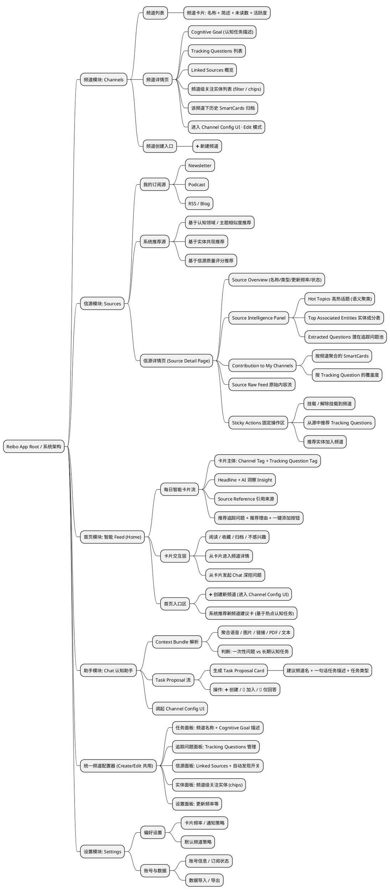

<!-- lark-mirror obj_token=FQGTdOE47ohDTdxD6UpjeFE2pEg space=产品调研 synced=2026-05-18T07:54:44Z -->

# Mindspace 手机端PRD

<whiteboard token="Ytj0wIoVKhayJIbM1sAjESpfpXg"></whiteboard>

## 产品定义与核心概念

### 1.1 产品定位

本产品是一款“问题驱动” 的 AI 认知升级助手。与传统资讯流不同，它不单纯分发新闻，而是通过分析用户订阅的信源，基于用户设定的“追踪问题”，主动筛选并重组信息，帮助用户建立长期、深度的知识体系。

### 1.2 核心名词定义

以下名词贯穿整个产品逻辑，请严格区分：

- **Channel (频道)**：
- **定义**：用户关注的一个宏观认知领域容器。它是所有信息聚合的顶层入口。
- **示例**：例如“AI 商业模式”或“美股 SaaS 投资”。
- **Subscription Source (订阅源)**：
- **定义**：信息的原始来源。包含 Newsletter、Podcast、RSS 等。
- **特性**：具备“智能元数据”，系统能分析信源的历史内容，提取出它常聊的话题（Hot Topics）和实体（Entities）。
- **Tracking Question (追踪问题)**：
- **定义**：用户在频道内设定的**长期追踪意图**或**研究方向**。它是 AI 的核心过滤指令。
- **关键区别**：不是“今天 DeepSeek 股价是多少”这种瞬时问题，而是“大模型如何改变软件定价模式”这种需要长期观察的议题。
- **Smart Card (智能卡片)**：
- **定义**：每日推送到首页的最小消费单元。
- **逻辑关系**：卡片是“信源”对“追踪问题”在“今日”的一个具体回答。
- **结构**：由“卡片切入点”引导，包含 AI 洞察和原文链接。

---

## 产品模块层级图

---

## 详细信息架构 

### 3.1 一级对象：频道（Channel）

**定义**：承载一个长期认知任务（Cognitive Task）的容器，用于组织追踪问题、信源、实体与生成的卡片。

| **属性名称** | **描述** | **数据来源与口径定义** |
|-|-|-|
| **Channel Name** | 用户关注的认知任务的名称，如 “AI 搜索格局”、“美股 SaaS 投资”。 | **[用户输入] 或 [系统建议]**。系统从自然语言任务描述中抽取合理命名。 |
| **Cognitive Goal（认知任务描述）** | 系统为频道自动生成的一段不可见 System Prompt，用于指导 AI 的抽取视角、推理方式、语气。 | **[用户输入 → 系统生成]** 基于 Context Bundle（语音/链接/文本等）和 Tracking Questions 推理生成。可被用户微调。 |
| **Tracking Questions（追踪问题）** | 频道所需长期回答的核心问题列表，是整个内容生成的过滤与组织框架。 | **[用户配置] + [系统推荐]** 来自用户手动添加、系统 trend clustering、卡片推荐问题添加按钮。 |
| **Interested Entities（关注实体）** | 用户关心的人物、公司、概念，用于强过滤与优先级提升。 | **[用户选择] + [系统推荐]** 基于 NER、频道主题匹配、信源高频实体抽取。 |
| **Linked Sources（关联订阅源）** | 频道从哪些信源中读取内容。包含用户订阅源 + 系统推荐源 +（可选）系统持续发现的新源。 | **[用户选择] + [系统推荐]** 初次创建提供默认推荐；支持新源自动扩展（默认开启）。 |
| **Source Auto-Discovery Toggle（信源自动扩展开关）** | 控制是否允许系统自动发现与频道相关的新信源。 | **[用户配置]（默认 ON）** |
| **Channel Status** | 频道当前状态：Active / Paused / Archived。 | **[系统状态] + [用户操作]** |

### 3.2 一级对象：智能卡片（Card）

**定义**：用户每日消费的最小单位，不等同于“文章摘要”，而是“围绕一个长期追踪问题给出的当日答案”。

| **属性名称** | **描述** | **数据来源与口径定义** |
|-|-|-|
| **Parent Channel（所属频道）** | 卡片属于哪个频道。 | **[系统关联]** 生成卡片时自动绑定。 |
| **Channel Tag（频道标签）** | 在卡片顶部展示所属频道名称，帮助用户理解语境。 | **[系统关联]** 来自 Parent Channel。 |
| **Target Question（对应追踪问题）** | 此卡片是为了回答哪一个长期追踪问题。核心展示。 | **[系统关联]** 卡片生成时绑定。 |
| **Tracking Question Tag（追踪问题标签）** | Target Question 的展示形式，如 “Q：Agent 定价模式”。 | **[系统生成]** 基于 Target Question。 |
| **Card Headline（今日切入点）** | 卡片的即时视角标题，与长期追踪问题不同，反映今日新信息。 | **[AI 生成]** 基于当天信源内容生成。 |
| **Insight / Answer（AI 洞察）** | 针对追踪问题的结构化回答，包含推理而非简单总结。 | **[AI 阅读信源后生成]** |
| **Source Reference（引用来源）** | 信息来源及链接，包含来源名称、文章标题、URL。 | **[系统抽取]** |
| **Recommended Tracking Question（推荐追踪问题）** | 系统在卡片底部提出的用户可能会感兴趣的新问题。 | **[系统生成]** 基于主题聚类、趋势检测、实体频次异常等。 |
| **Recommendation Reason（推荐理由）** | 系统推荐该问题的依据，如“本周多条信源集中讨论此议题”。 | **[系统生成]** 透明化推荐逻辑。 |
| **Add Tracking Question Button（添加追踪问题按钮）** | 用户点击即可将推荐问题加入当前频道的追踪问题列表。 | **[用户操作 → 系统更新频道]** |
| **Status（阅读状态）** | 未读 / 已读 / 收藏  | **[用户行为]** |
| **Card Timestamp（生成时间）** | 卡片生成的实际时间。 | **[系统生成]** |

### 3.3 一级对象：订阅源（Source）

**定义**：系统可进行语义分析、实体抽取、聚类等处理的输入流（如 RSS、Podcast、Newsletter）。

| **属性名称** | **描述** | **数据来源与口径定义** |
|-|-|-|
| **Source Name** | 信源名称，如 “Ben’s Bites”、“The Neuron”。 | **[系统抓取] + [用户输入]** 来自 RSS 标题或用户手动添加。 |
| **Source Type** | Newsletter / Podcast / RSS / Blog / Social。 | **[系统识别]** 基于 URL 元数据与源结构。 |
| **Top Associated Entities** | 历史出现频率最高的实体标签 Top 5–10。用于理解信源关注点。 | **[系统统计]** 基于 NER + 频率分析。帮助用户理解信源关注点结构。 |
| **Hot Topics（高热度话题）** | 过去 7–14 天内通过聚类发现的高频主题，如 “Agentic Workflow”。 | **[系统聚类分析]** 基于 embedding clustering。用于触发**推荐新频道逻辑**。 |
| **Extracted Questions（潜在问题池）** | 从信源内容中 AI 自动抽取的“研究型问题”。用于推荐 Tracking Question。 | **[AI 自动抽取]** 从文章语义中总结出的核心问题，如 “How will agentic frameworks affect cloud cost models?”。用于触发**推荐新追踪问题逻辑**。 |
| **Quality Score（信源质量评分）** | 用于衡量其是否适合作为推荐源，包括更新频率、原创度、引用度等。 | **[系统计算]** |
| **Channel Mappings（挂载频道）** | 该信源被哪些频道使用。 | **[系统记录]** |

## 关键功能逻辑

### 4.1 每日生成逻辑

**场景**：用户每天打开 App 看到的 Feed 流是如何产生的？

1. **扫描**：系统后台每日定时扫描频道关联的**订阅源**更新。
2. **匹配**：

- **意图匹配**：系统将**追踪问题**作为“探针”，去探测信源内容。如果某篇文章能回答或部分回答该问题，则命中。
- **实体匹配**：系统检测内容是否提及了频道内的**感兴趣实体**。

1. **生成**：

- 若命中，AI 阅读原文，生成**卡片切入点**和 **AI 洞察** 。
- *规则*：如果某个追踪问题当天没有高质量的相关更新，**系统不生成卡片**（宁缺毋滥）。

1. **分发**：生成的卡片按时间顺序推送到首页 Feed。

### 4.2 频道配置与反馈逻辑

系统如何通过“推荐”和“反馈”让频道内容越来越精准？

#### A. 智能推荐逻辑 

1. **源 -> 新频道推荐**：

- *逻辑*：当系统检测到用户订阅的信源中，有一个 **热门话题** (如 "AI Search") 持续高热，但用户当前没有频道覆盖此话题。
- *表现*：首页出现建议卡片 —— *“你的信源都在讨论 [AI Search]，建议创建一个专属频道进行追踪。”*
- *动作*：用户点击确认 -> 创建新频道。

1. **源 -> 新追踪问题推荐**：

- *逻辑*：在某个现有频道（如“AI 技术”）下，系统发现信源集中讨论一个**新聚类** (如 "Reasoning Model")，且不在当前的追踪问题列表中。
- *表现*：生成一张“趋势发现卡” —— *“关于 [AI 技术] 频道，出现了一个新的值得思考的方向：‘推理模型的 Scaling Law’。是否添加追踪？”*
- *动作*：用户点击“追踪” -> 该方向成为该频道下的新**追踪问题**，进入日常生成循环。

1. **实体 -> 信源优化**：

- *逻辑*：若系统发现某个外部信源的 **Top Associated Entities** 包含用户关注的实体。
- *表现*：提示用户 —— *“发现一个常谈论 [Sam Altman] 的优质信源，是否加入对应频道？”*

#### B. 用户反馈逻辑

用户通过对卡片的操作，修正系统的判断。

1. **显式负反馈 (不感兴趣)**：

- *操作*：用户对卡片点击“不感兴趣”。
- *系统追问*：询问是“不感兴趣这个**实体**”还是“不感兴趣这个**追踪问题**的切入角度”？
- *结果*：
- 若屏蔽实体：未来该实体的权重降为 0。
- 若否定问题：**降低该追踪问题的生成优先级**。

1. **显式正反馈 (Chat 追问沉淀)**：

- *操作*：用户在卡片详情页通过 Chat 对 AI 提问（例如：“这对 AWS 意味着什么？”）。
- *结果*：系统识别到这是一个有价值的新视角，对话结束时询问 —— *“是否将‘AI 对云厂商的影响’作为一个新的长期追踪问题？”*

1. **隐式反馈 (用脚投票)**：

- *阅读*：用户点击阅读卡片 = **该追踪问题依旧活跃**，系统保持关注。
- *忽略*：卡片多次曝光但用户未点击 = **该追踪问题关注度下降**。
- *结果*：当关注度降至低点，系统会发送维护提示 —— *“关于‘[某追踪问题]’，你似乎很久没看了，是否将其归档？”*

### 4.3 实体与信源管理

- **信源挂载**：用户虽然可以订阅孤立的信源，但系统在交互中应始终引导用户将信源**挂载 (Map)** 到具体的频道下。
- **价值**：只有挂载到频道，信源的内容才能被“追踪问题”过滤和提炼，实现降噪效果。