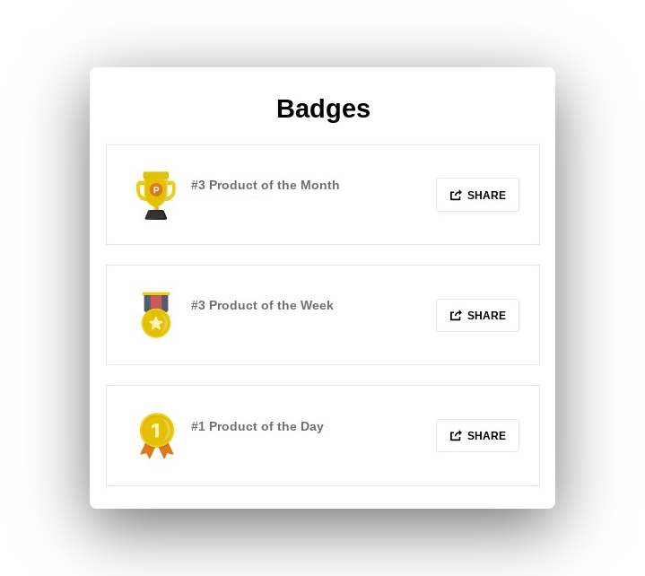
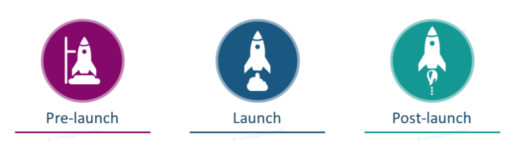
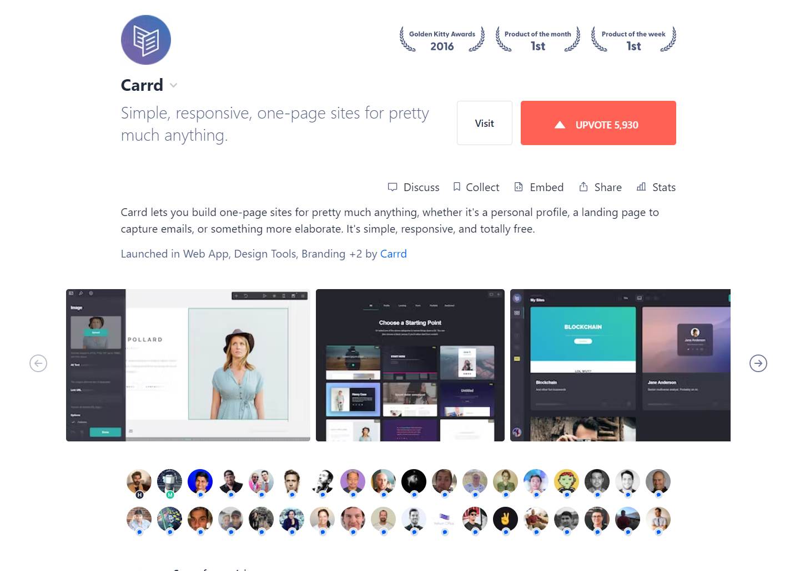
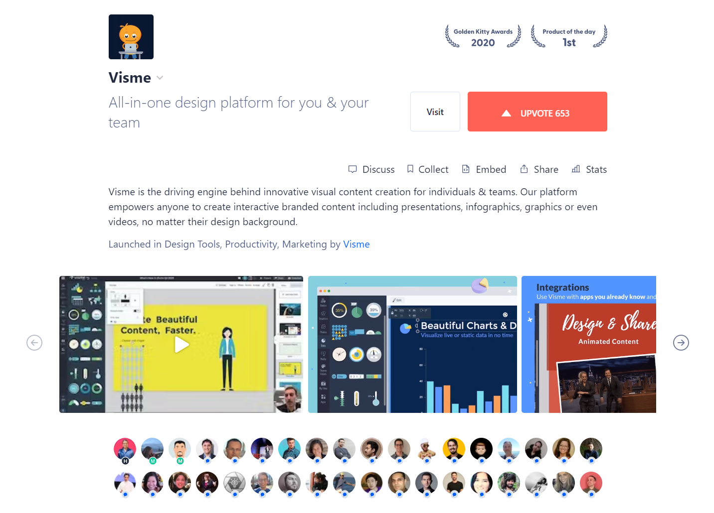
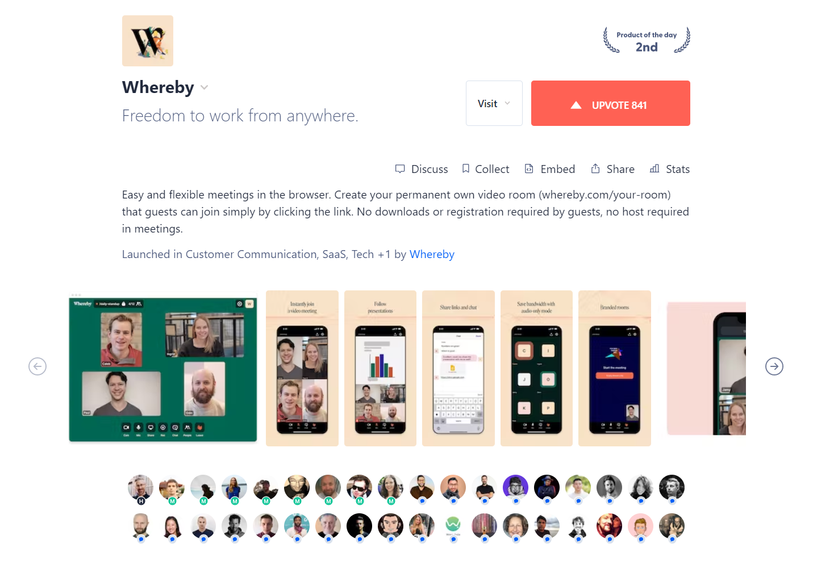
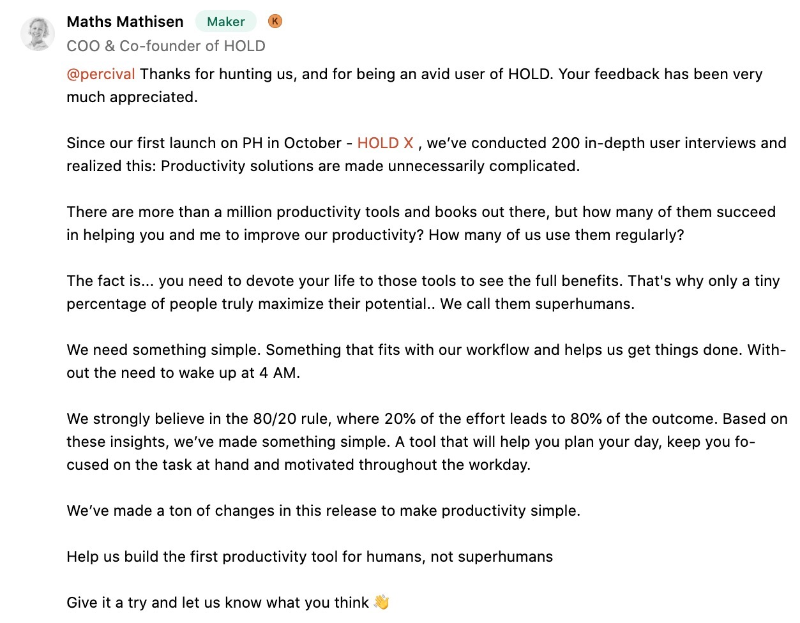
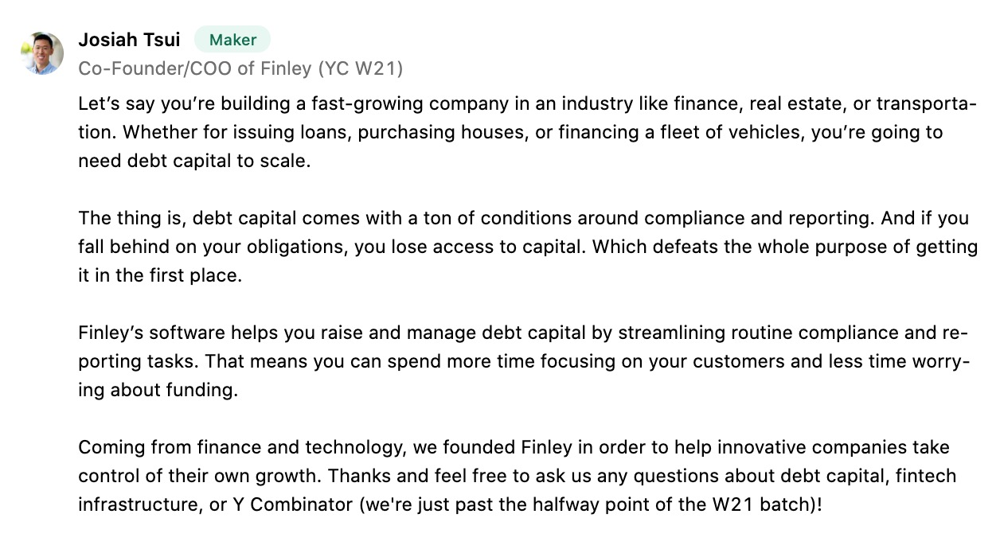
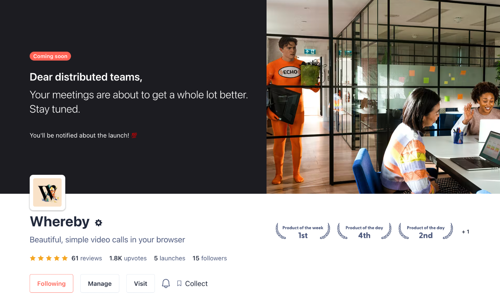

# 如何在 Product Hunt 冲到第一名：完整指南

> 原文：[Ultimate guide on how to rank #1 on Product Hunt](https://tibo-maker.notion.site/Ultimate-guide-on-how-to-rank-1-on-Product-Hunt-589c000cd56f4baf9c64988a52eb4b4e)  
> 作者：Tibo，Product Hunt 2022 年度 Maker，多次获得单日第一并多次进入前十  
> 抓取与翻译日期：2026-07-23  
> 归档说明：本文是保留原意的完整中文翻译。原文中的数据、工具、平台规则和案例结论均按作者说法保留，没有当作 2026 年的现行规则重新核验。英文原文快照见 [source_en.md](./source_en.md)，原文图片与视频已保存到 [assets](./assets/)。

Product Hunt 是获取新客户的一座金矿。排名靠前时，它甚至能带来大约 10,000 次独立访问，以及 1,000～3,000 条真实业务线索。

下面就来看看，怎样拿到单日第一，并尽可能放大这次发布的价值。

> 开始之前  
> 你也可以看看我的其他[项目和免费资源](https://tmaker.io/)。

如果不想阅读全文，文末附有一份可以直接照着执行的发布清单。

## 1. 熟悉 Product Hunt 的功能、社区和成功案例

如果你完全不了解 Product Hunt，可以先阅读这一节；已经熟悉平台的话，可以直接跳过。

原文这里有一个名为 Understanding Product Hunt 的折叠区块，但它引用的 Notion 子区块已经失效，公开页面与公开数据接口均无法读取其中内容。

## 2. 了解 Product Hunt 的用户、价值，并设定明确目标

究竟有哪些人在使用 Product Hunt？你又该怎样利用这批用户？

### Product Hunt 的用户

Product Hunt 的用户主要包括科技爱好者、早期采用者、投资人、记者和创业者。借助这批用户，你可以扩大产品触达、快速测试产品，也能更快拿到反馈。

### 为什么要重视 Product Hunt

Product Hunt 可以带来以下收益：

- **初始增长。** 排名靠前会让产品出现在大量科技爱好者、早期采用者和潜在客户面前，从而增加注册量、下载量和销售额。
- **间接改善 SEO。** 更高的曝光和访问量、高质量反向链接、社交信号、用户生成内容，以及品牌权威与信任，都可能改善网站在搜索引擎中的表现。
- **吸引融资关注。** 一次成功的发布可能引起天使投资人、风险投资机构和其他资金方的注意。较高排名也能充当社会证明，说明产品具有创新性和市场潜力。
- **验证产品。** 发布产生的讨论可以说明产品是否得到用户和行业人士认可，从而验证价值主张与产品市场匹配度。
- **增强官网信任。** 你可以把 Product Hunt 排名徽章放到官网，让潜在用户更容易建立信任。

- **提升知名度。** 较高排名会为产品和品牌带来关注，进而增加媒体报道、社交媒体提及和口碑传播。
- **获得反馈。** 活跃的 Product Hunt 社区能够帮助你发现产品的优势、弱点和改进方向。
- **打开其他机会。** 排名靠前还可能带来 Product Hunt Newsletter 推荐、Golden Kitty Award 等机会。

### 排名靠前意味着什么

Product Hunt 会根据用户投票和互动为产品排名。获得单日第一的产品可能得到超过 10,000 次独立访问。

这个数字看起来未必夸张，但 Product Hunt 用户普遍愿意尝试新产品，因此转化率可能较高。作者估计，10,000 次网站访问可以产生大约 1,000～3,000 条真实业务线索。

平台主要有三种排名：

- **Product of the Day：** 某一天排名最高的产品。
- **Product of the Week：** 根据一周内的总投票数和互动量评出的周榜第一。
- **Product of the Month：** 根据一个月内的总投票数和互动量评出的月榜第一。原文称，每月约有 400 万名对新产品感兴趣的用户访问 Product Hunt。

排名越高，产品获得的曝光、认可，以及与创业者、影响者和投资人合作的机会也越多。

你需要根据产品情况先设定发布目标，再开始制定策略。目标应当具体，例如希望获得多少投票、评论或新用户。明确目标有助于衡量发布效果，也能为下一次发布提供依据。

## 3. 制定完整计划

可以先设一个目标：找到 500 名可能在发布时提供支持的人。按作者的经验，这是进入单日前五所需线索量的一个大致平均值。

第 8 节会具体说明怎样接触这 500 人。先来看怎样从零开始制定发布策略。

可以按以下时间线规划和执行 Product Hunt 发布：

**发布前：** 积累势能、准备宣传素材，并建立一个对产品感兴趣的社区。这些人会成为你的第一批支持者。

**发布当天：** 尽早提交产品，理想时间是太平洋时间凌晨 12:01；随后通过多个渠道推广，并在 Product Hunt 上积极回复评论、处理反馈。

**发布后：** 分析结果、感谢支持者、处理反馈，并继续与新用户互动，建立长期关系。

### 三个案例

下面用三个不同驱动力的案例来理解这套方法：

1. Carrd：由强社区推动的发布。
2. Visme：由强营销推动的发布。
3. Whereby：由优秀产品推动的发布。

#### Carrd

Carrd 由独立开发者 AJ 于 2016 年创立。AJ 希望做一个简单、价格合理的平台，让个人、自由职业者和小企业都能方便地创建响应式单页网站。

**发布前策略**

1. 发布 Carrd Beta 版，主要通过口碑和社交媒体邀请早期用户测试。
2. 主动收集用户反馈，并根据建议持续迭代。
3. 在网页设计与开发相关的论坛、社交媒体和社区中与潜在用户交流。
4. 在 Twitter 分享开发进度和更新，让关注者逐渐形成期待。

**Product Hunt 发布当天**

1. 在 Twitter 和其他社交平台宣布发布，邀请关注者在 Product Hunt 支持并分享 Carrd。
2. 积极参与 Product Hunt 讨论，回答问题并为用户提供支持。
3. 为 Carrd Pro 提供限时折扣，吸引新用户和早期采用者。
4. 请求科技与设计圈的朋友、同事把 Carrd 分享给他们的网络。

**结果**

1. 发布当天进入头部产品，获得超过 1,000 票。
2. 用户注册量和 Carrd Pro 付费转化显著上升。
3. 获得多家科技媒体和博客报道，扩大了市场知名度。
4. 建立了一批持续提供反馈的忠实用户，推动产品继续改进。

#### Visme

Payman Taei 于 2013 年创办 Visme。他看到市场需要一款容易使用的设计工具，让没有专业设计能力的人也能创作有视觉吸引力的内容。Visme 面向企业、教育工作者和个人，帮助他们更有效地用视觉表达想法。

**发布前策略**

1. 打磨出功能丰富、完成度较高的版本，覆盖用户的主要设计需求。
2. 建立大量模板、图标和视觉素材库，降低内容创作门槛。
3. 通过博客、客座文章和社交媒体内容建立品牌认知。
4. 与设计和营销领域的影响者、博主及意见领袖合作，扩大触达。

**Product Hunt 发布当天**

1. 向现有用户和 Newsletter 订阅者发送邮件，邀请他们支持并分享 Visme。
2. 借助影响者合作放大发布消息，请他们在社交媒体和其他平台向自己的受众介绍 Visme。
3. 对高级套餐提供限时折扣，促进新用户注册。
4. 在 Product Hunt 上主动回答问题、提供支持并处理疑虑。

**结果**

1. 进入单日头部产品，获得超过 1,500 票。
2. 新用户注册和高级套餐转化快速增长。
3. 获得多家科技媒体和博客报道，进一步提升知名度和可信度。
4. 吸引潜在投资人关注，为后续融资创造条件。

#### Whereby

Whereby 由 Ingrid Ødegaard 于 2013 年创办，最初名为 appear.in。它希望用浏览器方案简化视频会议，用户无需安装软件或创建账号。目标用户包括小企业、远程团队，以及希望轻松使用视频会议的个人。

**发布前策略**

1. 打造无需下载、直接在浏览器运行的视频会议产品，让用户几次点击就能创建或加入会议。
2. 确保多个设备和浏览器之间的兼容性，提供顺畅体验。
3. 邀请一批用户参加 Beta 测试，收集反馈并完成必要改进。
4. 在社交媒体、相关论坛和行业社区推广 Whereby。

**Product Hunt 发布当天**

1. 通过社交媒体和 Newsletter 宣布发布，邀请关注者支持并分享。
2. 在 Product Hunt 主动回答用户问题、提供支持并处理疑虑。
3. 为高级套餐提供限时折扣，鼓励新用户注册体验。
4. 鼓励满意的 Beta 用户在 Product Hunt 和社交媒体分享正面体验。

**结果**

1. 进入单日头部产品，获得数百票。
2. 新用户注册和高级套餐转化显著增加。
3. 通过正面评价和推荐提高曝光与可信度。
4. 引起潜在投资人和合作伙伴关注，带来后续增长机会。

## 4. 需要 Hunter 吗

Hunter 是一名受信任的 Product Hunt 用户，由他替你提交产品。与知名 Hunter 合作，可能增加产品获得推荐的机会。

不过，你真的需要 Hunter 吗？

包括产品 Maker 在内的任何人都可以提交产品。原文给出两组数据：

- 79% 的 Featured Posts 由 Maker 自己提交；
- 60% 的 Product of the Day 第一名由 Maker 自己提交。

发布当天本来就有大量任务。没有 Hunter，意味着你不必额外协调合作流程。当天可能同时有上百件事需要处理，这个优势不应被低估。

Hunter 仍然可能带来一些收益：

- **平台经验。** 经验丰富的 Hunter 熟悉 Product Hunt 的运行方式，知道什么内容更适合平台，能够帮助优化策略。
- **人脉网络。** Hunter 可能认识行业影响者、记者或其他重要人物。你可以借助这些关系宣传产品、扩大讨论，但要提前确认对方愿意提供这类帮助。
- **社区互动。** Hunter 可以把产品分享给关注者、参与讨论并激发兴趣，从而帮助社区互动。

与 Hunter 合作并非 Product Hunt 发布的必要条件。如果决定自己提交，就要提前熟悉平台、参与社区，并认真规划发布策略。

作者的个人结论是：如果重新来一次，他不会选择 Hunter。

## 5. 选择发布日期

选择合适的日期和时间，可以尽量提高互动与曝光。发布结果受很多变量影响，其中不少无法控制，因此不存在保证成功的公式。

- 周末通常竞争较少，更容易拿到第一，但流量也更低。
- 工作日竞争最激烈，尤其是周二和周四；相应地，流量也更高。原文称，这两天的 Visit 按钮点击量高出约 15%。
- 可以利用 Twitter 等平台上已有的关注度，为 Product Hunt 发布引流。
- 一个常用做法是在太平洋时间凌晨 12:01 发布，以获得完整 24 小时的曝光。
  - 当天尽早启动几项推广动作，争取早早到达第一。排名第一的产品获得的展示最多，也更容易继续获得自然投票。
  - 原文称 Product Hunt 后来开始在最初四小时隐藏票数，并同时展示所有产品，让各产品都有机会被用户体验。如果产品本身优秀，自然流量会带来投票，拿到第一的概率也会提高。
- 还要根据目标用户、媒体报道时机、团队可用时间等因素调整发布时间。

> 需要特别注意的一件事：不要过度思考。

准备充分当然重要，但没有必要反复纠结每一个细节。把注意力放在真正影响结果的事项上。第一次没有做好也没关系，产品可以多次发布。

## 6. 制作能够吸引注意并促进转化的素材

开始之前，先注册个人账号，不要使用品牌或企业账号。

制作素材时，要始终记住 Product Hunt 的主要用户是 Maker、Indie Hacker 和创业者。素材应当直接回应这批人的需求。

### 标题

标题只写产品名称，不要加入 Emoji 或描述。

一个额外建议是：发布结束后，可以根据用户在 Product Hunt 上可能搜索的关键词调整标题。例如 [Tweet Hunter](https://www.producthunt.com/products/maker-swipe-file#tweet-hunter-for-twitter) 后来把名称改成 Tweet Hunter for Twitter，以便寻找 Twitter 工具的用户发现它。

### Tagline

用一句很短的话介绍产品。它既要吸引注意，也要说明产品的核心价值。

示例：

- **Notion：** One workspace. Every team.
- **Slack：** One platform for your team and your work.
- **Figma：** The collaborative interface design tool.

### Description

Description 适合进一步说明产品的用途和功能。文字应当简短，同时突出独特卖点和主要功能。

**Notion**

> Notion 是一个一体化工作空间，你可以在里面写作、规划、协作和整理信息。它可以用来记笔记、添加任务、管理项目等。把它想成一套乐高积木：Notion 提供基本组件，你可以自行组合成适合工作的布局和工具箱。

**Slack**

> 让工作生活更简单、更愉快、更高效。Slack 是一个协作中心，把合适的人、信息和工具聚到一起，帮助团队完成工作。从财富 100 强公司到街角小店，全球数百万人都在用 Slack 连接团队、整合系统并推动业务。

**Figma**

> Figma 是用于设计用户界面、移动应用和网站的协作式设计工具。它在云端平台中提供矢量编辑、原型设计和版本控制等多种功能。

### 缩略图

可以使用一张醒目的 240×240 图片。动态 GIF 往往更吸引人，但画面不要太繁杂。标准 Logo 也是安全有效的选择，简单，同时容易被注意到。

- [缩略图动画示例 1](./assets/08_Thumbnail_1.webm)
- 
- [缩略图动画示例 2](./assets/10_Thumbnail_2.webm)
- [缩略图动画示例 3](./assets/11_Thumbnail_4.webm)

### 图片、视频和 GIF

图片和 GIF 很有力量。它们既能吸引潜在用户，也能直观展示产品能提供什么。有时，一张图就能讲完全部故事。

- Product Hunt 原文建议 Gallery 图片使用 1270×760，可以一次上传多张。
- 第一张图最重要。它会自动成为社交网络上的预览卡片，因此要格外清晰。
- 画面应当简洁，快速传达产品价值。减少无关元素，让用户一眼就能看懂。
- 展示收益，而不是罗列功能。
- 很多用户会在手机上查看素材，因此图片和 GIF 在小屏幕上也必须清晰可读。

**Unsplash 示例**

**ClickUp 示例**

### 视频

效果最好的视频主要有两类：

- 展示产品能力的 Demo；
- Maker 亲自讲解的产品 Walk-through。

创始人亲自出镜会显得更真实，但如果视频已经把产品全部展示完，用户也可能不再访问网站。两者之间需要找到平衡，让视频既建立理解，也能促进网站转化。

原文给出的三个例子：

1. [Contra](https://www.youtube.com/watch?v=V84SxksORaA)
2. [tl;dv](https://www.youtube.com/watch?v=igSn0bX4izw)
3. [Mmhmm](https://www.youtube.com/watch?v=c8KhKBLoSMk&t=102s)

### Maker 的第一条评论

发布后要主动用一条评论开启讨论。你可以介绍产品、询问反馈和想法，也可以邀请用户提出问题。这是发布中的重要环节。原文称，获得 Product of the Day、Week 或 Month 的产品中，70% 都有 Maker 发布的首条评论。

## 7. 使用 Coming Soon 页面

把产品放到 Coming Soon 区域，可以提前获得曝光。

Coming Soon 是 Product Hunt 专门展示即将发布产品的页面。你可以最多提前一个月安排发布，用预告吸引访问，并在正式发布前积累关注者。

要进入这个页面，需要提交产品预告，包括简短描述、发布日期和邮件订阅表单。提前曝光可以帮助你激发兴趣、收集反馈，并在正式发布前建立订阅者名单。

## 8. 发布前的营销策略

> 如果你已经有自己的受众，这部分会容易很多。

[Tweet Hunter](https://tweethunter.io/) 和 [Taplio](https://taplio.com/) 可以帮助你建立受众、整理曾经关注其他 Product Hunt 发布的人，并在发布当天联系他们。

许多 Maker 活跃在 Twitter。提前在那里建立受众，会明显提高发布成功的机会。如果你已经有受众，一定要充分利用。

你可以借助自己的人脉网络积累发布势能，并制定发布前营销策略。

### 开始前要注意的两件事

**互动质量。** 来自 Hunter 和活跃 Product Hunt 用户的支持通常更有影响力。提前与他们交流，有助于产品建立可信度和初始关注。Twitter 可以成为这里的杠杆。

**活跃账号与冷账号。** 发布前先和潜在线索互动，让关系逐渐变熟。活跃账号的投票更有分量，也更可能被 Product Hunt 认可。

### 把发布前营销分成几步

#### 第一步：开始收集线索

建立一张表格，把发布当天可能提供支持的人全部记录下来，这样当天不用临时思考该找谁。特别标出那些拥有较大人脉或社交分发能力、能够带来更多关注的人。

线索可以来自：

- 朋友和家人。如果他们需要支持你，可以提前开始正常使用 Product Hunt，让账号保持活跃。
- 同事。
- 社交媒体关注者。
- 给相似产品投过票的人。
  - 在 Product Hunt 查看相似产品的投票者；
  - 整理他们的 Twitter 账号；
  - 使用 Tweet Hunter 或类似工具与他们互动。
- 你认识的影响者。
- 邮件订阅者。
- WhatsApp、Slack、Discord、Facebook 等群组。
- Coming Soon 页面上的账号。

原文还推荐 [Upvote Bell](https://upvote-bell.com/)。它可以下载某个项目的投票用户列表，并找出他们的 Twitter 用户名。一个典型用法是：找到同领域里发布成功的产品，下载投票者名单，然后在自己的发布日私信这些人。

#### 第二步：加入社区

加入与你的细分领域或行业相关的 Slack、WhatsApp 和 Facebook 群组。通过参与交流建立关系，同时向其他 Maker 和创业者学习。

原文列举了两个起点：

- [Indie Hackers](https://www.indiehackers.com/)
- [The Product Folks](https://docs.google.com/forms/d/e/1FAIpQLSeR4IwmiTm_78j4ICy363Q-FJ5xATMavMbaYlyX2XXOg2FlrQ/viewform)

把这些社区中的线索记录到另一张表中。

#### 第三步：提前准备要发送的素材

任何可以提前完成的事情，都不要留到发布当天。

至少提前准备：

- 社交媒体文案和图片。图片里应当包含 Product Hunt 标识和产品 Logo。
- 需要发送的私信和邮件。

不要直接索要投票，尤其不要公开向陌生人要求投票。可以请求支持和反馈。如果对方喜欢你的项目，通常会自然投票。

#### 第四步：提前写好 Maker 评论

准备一段具体、有思考的文字，介绍背景、表达感谢、回答用户可能提出的问题，并讲清楚你为什么做这个产品。

## 9. 发布当天要做什么

终于到了发布日。

原文推荐用 [Akkio Product Hunt Dashboard](https://pw2.akkio.com/) 监控发布进展和主要竞品。

准备好后，逐项执行：

1. 发布 Maker 评论。
2. 向 Tweet Hunter 联系人列表逐一发送私信。
   - 先联系转化可能最高、关系较熟的人；
   - 再联系冷线索；
   - 分批发送，不要一次性群发，以免被判定为 Spam。
3. 在此前加入的 Slack、WhatsApp 和 Facebook 群组中发送消息。
4. 在官网加入 Product Hunt Widget，鼓励访客参与互动。
5. 回复评论并处理反馈。
6. 在所有社交媒体账号发布消息。
7. 联系认识的影响者。
8. 向现有用户发送邮件。

随后持续回复评论和反馈，通过更多互动延续社交媒体上的讨论。

> 人们会关心你经历的困难和阶段性成果。作者建议当天发 10 条帖子或 Tweet，持续分享发布过程。

### 应当避免的做法

下面这些行为会损害 Product Hunt 排名和整场发布：

- 发送 Spam 或人为制造投票。Product Hunt 会检测并处罚投票操纵。应当通过真实价值和真实互动获得支持。
- 直白地要求别人投票。

## 10. 发布后的跟进

发布结束后，分析结果、感谢支持者，并处理尚未解决的反馈。

### 发布后可以做什么

- 如果前面的动作大部分都执行到位，产品很可能进入单日前五，并出现在第二天的 Product Hunt Digest 邮件中。
- 根据用户反馈继续迭代、改进产品。
- 把 Product Hunt Badge 和嵌入组件加入官网与营销素材，用来展示发布成绩和可信度。
- 很多人可能通过社交媒体和其他渠道联系你。尽量把他们转化为产品用户或长期关注者。

### 结语

拿到 Product Hunt 第一可以带来不少收益，但仍然要记得自己的长期目标。

如果排名没有达到预期，也不必因此泄气。把这次经历用来学习、迭代和改进，为下一次发布积累经验。

继续做产品吧。

## Product Hunt 发布清单

- [ ] 熟悉 Product Hunt 平台
  - [ ] 参与讨论
  - [ ] 为喜欢的产品投票和评论
  - [ ] 持续观察并理解每天的排名
- [ ] 设定发布目标
- [ ] 制定发布策略
- [ ] 决定是否使用 Hunter
- [ ] 选择发布日期
- [ ] 开始制作素材
  - [ ] Tagline
  - [ ] Description
  - [ ] Thumbnail
  - [ ] 图片或 GIF
  - [ ] 视频
- [ ] 安排发布
- [ ] 创建预告页并进入 Coming Soon 页面
- [ ] 执行发布前营销
  - [ ] 收集线索
    - 朋友和家人；如有必要，让他们提前正常使用 Product Hunt，保持账号活跃
    - 同事
    - 社交媒体关注者
    - 给相似产品投过票的人
    - 认识的影响者
    - 邮件订阅者
    - WhatsApp、Slack、Discord、Facebook 等群组
    - Coming Soon 页面上的账号
  - [ ] 加入社区和群组并参与交流
  - [ ] 提前准备发布当天需要的消息和图片
  - [ ] 写好 Maker 评论
- [ ] 发布当天
  - [ ] 发布 Maker 评论
  - [ ] 逐一私信表格中的线索
    - 先联系转化可能最高、关系较熟的人
    - 再联系冷线索
  - [ ] 在此前加入的 Slack、WhatsApp、Facebook 群组中发送消息
  - [ ] 在官网添加 Product Hunt Widget
  - [ ] 回复评论并处理反馈
  - [ ] 在所有社交媒体账号发布消息
  - [ ] 联系认识的影响者
  - [ ] 向用户发送邮件
  - [ ] 持续回复评论
- [ ] 发布后
  - [ ] 感谢支持者
  - [ ] 根据反馈改进产品
  - [ ] 在官网加入 Product Hunt Badge 和嵌入组件
