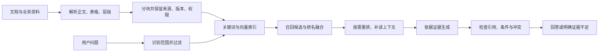

# RAG 目录评审与学习指南

日期：2026-09-09。对象：产品与全栈技术负责人。

## 结论与证据边界

完整遍历 [RAG 目录](https://docs.xiaohongshu.com/doc/58ab2642ea430526353832680db4fcc0) 的 21 个后代节点：15 份有正文材料，6 个空正文组织节点；根节点正文也为空。正文读取快照保存在本地 `tmp/rag_directory_20260909/`。

这些材料覆盖概念调研、技术选型、架构、评测和实际回答，适合学习，但不能拼成一套已经验证上线的系统。本文依据文档、回答样例和官方技术资料；没有取得 UltraAgent 源码，没有运行内部服务、复现评测或逐条核验样例中的法律结论。以下“当前架构”均指架构文档描述的状态。

主要发现：

1. 当前 RedAgenticRAG 是结构化文档导航与混合检索服务，文档明确没有内置最终答案生成 API。
2. Milvus/LangChain 选型与 RAGFlow LegalKG 是另外两套设计路线，不能当作当前服务的实现细节，也没有证据判定其替代关系。
3. 评测展示三类问题的结果，能指出问题，不能证明广泛可靠。麦克风/摄像头问题的 Faithfulness 为 0.4353、AnswerCorrectness 为 0.2238。
4. 回答样例有从分类体系推断真实业务使用的证据越界；另有样例明确只用了外网，不能作为内部 RAG 效果证明。
5. 真正的方案起点是业务问题、权威证据、可验收标准；架构组件应由失败样本驱动。

## 一、六篇核心文档分别贡献什么

| 文档 | 内容与价值 | 阅读边界 |
|---|---|---|
| [RAG调研报告](https://docs.xiaohongshu.com/doc/9732a926592ad7c14feddea5bdce71c4) | 解析、分块、向量、索引、查询处理、召回、重排、上下文、生成、验证的全景 | 是技术地图，各种“最佳”“必须”不等于对照实验结论 |
| [法律领域 RAG - 常规 RAG对比](https://docs.xiaohongshu.com/doc/2c6cbb3a673b5d7201c6c0af591b594a) | 强调条款层级、版本、跨条引用、精确证据 | 企业其他领域也需要这些；法律场景不自动要求图谱或微调 |
| [RAG技术选型](https://docs.xiaohongshu.com/doc/6ef4df778fd1cc9b32cfa754fe2e0229) | RAGFlow 解析、LangChain/LangGraph 编排、Milvus 混合检索，LightRAG 可选 | 面向 10 万—1000 万 chunk 的选型与实施规划，未验证落地 |
| [Agentic RAG 架构设计文档](https://docs.xiaohongshu.com/doc/8aff625d7aee65bfe5dae223a26c7ac6) | REDoc 同步、TOC、SQLite、BM25、摘要向量、RRF、导航/原文工具 | 最具体的服务说明；没有内置生成 API，默认检索也没有图遍历 |
| [RAG 评测指标](https://docs.xiaohongshu.com/doc/11d967cd2743c384e370444ce31261af) | 指标介绍与三类问题的对照表 | 缺完整实验协议、人工标准答案和执行轨迹，不能复现或外推 |
| [合规/法规/新闻多源知识图谱设计与实施方案](https://docs.xiaohongshu.com/doc/2e815bb94df53f2cf02ed10be62f9bbf) | 法规结构、语义关系、新闻与内规关联；RAGFlow 扩展 | 2026-05-19 提案，领域关系图不等于当前服务的目录树 |

推荐阅读顺序：先看问题和回答，再看架构与评测，最后读调研、选型和图谱。先知道要解决什么，才有能力判断组件是否必要。

## 二、从第一性原理理解 RAG

RAG 是 Retrieval-Augmented Generation：生成答案之前或过程中，检索任务需要的外部证据，再据此作答。它解决模型不知道私有知识、知识过时、无法定位依据等问题，但不会自动保证答案正确。

检索可以使用关键词、向量、已有搜索 API、数据库或文档导航。向量库不是定义要求；小语料也不一定需要切成很多块。官方说明同样允许复用现有 SQL、CRM 和文档系统，Agentic RAG 的关键是 Agent 决定何时、如何检索：[LangChain Retrieval](https://docs.langchain.com/oss/python/deepagents/retrieval)。

这是通用参考链路，不表示当前内部服务已实现所有环节。

### 一个贯穿全流程的假设案例

假设问题是：“活动 A 的优惠券可以和粉丝团券叠加吗？”以下规则都是教学假设，不是小红书真实规则。

- 规则正文写“可以叠加”，附表又写“特定券种除外”。若解析丢了表格，后续换更好的模型也无从得知例外。
- 文档有旧版与新版。若未按生效时间和业务范围选择，新版问题可能被旧版答案误导。
- 用户说“叠加”，原文可能叫“优惠互斥”。向量可补同义表达；BM25 更擅长找券种代码、接口名、数字和专有名词。
- 召回命中一句“可以叠加”，还需要补读父章节中的条件和例外，不能只给模型孤立句子。
- 回答必须说明适用条件，并引用对应原文。找到相关页面不代表结论被页面支持。
- 若问“这个商家现在为什么不能叠加”，还需要业务 API 中的实时资格、活动状态或券配置。文档 RAG 只能解释规则，不能证明当前账户状态。

### 各环节到底在解决什么问题

| 环节 | 作用 | 常见失败 |
|---|---|---|
| Parsing 解析 | 将页面/PDF/表格变成可检索内容并保留结构 | 漏表、OCR 错数字、标题和正文混淆 |
| Chunking 分块 | 给检索建立粒度合适、可引用的证据单元 | 太小丢前提，太大混主题；否定和例外被切走 |
| Embedding 向量化 | 将文本映射到便于语义相似检索的表示 | 相似不等于相同事实；摘要可能漏细节 |
| BM25 | 按词项匹配程度排名 | 不擅长没有词面交集的表达，中文分词影响结果 |
| Hybrid 混合检索 | 合并词面与语义两路互补候选 | 两路都缺失的证据不会凭空出现 |
| RRF 排名融合 | 依据候选名次合并，减少原始分数量纲差异 | 不是语义理解模型；参数和候选数仍影响效果 |
| Rerank 重排 | 对少量问题—候选对做更细的相关性评分 | 无法找回没召回的文档，也不能把相关性当事实支持 |
| Context assembly | 去重并补上条件、父章节、相邻证据 | 塞入太多噪声或把不同版本混在一起 |
| Generation 生成 | 把证据组织成用户需要的结论 | 过度概括、漏条件、凭常识补齐未知事实 |
| Verification 验证 | 检查来源、引用、结论支持关系和冲突 | 只检查有链接，或者把模型自信当保证 |

结构分块与长度限制可以结合：优先按标题/条款拆，超长节点继续拆，同时保留父节点和原文偏移。父子检索可用小块精准命中，按需补大块上下文，但不是每次都整章塞入。

RRF 常见形式是对各路排名求和 `sum(1/(k + rank))`。它并不读取内容判断逻辑；k=60 是常用设置，不是对任何数据都最优。

## 三、RAG、Agentic RAG、GraphRAG 的区别

| 路线 | 控制流程 | 适用条件 | 增加的成本 |
|---|---|---|---|
| 固定流程 RAG | 程序规定检索→上下文→回答 | 单次或可预先定义的检索足够 | 容易约束延迟、成本和复现 |
| Agentic RAG | 模型根据已见证据决定下一次搜索、补读、拆问和停止 | 问题未知部分需要逐步探索 | 调用数、尾延迟、重复搜索、停止条件和轨迹评估 |
| GraphRAG | 关系结构参与证据获取或组织 | 问题确实依赖引用、依赖、修订、影响等关系 | 实体消歧、关系维护、来源与版本治理 |

三者不是互斥产品等级，Agent 可以调用混合检索和图检索。图数据库也不是 GraphRAG 的充分条件：图必须实际帮助获取或组织回答证据。

尤其分清三种“图”：文档目录树、领域关系图、向量 ANN 的 HNSW 图。它们分别用于结构导航、关系推理和近邻搜索，不可混称。

当前内部架构提供 search/explore/read 等工具，适合被 Agent 调用，但默认 BM25+dense+RRF 路径是固定的；关键词图不参与默认检索；没有内置答案生成 API。不能因为名字有 Agentic 就推定已有完整自主问答循环。

## 四、对内部架构的具体判断

### 当前自建服务

文档描述的默认链路是：REDoc 同步→LLM 生成 TOC 和摘要→叶节点定位原文→原文 BM25 与 title+summary 向量→RRF→snippet、来源、breadcrumb→按需 read 原文。

优点：结构来源容易理解；工具接口便于渐进读取；部署组件较少。必须继续验证的点：

- 摘要向量会不会漏掉金额、否定、接口名和例外？与原文向量、双路表示做对照。
- TOC 锚定失败时整篇放入首个叶子，是否造成超大块？是否丢掉超长文档尾部？
- SQLite JSON 向量加载后做内存余弦检索，语料增大后的 P95、内存和并发如何？不能套用另一份选型的千万级目标。
- 更新、删除是否同时撤回旧 chunk、BM25、向量、目录、图边和缓存？文档自己也列出旧索引清理需求。
- 文档说明了采集认证和 metadata filter，但没有充分交代逐用户 ACL、权限撤回与补读授权；这是材料缺口，不等于断言实现存在漏洞。
- source_id、revision_id、chunk_id 应区分。只存 URL 和 content_hash 不足以重现当时引用的证据。

### Milvus 选型路线

解析、混合检索、父子块、增量记录、引用验证、可选图增强的方向合理，但以下内容应纠正：

1. **Qdrant 不必外接 Elasticsearch 才能混合检索。** 官方支持 dense/sparse 融合；原生本地 BM25 inference 在 v1.15.2 发布说明中已有记录。应基于实际版本、中文检索、平台运维和压测选型，而非“唯一无短板”。[Hybrid Queries](https://qdrant.tech/documentation/search/hybrid-queries/)、[v1.15.2](https://github.com/qdrant/qdrant/releases/tag/v1.15.2)。
2. **incremental 不会自动发现所有整篇源删除。** 它清理本轮见到的 source ID 的旧块；整篇消失且不再出现的 source 需要删除事件或完整对账等机制。[LangChain index API](https://reference.langchain.com/python/langchain-core/indexing/api/index)。
3. **BGE reranker 的相关性分数不能直接当 NLI 蕴含判断。** “支持退款”和“不支持退款”都与退款问题高度相关。事实验证需要检查支持、矛盾和未知，且要单独评估。[BGE Reranker](https://bge-model.com/bge/bge_reranker.html)。
4. **DeepDoc 不能直接等同于 VLM。** 官方核心介绍是 OCR、版面和表格结构识别；laws.py 是法律文档解析/切块入口。具体解析器要固定版本与配置。[DeepDoc](https://github.com/infiniflow/ragflow/blob/main/deepdoc/README.md)、[laws.py](https://github.com/infiniflow/ragflow/blob/main/rag/app/laws.py)。
5. 引用门禁中“NLI 失败可标记通过”和“任一失败重试/人工”存在策略冲突；“零幻觉引用”与“幻觉 ID <1%”也需区分原始生成和最终放行的口径。
6. LightRAG 与 GraphRAG 的成本倍率、固定触发阈值等，缺少同语料、同模型、同质量标准的比较，不能教成通用规律。

### LegalKG 路线

值得保留的是关系建模思路：先用解析器生成确定的文档层级，再把概念、义务、引用、修订和跨源关联明确为带类型的关系。每条关系必须能追溯到原文与版本。

例如“变更 A 影响哪些内部政策”确实可能受益于维护良好的引用/实施关系。普通事实查询不必先抽取全库图谱；先验证拆问和多次检索能否解决。图路径只能帮助找到证据，不能替代证据。

## 五、如何读评测，避免被漂亮分数误导

原评测表节选：

| 问题 | 系统 | Faithfulness | AnswerCorrectness | AnswerSimilarity |
|---|---|---:|---:|---:|
| 删除权 | 当前方案 | 0.8269 | 0.7813 | 0.9436 |
| 删除权 | 基线 | 0.7200 | 0.3513 | 0.7663 |
| 麦克风/摄像头 | 当前方案 | 0.4353 | 0.2238 | 0.8950 |
| 麦克风/摄像头 | 基线 | 0.2500 | 0.2097 | 0.8394 |
| 个性化广告 | 当前方案 | 0.9106 | 0.5952 | 0.9407 |
| 个性化广告 | 基线 | 0.7132 | 0.2135 | 0.8538 |

数据来源：[内部评测文档](https://docs.xiaohongshu.com/doc/11d967cd2743c384e370444ce31261af)。基线被描述为相同文件固定切块、向量检索。

0.2238 不等于“22.38% 的业务问题答对”。这是指标分值，缺少实验协议不能外推成任务成功率。相似度 0.8950 与正确性 0.2238 同时出现，恰好说明语义相似不等于结论正确。当前方案比基线好，也不代表已经达到业务门槛。

应区分：

- 检索覆盖：回答所需证据找全了吗？遗漏例外的后果可能比多找一段更严重。
- 检索排序：相关证据是否靠前？RAGAS ContextPrecision 是排序敏感的 AP 型指标，不是简单的相关块比例。[官方定义](https://docs.ragas.io/en/stable/concepts/metrics/available_metrics/context_precision/)。
- Faithfulness：答案里的主张有没有得到所给上下文支持？忠实复述过时资料依然可能现实错误。
- Correctness：是否满足参考答案的事实和要求？依赖参考答案质量、评审器和配置。
- RAGAS AnswerCorrectness 在 v0.1.21 默认事实/相似权重为 0.75/0.25，并非材料写的 0.5/0.5；应锁定实际版本。[版本文档](https://docs.ragas.io/en/v0.1.21/references/metrics.html)。
- 有无 reference 因指标而异；不能把“部分无需参考答案”推广到全套评测。
- 0—1 的检索分数和 LLM 自评不是经过校准的正确概率。

评测应保留问题、语料版本、权限身份、标准要点、gold evidence、候选列表、补读轨迹、模型/prompt/参数、最终回答、耗时与成本。先人工校准一批自动评分，防止评审模型系统性偏差。

诊断办法：把人工选好的证据直接交给生成器。如果仍错，先处理推理/表达/提示和模型；如果能答对，再定位解析、分块、召回、重排或上下文组装。不要把所有错答都归因于 embedding。

## 六、样例实际暴露的问题

### 分类字典不是使用事实

[数据分类字典](https://docs.xiaohongshu.com/doc/7a59e41d183d8f72a1248de54ae68cf5) 定义标签、语义边界和典型示例。[画像盘点回答](https://docs.xiaohongshu.com/doc/e201d5f8a852e8f8f9f20698cfcf86fc) 将类别概括为画像涉及的数据域，证据不足；它还写 16 大数据域而表仅列 14 项。

更可靠的流程：从业务资料提取已证明使用的字段→映射到字典分类→输出“场景、字段、分类、使用证据、确认状态”。没有证据的字段保留未知。这是结论范围控制，不是简单补一个引用。

### 不同来源不能直接比较方案

[TikTok 回答](https://docs.xiaohongshu.com/doc/d85c46a0c9c89e8127da2e2ba81493b9) 明确未启用内部 RAGFlow，仅用外网。[个性化广告回答](https://docs.xiaohongshu.com/doc/6184834c3ee40413d6348efca305e3d1) 混合内部节点与外部资料。它们不是控制变量实验。

回答稿没有人工 gold 标签、完整运行轨迹或统一模型配置，不能凭篇幅、引用数量、日期或文风判断算法更优。部分材料混列官方与商业解读来源，也应在证据等级上区分。本文不将这些生成结论当作法律意见。

## 七、怎样开展一次真正有效的 RAG 调研

### 第一步：定义业务交付

明确用户是谁、原来怎么做、答案将支持什么动作、哪类错误不可接受。比如交付是“定位权威规则并列出待确认项”，还是“自动生成可直接执行的配置”，验收门槛完全不同。

### 第二步：先做真实问题集

起步可选 30—50 个代表问题做人工诊断，这只是务实建议，不是充分统计样本。至少覆盖：精确字段、同义词、多文档、表格、条件/例外、版本冲突、无答案、无权限、文档已删除、实时业务状态。留独立测试集，避免在全部题目上反复调参后自评。

每题标注：必需结论、必需证据及版本、可接受未知、禁止推断、期望输出。数量以后根据问题分布和置信需求扩展。

### 第三步：盘点知识供应链

统计来源数量和格式、更新频率、权威层级、重复版本、权限模型、表格比例、删除机制和解析质量。问清“事实存在于哪里”，有些答案在业务 API，不在文档里。

### 第四步：建立尽量简单的可运行基线

优先复用现有搜索或阅读接口。若只有少量已指定文档，可以直接读取。需要全库查找时，再对比 BM25、dense 和 hybrid。固定模型、语料和预算，避免把换模型的收益算给检索。

### 第五步：按错误做增量实验

| 观察到的失败 | 优先验证的变化 |
|---|---|
| 精确术语找不到 | 分词、关键词、字段索引、别名 |
| 同义表述找不到 | dense、query rewrite |
| 找到句子但漏例外 | 结构分块、父节点/邻段补读 |
| 相关文档已在候选却靠后 | reranker、过滤、候选预算 |
| 跨文档证据缺一部分 | 拆问、多次检索、覆盖检查 |
| 问题依赖稳定关系路径 | 带来源的图索引 |
| 证据齐全但结论错误 | 生成策略、约束输出、事实检查 |
| 新规则仍回答旧版 | 版本选择、索引更新和缓存撤回 |

每次只改变少数变量，报告修复题、退步题、延迟和成本。外网开关、资料时点、用户权限也必须一致。

### 第六步：写出可以评审的技术方案

方案至少回答：业务范围与非目标、语料真源、问题集和指标、离线入库、在线流程、证据协议、权限、更新删除、评测结果、容量和成本、失败降级、上线/回滚与负责人。

组件选择应附决策依据，例如“加入 reranker 后，在独立测试集中减少了哪些错误，P95 增加多少”，而不是“某框架流行、功能齐全”。

建议证据返回字段：`source_id`、`revision_id`、`chunk_id`、标题、原文 span/offset、URL、生效时间、检索分数、来源类型；授权由服务端强制执行。检索分数只用于排序展示，不作为答案保证。

## 八、结合现有材料的建议演进方案

1. 先复用当前 search/read/TOC 能力，补齐可回放轨迹、证据版本和人工问题集。
2. 在受控流程里完成“问题范围→混合检索→补读条件→逐结论引用→未知/冲突处理”。明确生成由哪个服务或 Agent 负责。
3. 建立源更新、删除、权限变更的闭环验证，保证旧证据撤回。
4. 实测摘要向量与原文向量、结构块与混合切分、是否需要 rerank。
5. 对固定流程确实漏证据的题目再增加 Agent 循环，设置调用数/时间/费用上限、重复查询检测和明确停止条件。
6. 只有关系问题仍持续失败、且有人维护实体/关系证据时，再加入领域图谱。
7. 达到目标质量后根据实际容量、并发和维护成本决定外部索引服务；不为尚未验证的规模提前替换全部组件。

对公司内 FDE 的启发：机会常在把“文档里的规则”与“系统里的实时状态”连接成可交付工作流。例如资格排查、配置核对、变更影响分析。是否有价值要用具体业务用例和节约的人工时间证明；本轮材料不能证明这些场景已有岗位或需求承诺。

## 九、自测：能回答这些，就抓住了关键

1. 检索第一名分数 0.95，能说答案 95% 正确吗？不能；相似度/融合分数不是校准概率。
2. 引用中有“支持退款”，是否足以回答用户能退款？不够；还需适用产品、条件、时效和例外。
3. 字典存在“生物识别”标签，能说业务在使用这类数据吗？不能；需要具体使用证据。
4. A、B 两文档，本轮只同步修改后的 A，能删除 B 吗？不能仅凭这次增量推断；需要删除事件或完整清单对账。
5. 有目录树和 NetworkX 就是 GraphRAG 吗？不能据此认定；看图是否参与证据获取或组织。
6. 人工给齐证据仍答错，优先升级向量库吗？不；先查生成和结论支持关系。
7. 多 Agent 加外网回答更长，能证明检索算法更好吗？不能；实验边界和有效证据必须可比。

## 附录：完整目录索引

上述六篇核心材料之外，另有以下节点：

| 标题 | 类型 | 链接 |
|---|---|---|
| RAG问答 | 空正文容器 | https://docs.xiaohongshu.com/doc/6831cbdf8e2d8fed7bca347bc8e343a1 |
| 画像知识库 | 空正文容器 | https://docs.xiaohongshu.com/doc/d0dd3de848c87e3269c30edc26f3bcf6 |
| 广告类型与数据利用程度 | 输入资料 | https://docs.xiaohongshu.com/doc/38f00dc361ca8b338673efca29d74f0b |
| rednote用户数据分类字典（DT） | 输入资料 | https://docs.xiaohongshu.com/doc/7a59e41d183d8f72a1248de54ae68cf5 |
| 回答 | 空正文容器 | https://docs.xiaohongshu.com/doc/06ded8b13411bc80764f71ef59ab46bf |
| 0615 | 空正文容器 | https://docs.xiaohongshu.com/doc/55e7c9ff2761e83bc2ff4a47cce843e0 |
| 各国删除权法规梳理与客户端功能映射 | 回答样例 | https://docs.xiaohongshu.com/doc/0a36cc1b6374b4d866a0b237ca7618cf |
| TikTok 云上传约定与 GDPR 数据最小化合规分析 | 回答样例 | https://docs.xiaohongshu.com/doc/d85c46a0c9c89e8127da2e2ba81493b9 |
| 小红书画像知识库 — 画像用到的数据盘点 | 回答样例 | https://docs.xiaohongshu.com/doc/e201d5f8a852e8f8f9f20698cfcf86fc |
| 欧盟和美国隐私合规法律对麦克风/摄像头前端功能的设计要求 | 回答样例 | https://docs.xiaohongshu.com/doc/bdb6ce28acfd560735f0c981051b50c6 |
| 0625 | 空正文容器 | https://docs.xiaohongshu.com/doc/43a403ee87c6094315c450f6f3c3cb50 |
| 欧盟与美国隐私合规法律中麦克风/摄像头前端功能设计要求 | 回答样例 | https://docs.xiaohongshu.com/doc/a774b74c9fde9ae993c19e43fc1313c4 |
| 欧盟与美国个性化广告及个性化推荐合规要求系统整理 | 回答样例 | https://docs.xiaohongshu.com/doc/6184834c3ee40413d6348efca305e3d1 |
| 0630 | 空正文容器 | https://docs.xiaohongshu.com/doc/93c3fb9c45469e53363423a6ccc06e78 |
| 问题 | 五个用例种子 | https://docs.xiaohongshu.com/doc/ba0ed4a6875f55c69f81f4a142adee3d |

采集方式：递归 menu-list，逐节点 docs:get webFetch，保留全部 text block，图片未纳入逐图审查。外部核验仅查询通用技术问题，未上传内部正文。本文的实现描述来自文档，样例不是经专家确认的标准答案。

## 原文归档入口

全部原文与来源索引已持久归档至 [RAG 原文归档](../source_materials/2026_09_09_xhs_rag/README.md)，包含完整接口返回、正文、版本元数据和前一轮阅读快照。

## 补充教学：Agentic RAG 的工具与搜索底层

用户追问：是否给模型几个 tool 自主调用，以及搜索底层如何实现。

可以拆成两层：外层 Agent 决定搜什么、读哪里、是否继续；内层检索服务按确定算法返回候选。最小 Agentic RAG 可以仅有一个检索工具，不要求多个 Agent。工具调用由模型输出结构化名称与参数，宿主程序校验、执行、追加工具结果后再次调用模型；模型不会直接执行函数。参考 [LangChain Retrieval](https://docs.langchain.com/oss/python/deepagents/retrieval)。

建议的教学接口（非内部实际函数签名）：`search(query, filters, limit)` 返回候选 ID、标题、snippet、版本与来源；`read(node_id)` 读取证据原文；`get_toc(doc_id)` 导航章节；`search_in_doc(doc_id, query)` 缩小范围。权限范围必须由服务端结合调用者身份强制限定，不能由模型参数自行决定。

一次 search 内部可以是固定混合检索：query 规范化→权限和版本过滤→BM25 词项匹配、query embedding 向量近邻检索→RRF 合并并去重→可选 reranker→返回少量带来源片段。候选数应通过评测设定。BM25 通常可借助倒排索引；向量检索可以精确扫描，也可以在较大数据集使用 ANN。这些是实现选择，不是 Agentic 的定义。

底层不必再调用生成式模型规划，但 embedding 服务和可选 reranker 本身可以是模型。也可以复用公司搜索 API、SQL 或现有文档导航能力。Agentic 外层和固定检索内层可以同时存在。

内部文档的具体区别：BM25 对原文 full_text 排名，Dense 对 title+summary 的预存向量排名；向量保存在 SQLite JSON，查询时在内存计算余弦相似度；RRF 融合后返回 snippet，原文通过 read 按需读取。不能把它描述成已经使用 Milvus/ANN 或部署完整自主问答。

工程闭环需要有限调用预算、超时、重复搜索检测、明确证据不足、执行轨迹和引用定位。模型决定停止不构成完整性保证。评测既要看单次 search 的召回，也要看整个轨迹是否找到必需证据并正确作答。
