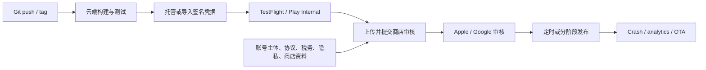

# iOS / Android 一键托管生产流程调研

日期：2026-07-17

## 结论

有，而且已经成熟到可以把日常发版的大部分机械步骤托管掉。准确的产品类别叫 **managed mobile CI/CD / Mobile DevOps**：一次性接入代码仓库、开发者账号和签名凭据后，后续可以由一次 push、tag 或按钮触发双端构建、测试、签名、内测分发、商店上传、提审和分阶段发布。

市场上仍然没有移动端版的完整 Vercel。Web 部署完成后，平台自己就是生产运行环境；移动 App 的二进制最终由 App Store / Google Play 分发，Apple 和 Google 还控制开发者身份、协议、隐私与合规声明、首发资格和审核。因此，现有产品提供的是**一键执行发布流水线**，无法替开发者**代管生产责任**。

如果项目使用 Expo 或普通 React Native，**Expo EAS 是目前最接近低配置双端托管的方案**。Flutter、原生或混合技术栈的小团队优先看 **Codemagic**；有多 App、多 release train 和审批治理的团队看 **Bitrise**；需要私有化、受监管环境、证书集中治理或企业内部分发时看 **Appcircle**。

## “一键”现在能到哪一步

上图里 A 到 E，以及过审后的 G，已经可以高度自动化。F 和 X 仍然属于开发者与商店之间的责任关系。

首次接入通常还要完成这些人工动作：

- 注册并验证 Apple / Google 开发者账号。Apple Developer Program 为每年 99 美元；Google Play Console 为一次性 25 美元。[Apple membership](https://developer.apple.com/support/compare-memberships/)、[Google Play 注册](https://support.google.com/googleplay/android-developer/answer/6112435?hl=en-EN)
- 建立 App Store Connect / Play Console app record，确认 bundle ID / package name、签名方式、免费或付费、出口与政策声明。
- 填写截图、描述、隐私政策、Data Safety / App Privacy、审核账号和敏感权限说明。Apple 要求声明自身与第三方 SDK 的数据实践；Google 即使应用不收集数据，也要求完成 Data Safety 表单。[Apple App Privacy](https://developer.apple.com/help/app-store-connect/manage-app-information/manage-app-privacy/)、[Google Data Safety](https://support.google.com/googleplay/android-developer/answer/10787469?hl=en)
- Google Play 新个人账号还要先完成至少 12 名测试者连续 14 天的 closed test，才能申请 production access。[Google Play 测试要求](https://support.google.com/googleplay/android-developer/answer/14151465?hl=en-EN)
- Apple 每个版本仍经过 App Review；Google 的部分账号审核可能达到 7 天或更久。[Apple Review](https://developer.apple.com/help/app-store-connect/manage-submissions-to-app-review/overview-of-submitting-for-review)、[Google publishing status](https://support.google.com/googleplay/android-developer/answer/9859751?hl=en)

因此，“一次接入后的一键发版”成立；“从一个 GitHub 仓库零配置直接公开上线双端商店”仍然不成立。

## 主要方案比较

| 方案 | 最适合谁 | 已托管能力 | 主要边界 | 当前价格信号 |
|---|---|---|---|---|
| **Expo EAS** | Expo / React Native，小团队 | 双端 Build、凭据、Submit、Workflows、OTA、rollback；可按 native fingerprint 自动选择 build 或 update | 首次 Google 上传需人工；iOS `--auto-submit` 默认到 TestFlight / App Store Connect，不等于自动送审公开；metadata 能力仍不完整 | Free 有低优先级额度；Starter 19 美元/月；Production 199 美元/月，另有 usage billing。[定价](https://expo.dev/pricing) |
| **Codemagic** | Flutter、RN、原生、多技术栈小团队 | Build、自动签名、TestFlight/Play、production track、staged rollout、RN CodePush | YAML 与原生工具链仍需理解；商店异步状态和错误仍会泄漏到 pipeline | 个人每月 500 M2 分钟免费；M2 0.095 美元/分钟，M4 0.114 美元/分钟。[定价](https://docs.codemagic.io/billing/pricing/) |
| **Bitrise** | 中大型移动团队、多 App、多审批 | 400+ mobile Steps、签名、测试、Release Management、Insights、Build Cache、CodePush | 产品与计费层次较多；高级 Release Management 成本较高；原生 Xcode/Gradle 错误仍需团队诊断 | Hobby 300 credits/月；付费按 build/credit/add-on 组合。[定价](https://bitrise.io/pricing) |
| **Appcircle** | 受监管企业、私有化、内部企业分发 | Build、签名身份、测试分发、公开/企业商店、re-sign、RBAC/SSO、self-hosted、RN CodePush | Corporate 询价，采购和运维更重；self-hosted iOS 仍需要 Mac runner | Starter 20 builds/月、5 次 store publish；Corporate 按模块询价。[定价](https://appcircle.io/pricing) |
| **Xcode Cloud** | 纯 Apple 原生项目 | Apple 托管 build/test/cloud signing/TestFlight，准备可提审 binary | iOS-only；首次要从 Xcode 配置；正式发布仍需 App Review | 随 Apple 开发者体系提供，扩容按 Xcode Cloud 方案 |
| **GitHub Actions + fastlane** | 强 DevOps、重视可迁移性 | 理论上能覆盖 build、sign、upload、metadata、track | 需要自己维护 macOS runner、证书、lane、重试、Apple 异步状态和发布控制台 | runner 费用可低，但工程与持续维护成本最高 |

### Expo EAS 为什么最接近“一键”

[EAS Golden Workflow](https://docs.expo.dev/eas/workflows/examples/deploy-to-production/) 已经能先计算 native fingerprint：没有兼容 binary 就构建并提交双端商店，已有兼容 binary 就发布 OTA。`eas build --platform all` 生成 iOS 和 Android 制品，`--auto-submit` 可以把构建与上传串在一起。[EAS Build](https://docs.expo.dev/build/)

边界也写在官方文档里。Google 的 API submission 在首次手动上传后才工作；iOS TestFlight build 不会自动成为公开 App Store 版本。[EAS Submit](https://docs.expo.dev/submit/introduction/) Expo 的 iOS 教程进一步说明，`--auto-submit` 不会替你自动送 App Review。[iOS production build](https://docs.expo.dev/tutorial/eas/ios-production-build/)

这意味着 EAS 最适合把承诺写成“每次 push 自动产出并递交 release candidate”，而不是“一键上架”。

### Codemagic、Bitrise、Appcircle 的差异

[Codemagic 的 First Release Pipeline](https://docs.codemagic.io/yaml-quick-start/first-signed-build/) 已把 unsigned build、凭据、signed build、internal distribution 和 store release 串成完整路径，覆盖 Flutter、React Native、原生 iOS/Android、KMP、Unity 和 .NET MAUI。它的优势是跨栈、价格透明、YAML 可审阅，适合小团队先做 POC。

[Bitrise](https://bitrise.io/platform/bitrise-ci) 更像完整 Mobile DevOps 套件。除了 CI，它还有跨商店 Release Management、审批、Insights、Build Cache 和 CodePush，适合 release train 已经复杂的团队。高级 [Release Management](https://bitrise.io/platform/release-management) 当前列出的 Standard 价格为 250 美元/App/月，个人项目通常没有必要从这里起步。

[Appcircle](https://docs.appcircle.io/publish-to-stores-module) 的差异点是证书治理、企业内部分发、binary re-sign、RBAC/SSO，以及整个平台 self-hosted。它能把云端功能运行在企业自己的基础设施中，但 [self-hosted runner](https://docs.appcircle.io/self-hosted-appcircle/self-hosted-runner/installation) 构建 iOS 仍然需要 macOS。

## OTA 能否绕过商店发版

只能处理有限范围。Expo EAS Update、Bitrise CodePush、Codemagic CodePush 和 Appcircle CodePush 可以快速分发 React Native / Expo 的 JavaScript 与 assets。只要更新依赖了新的 native library、权限、entitlement 或原生 SDK，就必须产生新 binary。[Expo runtime version](https://docs.expo.dev/eas-update/runtime-versions/) 明确要求 native code 变化时重新 build。

政策层也有限制。Apple Guideline 2.5.2 禁止下载并执行会引入或改变功能的代码；Google 禁止应用绕过 Play 自更新或从外部下载 DEX、JAR、`.so` 等可执行代码。[Apple Review Guidelines](https://developer.apple.com/app-store/review/guidelines/)、[Google Device and Network Abuse](https://support.google.com/googleplay/android-developer/answer/16559646?hl=en&rd=1)

所以 OTA 是热修复和同一 native runtime 内的 JS/assets 发布通道，不是规避商店审核的生产捷径。

## 托管平台没有消除的工程风险

公开 issue 说明，移动 CI/CD 的抽象层会在签名、App Store API 和原生构建失败时泄漏：

- EAS 曾出现 App Store Connect API key 403，用户需要补 `ascAppId` 或改走 Transporter。[expo/eas-cli #2136](https://github.com/expo/eas-cli/issues/2136)
- 2025 年仍有 EAS Workflows 将 production build 送到另一个 App Store Connect app 的未关闭报告。它是单一风险信号，不能外推成普遍缺陷。[expo/eas-cli #3230](https://github.com/expo/eas-cli/issues/3230)
- Codemagic 的托管镜像升级曾破坏多个 CocoaPods 项目，随后需要平台回退依赖。[Codemagic discussion #2811](https://github.com/orgs/codemagic-ci-cd/discussions/2811)
- Fastlane 在 Apple build processing 状态迟迟不可见时会长时间等待，说明任何第三方都继承 Apple API 的异步和可用性边界。[fastlane #29725](https://github.com/fastlane/fastlane/issues/29725)

托管服务减少的是环境搭建和重复操作，不会把 Xcode、Gradle、签名权限、商店 API 与审核规则变成普通 Web deploy。

## 选型建议

如果现在就要搭建生产流程，可以按这个顺序决策：

1. Expo / React Native 项目先用 EAS。它把 Build、Submit、Update 和 workflow 放在同一个产品里，认知成本最低。
2. Flutter、原生或多技术栈，先用 Codemagic 做一条真实 production candidate POC。它的成本与退出路径比企业套件清楚。
3. 多 App、多人审批、需要跨商店发布运营台时再升级到 Bitrise。
4. 私有化、金融/医疗等受监管环境、企业内部 App Store 和证书集中治理，直接评估 Appcircle。
5. 团队已有成熟 DevOps 时，用 fastlane 把 release logic 保持在仓库中，GitHub Actions 或其他 runner 只负责执行。迁移托管平台时不必重写全部发布语义。

验收标准不要写成“pipeline green”。一条可信的移动生产流水线至少要验证：真实签名制品、TestFlight/Play Internal 可安装、商店 app record 映射正确、metadata 与隐私资料齐全、审核状态可追踪、分阶段发布可暂停、失败后有人工 fallback，以及签名凭据可以导出。

## 如果这是一个产品机会

“再做一个移动 CI”属于拥挤市场。EAS、Codemagic、Bitrise 和 Appcircle 已经覆盖了 build、sign、submit，Apple 与 Google 也在补第一方能力。Google AI Studio 现在甚至能从 prompt 生成 Android App、自动签名并创建 listing，但官方仍把发布限制在 internal testing，production 必须回到 Play Console。[Google AI Studio Android](https://ai.google.dev/gemini-api/docs/aistudio-android)

相对仍有空间的是 **AI 生成 App 到商店生产就绪之间的 readiness / operations layer**：自动检查真实 binary 的权限与 SDK，生成并核对隐私申报、截图和 metadata，完成账号与凭据 preflight，维护双商店状态机，遇到审核问题时给出可执行修复，并保留人类确认点与审计记录。Runway、各类 store metadata 工具和 no-code builder 已经在覆盖部分环节，所以差异化需要落在“从真实代码和 binary 生成可验证声明”，而不是再做一个表单聚合器。

对于 FlutterFlow、Draftbit 这类封闭 builder，“一键发布”可以做得更接近，因为平台同时控制代码生成与构建配置。它们自己的文档也承认 Apple 和 Google 仍控制审核、账号要求、tester setup 与公开发布时间。[Draftbit known limitations](https://help.draftbit.com/intro/troubleshooting/known-limitations/)

## 来源与证据说明

本报告以 Apple、Google、Expo、Codemagic、Bitrise、Appcircle 的官方文档和当前价格页为主，用 GitHub issues、迁移记录和独立开发者讨论校准厂商承诺。公开 issue 只作为边界与风险信号，不把单一故障当成普遍发生率。价格和平台政策以 2026-07-17 为准。
