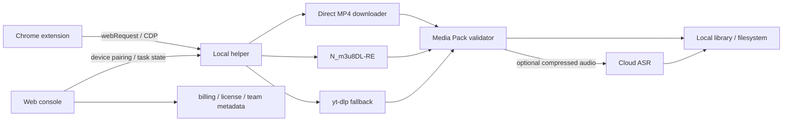

# 小红书视频下载能力商业化调研

日期：2026-07-17  
模式：Internal decision memo

## 结论

可以收费，但不建议做“输入任意小红书链接，返回无水印视频”的公开网站或 API。这个类别已经被免费工具压到接近零价格，同时要持续承担反爬、验证码、账号风控、版权投诉和平台协议风险。即使解析体验比现有网站快一点，也难形成可持续优势。

更值得验证的产品类别是：

> 帮创作者、研究者和内容团队，把自己有权使用的公开视频、录音和原始素材，变成可搜索、可引用、可交给 AI 继续处理的内容资产。

小红书下载应当是入口适配器，不应成为产品名称和唯一价值。产品主交付应是一个带来源信息的 Media Pack：原媒体或本地文件引用、音频、逐字稿、字幕、章节、封面、作者与来源 URL、原文件 hash，以及可供 AI/知识库消费的 JSON/Markdown。最有辨识度的交付形态是“Save to AI”，而不是“去水印下载”。

如果只想快速验证付费，做本地优先的 Chrome 扩展或桌面助手，卖一次性授权或低价订阅。若要开放给开发者消费，API 只接收客户上传文件、客户控制的签名 URL 或正式授权 connector；不要承诺“任意小红书 URL 永久可解析”。

## 竞品实测

### AnyToCopy

[AnyToCopy 小红书工具](https://www.anytocopy.com/xiaohongshu)把下载、音频提取、逐字稿、Live 图、批量 ZIP 和 API 放在同一个产品中。实际提交一条公开小红书链接后，页面立即要求登录，用户在看到任何解析结果前就遇到注册门槛。

它的产品价值已经不只下载。[帮助文档](https://www.anytocopy.com/help)列出的结果包括标题、正文、视频、MP3、逐字稿、封面和图集；视频转写按月度时长消耗额度。其[视频 API 文档](https://www.anytocopy.com/account/api/docs)采用异步任务、API Key/Secret 和轮询查询，且只对专业版开放。当前[价格页](https://www.anytocopy.com/pricing)显示标准版 ¥24.8/月起，专业版 ¥129/月起；但 API 文档的并发示例为 5，价格页却写 10，公开合同存在不一致。

它的“批量”也需要准确理解：首页主要指单笔记内多媒体 ZIP，价格页指并发任务，API 仍只有单个 `workUrl`，并没有真正的多 URL batch endpoint。

可以超越的地方：先给结果再要求登录；公开显示任务状态、清晰度、预计文件大小、转写成本和失败原因；API 使用标准状态码、幂等键、Webhook 和明确的保留策略。

### KuKuTool / MaxHelper

[KuKuTool 小红书解析](https://dy.kukutool.com/xiaohongshu)在未登录状态下约 2.5 秒完成同一链接解析，直接给出：

- 普通视频：74.4 MB；
- 超高清视频：1559.9 MB；
- 音频提取、图片下载、复制直链和批量 ZIP。

它的 FAQ 明确说明通过广告维持免费服务，页面实际也有明显广告。当前“批量解析”入口跳到 [MaxHelper 批量工具](https://www.maxhelper.app/zh/batch)，一次支持最多 20 条链接，但 FAQ 明确将其列为订阅高级功能；两站是否属于同一主体尚未核实。这个体验已经证明：单条下载、质量选择、音频提取和单笔记内 ZIP 都不再是可收费差异。

可以超越的地方：无广告、任务队列、断点续传、重复检测、真实质量说明、下载后可播放性校验，以及失败后的自动续接。不过这些改进更像“更好的下载器”，仍然不足以建立长期付费理由。

### MediaClaw

[MediaClaw](https://mediaclaw.app/)是目前最接近完整收费产品的竞品。它已经覆盖小红书和抖音的内容采集、评论、客资、关键词、竞品监控、无水印下载、OCR、带时间戳逐字稿、CSV/Markdown 和飞书同步。

其[价格页](https://mediaclaw.app/pricing)显示，免费版开放单篇采集和下载；个人版根据周期约 ¥24–33/月，团队版约 ¥57–89/月，并通过积分计费逐字稿、OCR 和 AI 分析。Chrome 商店当前显示约 [370 位用户、1 个评分](https://chromewebstore.google.com/detail/mediaclaw-%E7%A4%BE%E5%AA%92%E8%99%BE%EF%BD%9C%E5%B0%8F%E7%BA%A2%E4%B9%A6%E6%8A%96%E9%9F%B3ai%E8%BF%90%E8%90%A5%E5%B7%A5/ihclbgfnkclacfkbedkdnbpmkcdaccje?authuser=0&hl=zh-CN)。这证明有人愿意为工作流付费，但公开安装量仍属于早期信号，不能据此推断市场已经很大。

MediaClaw 已经占据“新媒体运营采集分析工具”的位置。若继续做评论获客、竞品监控、爆款仿写和飞书同步，只会进入正面功能竞赛。更合理的差异是转向知识工作者和 AI 开发者：强调逐字稿可核对、原片定位、引用与 provenance、跨工具输出，以及本地 API/MCP。

### RednotePro

[RednotePro Chrome 扩展](https://chromewebstore.google.com/detail/rednotepro-watermark-free/geehfibobbpljdomnngjedmlkkpnndim?hl=zh-CN)提供本地处理、原图/源视频、Live Photo、搜索结果排序、批量下载和 Excel 导出，采用免费基础版加 Pro 订阅。商店当前只有约 46 位用户且无评分，进一步说明“本地下载插件”容易做出来，付费规模仍需验证。

### 纯 API 与长视频转写基线

[xiaohongshu.day API](https://xiaohongshu.day/api/docs)公开售价为 ¥60/2000 次，约 ¥0.03/次，说明纯解析 API 已进入低价竞争。[DouSnap](https://www.dousnap.com/)用同一条约 30 分钟视频测试时，5 秒内先返回媒体信息，但转写在 55 秒后仍未完成。这里最明显的产品机会不是“再快 1 秒解析”，而是媒体先交付、转写后台持久运行、完成通知、阶段与 ETA、失败续接。

## GitHub 可复用能力

### 推荐主线

#### arnoldhao/xiadown

[xiadown](https://github.com/arnoldhao/xiadown)是最接近目标架构的开源项目：Go + Wails + React，真实浏览器 CDP 捕获用于小红书、抖音、TikTok 等站点，`yt-dlp` 处理更通用的平台。仓库当前约 581 stars，采用 [Apache-2.0](https://github.com/arnoldhao/xiadown/blob/main/LICENSE)，允许商业修改和分发，但需要保留许可证、版权声明并标注修改。

值得复用或 clean-room 改写的层：

- [CDP session 与 response capture](https://github.com/arnoldhao/xiadown/blob/main/internal/application/library/service/resource_sniff.go)；
- [小红书 response adapter](https://github.com/arnoldhao/xiadown/blob/main/internal/application/library/service/resource_site_xiaohongshu.go)；
- 请求头保留、候选媒体评分、多格式信息抽取和 SSRF/session 测试。

风险是项目历史只有约三个月，主要由单作者推动，Wails v3 alpha 和完整资源库 UI 不应整仓继承。建议只吸收捕获层和 adapter，外围任务合同、测试、更新机制自行设计。

#### yt-dlp

[yt-dlp](https://github.com/yt-dlp/yt-dlp)当前约 178k stars，采用 [Unlicense](https://github.com/yt-dlp/yt-dlp/blob/master/LICENSE)，商业复用友好，适合承担多平台 extractor、格式选择、合并、字幕和元数据处理。

小红书不能依赖它作为唯一主链路。官方 issue 已记录 [initial state 提取失败和 CAPTCHA](https://github.com/yt-dlp/yt-dlp/issues/13578)，并且还有最高质量和 Rednote 域名迁移问题。正确位置是 fallback 和通用站点引擎，小红书主链路使用用户真实浏览器会话。

#### N_m3u8DL-RE

[N_m3u8DL-RE](https://github.com/nilaoda/N_m3u8DL-RE)支持 HLS、DASH、MSS、直播、重试、并发、headers、代理、字幕和 mux，采用 [MIT License](https://github.com/nilaoda/N_m3u8DL-RE/blob/main/LICENSE)。捕获到 `m3u8` 或 `mpd` 后，可以把它作为可替换的下载引擎；直接 MP4 仍建议用自研的 range/resume/checksum downloader。

### 只参考，不直接嵌入闭源产品

- [XHS-Downloader](https://github.com/JoeanAmier/XHS-Downloader)：约 11.9k stars，CLI、API、MCP、Docker、Live Photo、断点续传都很完整，但采用 [GPL-3.0](https://github.com/JoeanAmier/XHS-Downloader/blob/master/LICENSE)。分发衍生闭源客户端会产生 copyleft 义务。README 也已经标记浏览器 Cookie 读取功能失效，说明解析层维护成本持续存在。
- [cat-catch](https://github.com/xifangczy/cat-catch)：成熟的浏览器资源嗅探 UX 与 `m3u8` 流程参考，同样是 GPL-3.0。
- [res-downloader](https://github.com/putyy/res-downloader)：Apache-2.0，但主路径依赖本地代理、根证书和 TLS MITM。大众用户安装、企业设备策略、卸载清理和安全信任成本过高，不适合默认体验。
- [Syzygy](https://github.com/MartianDovah/syzygy_downloader)：README 宣称视频深度捕获，但核心闭源且仓库没有明确许可证，不能当作可复用源码。

商业客户端还需要对 `yt-dlp` 的可选依赖和 FFmpeg build 做 SBOM。FFmpeg 应使用许可证边界明确的构建，或作为用户环境中的独立工具，不要未经检查直接打包。

## 产品与合规边界

这部分不是正式法律意见。上线前需要熟悉互联网平台与著作权的中国律师复核服务协议、隐私政策、宣传文案和实际数据流。

### 为什么公开下载 API 风险高

小红书用户协议的公开镜像写明，未经书面许可不得复制、读取、采用、统计平台内容和相关数据，不得销售、商业使用或向第三方提供；并将盗链、非法抓取、模拟下载和深度链接列为禁止行为。正式上线前应从 App 或官网入口重新核验现行正文：[协议镜像](https://www.elawcn.com/agreement/2026/0301/1751.html)。

[《中华人民共和国著作权法》](https://www.npc.gov.cn/c2/c30834/202011/t20201119_308796.html)把数字化复制纳入复制权，并对技术措施作出限制。个人学习、研究或欣赏的合理使用边界，不能直接推导为公开商业服务的免责依据。

最高人民法院披露过与小红书下载工具直接相关的案例：[带水印批量下载图片、笔记，仅提高下载效率，法院未认定构成不正当竞争；修改视频 MD5 并引导跨平台搬运的视频助手则被判构成不正当竞争，赔偿 15 万元](https://www.court.gov.cn/zixun/xiangqing/439991.html)。这说明工具不会仅因“能下载”自动违法，但产品能力、宣传、获利方式和主要用途会改变风险判断。

产品应明确删除：去作者标识、改 MD5 规避查重、伪原创/搬运宣传、一键跨平台分发、按作者或榜单大规模抓取、绕过 CAPTCHA/付费墙/私密权限/DRM，以及返回长期可复用第三方 CDN 地址。

### 本地优先降低什么，不能消除什么

本地扩展让媒体从来源站直接进入用户设备，Cookie 和 token 不上传，能减少服务器带宽、侵权副本留存和共享账号封禁风险，但不能消除平台协议与用户用途风险。

Chrome 官方提供三层实现能力：[`webRequest`](https://developer.chrome.com/docs/extensions/reference/api/webRequest)观察请求、[`downloads`](https://developer.chrome.com/docs/extensions/reference/api/downloads)发起和监控下载、[`debugger`](https://developer.chrome.com/docs/extensions/reference/api/debugger)通过 CDP 读取 Network 事件。优先使用最小权限的 `webRequest`，CDP 作为用户主动开启的 fallback。Chrome 商店要求即使数据只在本地处理，也要披露网站内容与浏览活动的处理，并要求扩展只为明确的用户可见功能使用这些数据：[User Data Policy](https://developer.chrome.com/docs/webstore/program-policies/user-data-faq)。

## 应该卖什么

### 推荐定位：Local-first Media Inbox for AI

用户把有权使用的媒体保存为一个可交给人和 AI 继续工作的标准包：

```text
Media Pack
├── source.json        # 来源、作者、发布时间、URL、获取方式
├── media.*            # 本地文件或客户控制的对象存储引用
├── audio.m4a
├── transcript.json    # 词级时间戳、置信度、说话人
├── transcript.srt
├── transcript.md
├── chapters.json
├── cover.*
└── integrity.json     # 原文件 hash、时长、编码、验证状态
```

对用户的核心承诺不是“无水印”，而是：

> 给我一个我有权使用的链接或文件，几分钟后得到可搜索、可引用、能定位回原片、能交给任何 AI 的内容资产。

目标用户优先顺序：

1. 需要归档自己多平台内容的创作者和团队；
2. 需要把公开访谈、课程、播客和行业视频送进知识库的研究者；
3. 需要标准 media-to-text contract 的 AI 开发者；
4. 内容营销团队，但仅处理已授权或自有素材。

### 如何明显超过现有体验

1. **先完成第一条任务，再登录。** 首次使用零注册、无广告；完成后再询问是否同步历史。
2. **结果透明。** 下载前显示 H.264/H.265、分辨率、码率、真实体积、预计时间和来源；避免只写“高清/超高清”。
3. **三段 fallback。** 纯解析 → 已登录浏览器 CDP → 用户完成 CAPTCHA 后自动续接；每一步都有明确失败原因。
4. **交付可核验。** 下载后校验时长、音轨、完整性和可播放性，转写内容可点击定位到原片时间点。
5. **术语与转写质量。** 支持自定义 glossary、词级时间戳、低置信片段标记、说话人、双语字幕和人工修订。
6. **标准输出合同。** 一键导出 JSON、Markdown、SRT、VTT、Notion/Obsidian/飞书，并提供本地 REST API、CLI、MCP 和 Webhook。
7. **素材不是黑箱。** 永久保留来源、作者、水印、hash 和处理历史，帮助用户证明它来自哪里、做过什么变换。
8. **本地默认。** 视频默认不经过服务器；只有用户主动选择云转写时才上传压缩音频，并明确保留期限。

其中 1–4 是首版必须做到的体验，5–8 才构成长期付费价值。

## 技术架构



浏览器扩展只做用户主动触发的页面发现；本地 helper 负责下载、续传、转码、校验和文件落盘；云端只做授权、计费、设备同步和可选 ASR。平台 adapter、下载 engine 和转写 engine 都放在稳定接口后面，可以单独更新和熔断。

对外 API 分成两类：

- Cloud Media API：只接客户上传文件、客户签名 URL 和正式授权 connector。
- Local Capture API：调用已配对的本地设备，由用户浏览器完成页面访问和媒体保存；云端只拿任务状态，不承诺第三方平台解析 SLA。

## 收费与验证

建议先用低成本本地产品验证，而不是先建公网解析集群。

- 免费：每月 5 个 Media Pack，本地下载和基础元数据；
- Pro：¥29–49/月或 ¥199–299/年，包含一定转写时长、批量队列、知识库导出；
- Team：¥99–199/月，3–5 席、共享资产、权限和审计；
- 超额转写：¥0.06–0.12/分钟；
- Developer：本地 Capture SDK/MCP 按设备或团队授权；若仍要测试纯解析 API，应独立按量售卖并设置免费 credits、batch、幂等键和 Webhook，但不要把匿名“小红书解析次数”当作核心产品。

国内云 ASR 公开价格大约在每小时数元区间。例如[腾讯云录音文件识别](https://cloud.tencent.com/document/product/1093/35686)的套餐折算约 1.5–5 元/小时；本地直下视频后只上传压缩音频，可以把主要变量成本集中在转写上。

首轮验证门槛：

1. 访谈 20 位目标用户，其中至少 8 位每周需要处理 5 条以上视频；
2. 让 10 位用户连续使用两周，至少 5 位愿意支付 ¥29/月或 ¥99 一次性授权；
3. 在 100 条用户授权测试链接上达到 ≥90% 首次成功率，失败状态可解释，人工续接后 ≥97%；
4. 用户至少有 30% 的任务会继续使用逐字稿、原片定位、知识库导出或 API；如果用户只下载文件，付费理由仍然不足。

## 最终建议

不做公开的 AnyToCopy/KuKuTool 克隆，也不把“去水印”作为品牌核心。先做一个本地优先、跨平台、可被 AI 调用的 Media Inbox，首个小红书 adapter 用 `xiadown` 的 Apache-2.0 CDP 思路缩短研发时间，`yt-dlp` 和 `N_m3u8DL-RE` 放在可替换下载层。

真正的护城河不在解析算法。平台变化会不断抹平解析优势。能够积累的是：任务可靠性、错误续接、逐字稿质量、来源与原片定位、标准 Media Pack、用户自己的内容资产，以及被其他 AI 工作流调用的接口。

如果首轮用户只愿意为“下载成功”付费，应停止扩大投入；免费竞品与平台规则会让这条路长期处在低价格、高维护和高风险的组合中。
