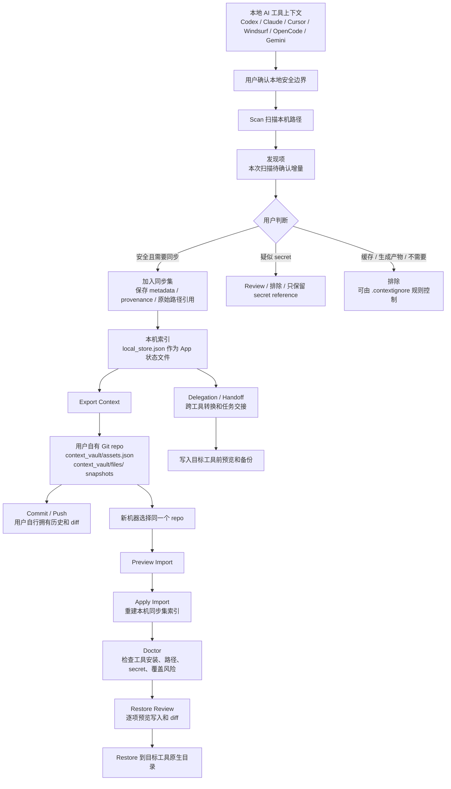

# AI Tool Environment Sync 产品方案

日期：2026-06-20

## 一句话定义

做一个 Mac App 优先、local-first 的跨工具 AI 工作环境同步产品，让用户在换电脑、换 AI 工具、重装环境之后，可以恢复自己的 rules、skills、MCP 配置、工具上下文、记忆摘要、会话交接和 secret 引用。

它不是 Rimbo，也不是金融产品；不是单纯的 memory sync，也不是另一个聊天记录备份工具。它的核心对象是“AI 工具环境”，目标是让 Codex、Claude Code、Cursor、Windsurf、OpenCode、Cline、Roo、Gemini CLI 等热门工具共享同一份可审计、可迁移、可恢复、可委派的个人上下文资产。

## 为什么值得做

AI 工具已经从单个聊天窗口变成个人工作环境。重度用户积累的不只是对话历史，而是一整套让 agent 真正好用的环境：

- 个人偏好：沟通方式、默认技术选择、工作习惯。
- 项目规则：`AGENTS.md`、Claude memory、Cursor rules、Windsurf rules、OpenCode instructions。
- Skills：Codex skills、Claude skills、自定义 workflow、工具调用说明。
- MCP 配置：server 列表、启动命令、权限、工具说明。
- Provider 配置：模型路由、默认模型、API gateway、成本策略。
- 运行上下文：近期任务、关键决策、项目路径、工作区状态、session handoff。
- 安全上下文：secret 名称、所需权限、缺失检查、恢复指引。

这些内容今天分散在每个工具、每台机器和每个项目目录里。换电脑时，代码仓库能迁移，但 AI 工具环境经常需要手工重配；换工具时，规则和 skills 也很难迁移。这个问题会随着 agent 使用强度提升变得更明显。

市场上已经有相邻产品验证需求：

- `memories.sh` 很接近“跨工具配置同步”，强在工具 adapter、原生配置生成、rules/skills/MCP 文件扫描。
- `memoir` 很接近“跨工具、跨机器的一份 AI memory”，强在 session continuity、decision registry、加密和 Git backup。
- `Memorix`、`Pieces`、Letta Context Repositories 分别验证了 MCP memory、OS-level memory、git-backed context 的方向。

但空位仍然存在：这些产品大多只覆盖 memory、rules、MCP 或某个工具生态的一段。我们要做的是把多工具 AI 环境整体变成一个可同步、可恢复、可审计的用户资产。

## 产品边界

### 要做什么

产品定位是 `AI Environment Passport` 或 `Context Vault`：

- 把分散在各 AI 工具里的上下文资产扫描出来；扫描结果仍指向原始本地路径，不复制成第二份本地上下文库。
- 在本机维护索引、选择状态、恢复记录和预览状态；用户确认后形成“同步集”。
- 支持平台数据库存储，但当前阶段不做平台数据库实现。
- 支持用户挂载自己的 GitHub repo 作为同步、备份和恢复来源。
- 第一版完全不向我们的服务器上报任何数据，存储只发生在用户本机和用户自己的 GitHub repo。
- 支持跨机器 clone、doctor、restore。
- 支持跨工具转换、注入和委派，例如把 Claude Code 的某个 skill 发送到 Codex，并转换成 Codex 可用格式。
- 支持 secret reference，而不是复制 secret 明文。
- 支持本地加密、冲突合并、审计 diff。

### 不做什么

第一阶段不要做这些：

- 不做完整聊天历史同步。最多保存 session summary、handoff 和关键决策。
- 不迁移浏览器 cookie、系统 token、工具登录态。
- 当前阶段不做平台数据库存储，只预留账号、同步和 schema 能力。
- 不把平台云端做成唯一 source of truth。
- 不做遥测、匿名统计、错误日志上传、扫描结果上传或资产摘要上传。
- 不做通用知识库或企业文档库。
- 不做团队协作平台，先解决个人跨设备和跨工具。
- 不自动复制 secret，只记录 secret reference 和恢复检查。

## 技术路线

第一版使用 Apple 原生技术栈实现 Mac App，而不是 Electron 或 Web wrapper。

### App 技术栈

- 语言：Swift。
- UI：SwiftUI 优先；必要时用 AppKit 补充系统级能力。
- 本地存储：SQLite 或 SwiftData，具体取决于 schema 复杂度和迁移需求。
- 文件扫描：Swift 文件系统 API + macOS sandbox/bookmark 权限。
- GitHub 同步：优先走 Git CLI 或 libgit2 包装层；OAuth / token 只保存 secret reference 或 Keychain item。
- Secret 存储：Keychain 只保存本机授权材料，不进入 context repo。
- 网络边界：第一版不连接我们的后端，不接 analytics，不接 crash reporting；网络只用于用户主动配置的 GitHub repo。
- 后台任务：LaunchAgent 或 App 内后台 watcher，第一版以显式扫描和用户确认优先。
- CLI 辅助：可以提供一个 Swift 写的 `context` helper，供 App 调用，也供高级用户自动化。

### 为什么不用 Electron

这个产品需要深度接触本机文件系统、Keychain、权限、后台监听、菜单栏、系统通知和本地工具目录。原生 Swift App 更适合做：

- 更自然的 macOS 权限体验。
- 更低的后台资源占用。
- 更可信的本地安全叙事。
- 更好的 Keychain、文件 bookmark、菜单栏和 Finder 集成。
- 更像一个“本机环境管理器”，而不是网页控制台。

### 原生 App 边界

Swift App 负责产品主体验和本地安全边界；跨工具 adapter、schema 转换和 GitHub 同步可以设计成清晰模块，未来必要时拆出 CLI 或跨平台 core。第一阶段不要为了跨平台牺牲 Mac App 的完成度。

## 目标用户

第一批用户是重度 AI coding 工具用户：

- 同时使用 Codex、Claude Code、Cursor、Windsurf、OpenCode、Gemini CLI、Cline/Roo 的开发者。
- 经常换电脑、重装系统、切工作区、开新项目的 agent power user。
- 维护个人 skills、MCP servers、项目规则和模型路由的人。
- 需要把 AI 工具环境沉淀成长期资产的独立开发者、研究者、技术负责人。

后续再扩到团队场景：

- 团队共享项目 agent rules。
- 团队标准 MCP 配置。
- 公司级 skill library。
- 安全策略、secret policy、tool permission policy。

## 核心用户故事

### Mac App 首次接入

用户安装 Mac App 后，App 自动扫描本机常见 AI 工具目录：

- Codex
- Claude Code
- Cursor
- Windsurf
- OpenCode
- Cline / Roo
- Gemini CLI

App 展示一个环境地图：

- 每个工具有哪些 rules、skills、MCP 配置和 memory。
- 哪些资产可以同步。
- 哪些资产疑似包含 secret，默认阻断。
- 哪些资产是运行时依赖或生成产物，默认不加入同步集。
- 哪些资产可以跨工具委派。
- 顶部 `Scan Local Environment` 是主题色高亮主操作；统计卡、接入进度、迁移路径和工具矩阵都应该是可点击入口，点击后进入对应审核、同步、恢复或工具筛选视图。

用户在 UI 中选择哪些发现项加入“同步集”。系统只在本机记录索引和选择状态；当用户绑定自己的 GitHub repo 后，安全资产会导出为可审计的 context repo。新机器恢复时，用户选择或输入同一个 repo，本机索引可以从 repo 重建。

### 新机器恢复

用户拿到一台新电脑后：

```bash
git clone git@github.com:me/ai-context.git
context import ./ai-context
context doctor
context restore --tools codex,claude,cursor
```

在主产品体验里，这个流程应该由 Mac App 承接：用户登录或选择自己的 GitHub repo，App 拉取 context，展示 doctor 结果，再让用户逐项确认恢复。CLI 作为高级入口和自动化能力保留。

系统告诉用户：

- 哪些 rules、skills、MCP 配置已经恢复。
- 哪些工具没安装。
- 哪些 secret 需要从 1Password、Keychain、Vault 或环境变量恢复。
- 哪些路径因为机器差异需要 remap。
- 哪些文件会覆盖本地内容，需要确认。

### 日常同步

用户在一台机器上新增 Codex skill、Claude command、Cursor rule 后：

```bash
context scan
context diff
context sync
```

系统把变更写入本机索引，并按用户选择同步到自己的 GitHub repo；平台数据库同步只预留接口，当前阶段不实现。其他机器可通过 Mac App 选择同一个 repo 拉取恢复，也可以通过 `context pull` 或 `context restore` 恢复。

Mac App 中对应的是后台监听和显式 review：发现本地工具上下文变化后，先进入“发现项”，用户确认加入“同步集”后才会导出到用户 Git repo。

### 用户上下文处理流程

用户看到的上下文分成三种状态：

- 发现项：本次扫描中尚待确认的上下文。它是增量 review 队列，不是全部上下文库；如果 App 刚启动但还没有重新扫描，这里可以为空。
- 同步集：用户已经确认要进入同步和恢复闭环的资产集合。它来自本机索引，也可以从用户 Git repo import 重建。
- Context repo：用户自有 Git repo 里的 durable copy。新机器恢复时，用户选择或输入这个 repo，App 从 `context_vault/assets.json` 和 `context_vault/files/` 重建同步集和恢复来源。

因此，“发现项为空、同步集很多”是合理状态：当前没有本次扫描待确认的增量，但本机索引里已经有很多资产进入同步集。需要查找新增或变化时，用户重新扫描；需要跨机器恢复时，用户绑定同一个 Git repo。



### 跨工具委派和迁移

用户在 Claude Code 里有一个可复用 skill，希望发送给 Codex 使用：

```bash
context delegate skill claude-code:review-pr --to codex
context restore --dry-run
context restore
```

Mac App 中对应的是从源工具资产列表里选择一个 skill、rule、MCP server 或 handoff，点击“发送到 Codex”。系统不会粗暴复制，而是先解析源资产，再转换成目标工具原生格式，并保留来源、转换说明和回滚点。

跨工具委派要支持几类对象：

- Skill 委派：Claude Code skill -> Codex skill，Codex skill -> Claude skill。
- Rule 委派：Cursor/Windsurf/OpenCode rule -> Claude/Codex instructions，并可生成 Gemini CLI `GEMINI.md` context artifact。
- MCP 委派：某工具 MCP config -> 另一工具可用 MCP manifest。
- Session 委派：一个工具的 session handoff -> 另一个工具的启动上下文。
- Project context 委派：项目规则和当前任务状态发送到目标工具。

### 会话交接

用户在 Claude Code 做完一轮架构分析，希望 Codex 接着实现：

```bash
context handoff add --from claude --workspace ~/project
```

Codex 启动时能读到：

- 当前目标。
- 已做判断。
- 待办。
- 风险。
- 相关文件。
- 不要重复踩的坑。

## 核心资产模型

产品要把 AI 环境拆成可管理的资产，而不是只同步文件。

| 资产 | 含义 | 示例 |
| --- | --- | --- |
| `rules` | 长期行为规则和项目约束 | `AGENTS.md`、Cursor rules、Claude memory |
| `skills` | 可复用能力和 workflow | Codex skill、Claude skill、自定义脚本 |
| `memory` | 长期偏好、事实、决策摘要 | 用户偏好、项目关键结论 |
| `sessions` | 会话交接和任务状态 | handoff、next actions、decision registry |
| `mcp` | MCP server 配置和能力描述 | server command、env refs、权限 |
| `tool_config` | 工具原生配置模板 | Codex、Claude、Cursor、OpenCode |
| `providers` | 模型和 API gateway 配置 | 默认模型、fallback、路由策略 |
| `secrets` | secret 引用和恢复检查 | `op://...`、Keychain item、env var name |
| `devices` | 设备差异和路径映射 | mac mini、laptop、work machine |
| `workspaces` | 项目路径和项目级上下文 | repo path、branch、dirty state summary |

## 存储设计

产品需要支持三层存储，但分阶段实现。

### 本机索引与同步集

本机索引是 Mac App 的内部状态，不是第二份本地上下文库。它负责保存扫描索引、用户选择的同步集、转换记录、doctor 结果、restore plan 和本机状态；原始上下文文件仍分散在各 AI 工具和项目目录中。

本机索引的职责：

- 记录哪些工具被扫描过。
- 保存同步集资产的 metadata、provenance 和原始路径引用。
- 保存 asset provenance。
- 保存跨工具委派记录。
- 保存本机路径映射和 restore 状态。
- 保存 secret reference，不保存 secret 明文。
- 在导入用户 Git repo 时重建本机同步集状态。

用户可见的 durable copy 不在另一个本地库里，而在用户自己绑定的 Git repo 中。App 可以备份本机索引，目的是回滚 import/restore 操作，不是替代用户 repo 成为长期 source of truth。

### 用户自挂 GitHub

用户可以绑定自己的 GitHub repo，把 context repo 作为同步和备份目标。这个能力是早期必须支持的，因为它保证用户拥有数据，也降低平台信任成本。

GitHub repo 的职责：

- 跨设备同步。
- 版本审计。
- 手动 diff / rollback。
- 用户自主备份。
- 迁移到其他工具或平台。

### 平台数据库

平台数据库是产品后续能力，当前阶段不做实现，但 schema 和 product flow 要预留。

平台数据库未来可以承担：

- 多设备状态同步。
- Mac App 登录态和设备列表。
- 可视化索引。
- 更好的冲突合并。
- 团队共享。
- marketplace / adapter registry。
- 端到端加密后的私有 context 备份。

但平台数据库不能成为唯一 source of truth。用户应该始终可以选择只用本机索引 + 自己的 GitHub repo；跨机器恢复必须能通过 repo 链接完成。

## Context Repo 设计

Context repo 是用户拥有的可选同步目标。平台可以提供 UI、索引、云协助和同步服务，但不能把云端黑盒数据库变成唯一真相源。

建议仓库结构：

```text
ai-context/
  manifest.json
  profile/
    preferences.md
    communication.md
    model-policy.md
  rules/
    global/
    projects/
  skills/
    codex/
    claude/
    shared/
  memory/
    facts.md
    decisions.md
    observations.jsonl
  sessions/
    handoffs/
    decision-registry.jsonl
  mcp/
    servers/
    manifests/
  tools/
    codex/
    claude-code/
    cursor/
    windsurf/
    opencode/
    gemini-cli/
    cline/
    roo/
  providers/
    model-routing.json
  secrets/
    references.json
    policy.md
  devices/
    xuhao-macbook.json
    office-mac-mini.json
  workspaces/
    context-infrastructure.json
```

`manifest.json` 示例：

```json
{
  "schema_version": "0.1.0",
  "owner": "xuhao",
  "created_at": "2026-06-20",
  "sync_policy": {
    "default_visibility": "private",
    "secret_mode": "reference_only",
    "generated_files": "exclude",
    "runtime_dependencies": "manifest_only"
  },
  "tools": {
    "codex": { "enabled": true, "adapter_version": "0.1.0" },
    "claude_code": { "enabled": true, "adapter_version": "0.1.0" },
    "cursor": { "enabled": true, "adapter_version": "0.1.0" }
  }
}
```

secret reference 示例：

```json
{
  "id": "github_token",
  "type": "env",
  "name": "GITHUB_TOKEN",
  "required_by": ["mcp/github", "tools/claude-code"],
  "restore": {
    "provider": "1password",
    "ref": "op://Private/GitHub Token/token"
  },
  "policy": {
    "store_plaintext": false,
    "required_on_restore": true
  }
}
```

## 系统架构

整体分成八层。

### 1. Scanner

负责扫描当前机器和项目中的 AI 工具环境：

- `~/.codex`
- `~/.claude`
- `~/.cursor`
- `~/.windsurf`
- `~/.opencode`
- `~/.cline`
- `~/.roo`
- `~/.gemini`
- 项目内 `AGENTS.md`、`.cursor/rules`、`.claude`、`.mcp.json`

Scanner 只做发现和读取，不做判断。

### 2. Policy Engine

负责判断哪些内容应该同步、排除、加密、只做 manifest：

- generated 文件默认排除。
- runtime dependency 默认只记录 manifest，不同步 `node_modules`。
- secret 默认只保存 reference。
- 项目私有规则可以进入 encrypted 区域。
- 可公开 skills 可以进入 plaintext 区域。

### 3. Normalizer

把各工具原生格式转成统一 schema：

- Cursor rules -> canonical rules。
- Claude skills -> canonical skills。
- Codex skills -> canonical skills。
- 各工具 MCP config -> canonical MCP server manifest。
- session summary -> canonical handoff。

### 4. Repo Manager

负责本机索引、用户 GitHub repo 和未来平台数据库之间的数据同步：

- 写入 normalized assets。
- 生成 diff。
- commit。
- pull/push。
- conflict detection。
- schema migration。
- encrypted file handling。
- platform sync adapter。

第一阶段本机索引服务于 App 状态和预览，用户 GitHub repo 是 durable 同步和恢复来源。平台数据库只做预留，不进入 MVP 实现。

### 5. Restore Engine

把 canonical schema 写回目标工具：

- 生成 Codex skills。
- 生成 Claude skills 和 commands。
- 生成 Cursor rules。
- 写 MCP config。
- 做路径 remap。
- 做覆盖前 dry-run。
- 对已有本地文件做三方 merge 或备份。

### 6. Delegation Engine

负责跨工具上下文委派：

- 识别源工具资产类型。
- 检查目标工具是否支持该资产。
- 生成目标工具原生格式。
- 标记转换损耗和人工确认项。
- 记录来源、版本、转换规则和回滚信息。
- 支持从 Mac App UI 发起，也支持 CLI 自动化。

### 7. Doctor

这是产品体验的关键，不只是 `sync`。

Doctor 要回答：

- 当前机器装了哪些工具。
- 哪些工具缺失。
- 哪些配置可恢复。
- 哪些 secret 缺失。
- 哪些 MCP server command 不可执行。
- 哪些 skill 依赖缺失。
- 哪些路径需要 remap。
- 哪些本地文件会被覆盖。
- 哪些仓库 schema 需要升级。

### 8. MCP Bridge

让各 AI 工具可以直接读写这份 context：

- 查询用户偏好。
- 查询项目规则。
- 写入 session handoff。
- 写入 decision。
- 请求添加 memory。
- 读取当前工具可用 skills。

MCP Bridge 不替代本机索引、用户 GitHub repo 或未来平台数据库，只是 runtime access layer。

## 安全设计

这个产品必须默认安全，否则跨工具同步会变成风险放大器。

### 最高优先级：零感知、零上报

用户使用这个 App 的前提是：他不希望自己的 AI 工具环境被平台感知。我们不能知道用户有哪些工具、有哪些 skills、有哪些 rules、有哪些 MCP、有哪些项目路径，也不能知道他是否同步成功。

第一版实现必须遵守：

- 不向我们的服务器上传任何数据。
- 不采集匿名统计。
- 不上传错误日志。
- 不上传扫描结果。
- 不上传资产摘要、文件名列表、工具列表或目录结构。
- 不上传 doctor 结果、restore 结果或同步状态。
- 不接入第三方 analytics / crash reporting SDK。
- 不默认请求平台账号。
- 网络请求只用于用户明确配置的目标，例如用户自己的 GitHub repo。

存储边界必须清楚：

```text
用户本机索引
  -> 用户自己授权的 GitHub repo
  -> 未来用户显式选择的平台数据库

第一版没有平台数据库写入，也没有任何遥测回传。
```

这不是可配置项，而是第一版产品信任基础。后续即使引入平台数据库，也必须是用户显式打开、端到端加密、可审计、可关闭的能力。

安全原则：

- Local-only by default：默认所有数据只进入本机；用户 GitHub repo 是用户主动选择的同步目标，平台数据库是后续显式 opt-in 能力。
- User-owned：用户能完整看到仓库内容和 diff。
- Secret reference only：默认不保存 secret 明文。
- Dry-run first：任何写回工具配置前都要先展示计划。
- No telemetry：不做默认遥测，也不做匿名遥测。
- Local audit log：只在本机记录哪些工具读写了哪些 context，不上传。

数据分级：

| 级别 | 存储方式 | 示例 |
| --- | --- | --- |
| Plaintext | Git 明文 | 公开 skill、通用 rules、模板 |
| Private | Git 加密文件 | 私人偏好、项目 memory、session handoff |
| Reference | 只存引用 | API key、token、cookie、SSH key |
| Cache | 不入 Git | embedding index、扫描缓存、临时 diff |

secret 检查需要作为默认门禁：

- 扫描疑似 token、password、cookie、api key。
- 写入前阻断或要求显式确认。
- 支持 `.contextignore` 和 `secrets/policy.md`。
- restore 时检查 secret 是否可解析，但不读取明文输出到日志。

## 与竞品的差异

### 对比 memories.sh

`memories.sh` 强在跨工具 adapter、配置生成和文件同步目标，适合借鉴。

我们的差异：

- 它的中心是 memory store 和 generated config。
- 我们的中心是 Mac App 管理的本机索引与用户自挂 GitHub repo；repo 才是跨机器恢复入口。
- 它更像 `memory -> generate configs`。
- 我们更像 `scan -> normalize -> sync -> doctor -> restore`。
- 我们把 secret reference、device restore、conflict、doctor 作为产品核心，而不是附属功能。

### 对比 memoir

`memoir` 强在 memory continuity、decision registry、session handoff、加密和多设备同步。

我们的差异：

- 它的中心是 memory。
- 我们的中心是完整 AI tool environment。
- 它不以同步 `~/.codex/skills`、`.claude/skills`、`.cursor/rules`、MCP manifests、tool permissions 为主。
- 我们需要吸收它的 session 和 encryption 思路，但扩展到 environment portability。

### 对比 Pieces / Letta / Memorix

这些产品分别偏 OS-level memory、agent context repository、MCP memory layer。

我们的差异：

- 更偏个人 AI 工具环境迁移。
- 更强调原生工具配置恢复。
- 更强调 Mac App 可视化管理、本地优先、用户自挂 GitHub repo 和可审计 diff。
- 更强调跨工具 rules/skills/MCP 的可转换性。

## 业界项目可借鉴能力清单

前面调研过的项目里，有些能力可以直接成为我们的设计输入。这里要明确“借什么”和“不借什么”，避免产品中心被竞品带偏。

### memories.sh

最值得借鉴的是跨工具 adapter 和文件目标清单。

可借鉴：

- Tool registry：记录 Claude Code、Cursor、Windsurf、Codex、OpenCode、Cline、Gemini、Roo 等工具的全局路径、项目路径、MCP config 路径和生成目标。
- Sync targets：把 `.agents`、`.claude`、`.cursor`、`.codex`、`.windsurf`、`.cline`、`.gemini`、`.roo`、`.opencode` 等目录纳入扫描范围。
- Dry-run / apply 语义：任何导入、写回和恢复前先展示计划。
- Optional config 默认排除：高风险配置默认不进入同步集，用户显式选择后才纳入。
- Redact / secret key 检测：按 `token`、`secret`、`password`、`api_key`、`cookie` 等字段识别敏感信息。
- Generated config adapters：从 canonical instructions / skills 生成各工具原生配置。

不直接照搬：

- 不把 SQLite/cloud memory store 当产品中心。
- 不把“memory -> generate configs”作为主流程。
- 不递归同步 skill 目录里的运行时依赖和大量 reference 文件。
- 不使用它的 Vault 作为 secret 方案中心；我们只保存 secret reference，并优先接 Keychain / 1Password / env。

在我们的产品中，`memories.sh` 更像 adapter reference，不是产品模型 reference。

### memoir

最值得借鉴的是 session continuity、decision registry、加密和多设备 merge 思路。

可借鉴：

- Session handoff：把目标、已做判断、next actions、风险和相关文件打包成可交接上下文。
- Decision registry：长期保留关键决策、rationale 和影响范围。
- Machine-aware merge：多设备同时修改 context 时不要简单覆盖。
- AES-256-GCM / user key 思路：私密 memory 和 session 不应在同步目标里明文保存。
- Workspace restore：记录 workspace path、git remote、branch、dirty state summary，帮助新机器恢复项目上下文。
- Secret scanning：写入前阻断疑似敏感信息。

不直接照搬：

- 不把产品做成 memory continuity 工具。
- 不只覆盖 memory / session，而要覆盖 rules、skills、MCP、tool config、secret reference 和 restore。
- 不接受默认 telemetry；我们的默认策略应是 no telemetry。
- 不使用“清空 staging repo 再复制”的 Git provider 方案，避免误删和不可解释变更。

在我们的产品中，`memoir` 更像 session / encryption / merge reference。

### Memorix

可借鉴：

- MCP memory layer：让多工具通过 MCP 访问同一份 context。
- Workspace sync：按 workspace 组织 agent memory 和任务状态。
- Dashboard 思路：给用户一个能看见 memory / context 状态的界面。

不直接照搬：

- 不把 MCP memory server 作为唯一产品形态。
- 不只做 cross-agent memory，要把工具原生环境恢复作为主线。

### Pieces

可借鉴：

- OS-level context capture 的产品心智：用户的工作流上下文不只存在于某个 AI 工具里。
- 本地优先和跨工具接入：通过本机服务连接不同工具。
- 对“最近工作上下文”的召回体验。

不直接照搬：

- 不做全系统级 activity capture。
- 不做浏览器历史、剪贴板、文件活动等宽泛采集。
- 不让产品变成泛个人知识库。

### Letta Context Repositories / Beads

可借鉴：

- Git-backed context 的长期可审计性。
- Context repository schema versioning。
- JSONL decision / event log。
- Branch-aware memory：agent 在不同分支、不同任务中保留不同上下文。

不直接照搬：

- 不绑定某一个 agent runtime。
- 不把 Git repo 作为唯一 UI 入口；我们的主体验是 Mac App，但 durable 同步和恢复来源是用户可控 GitHub repo，本机只维护索引和操作状态。

### CtxVault

可借鉴：

- Typed vault：把 semantic memory、skill memory、tool config、secret reference 分成不同 vault。
- Scope isolation：不同工具、项目、隐私级别之间有结构边界，而不是只靠 metadata filter。

不直接照搬：

- 不做纯 memory infrastructure。
- 不让 vault 抽象压过 Mac App 的可视化环境管理体验。

### 借鉴后的产品组合

最终组合应该是：

```text
memories.sh 的工具 adapter 和 dry-run/apply
memoir 的 session handoff、decision registry、encryption、merge
Memorix 的 MCP runtime access
Pieces 的本机环境感知
Letta / Beads 的 git-backed context 和 event log
CtxVault 的 typed vault / scope isolation

再加上我们的 Mac App-first、本机索引、用户自挂 GitHub、跨工具委派体验
```

这意味着第一版要优先做“可见、可控、可恢复、可委派”，而不是优先做一个更大的 memory engine。

## MVP 方案

MVP 的目标不是覆盖所有工具，而是验证“新机器恢复一套 AI 工具环境”是否足够强。

### MVP 支持工具

优先支持：

- Codex
- Claude Code
- Cursor
- Windsurf
- OpenCode

第二批：

- Cline
- Roo
- Gemini CLI
- GitHub Copilot CLI / agents

### MVP 支持资产

第一版只做高价值、低风险资产：

- global instructions / rules。
- project `AGENTS.md` 和工具 rules。
- Codex skills、Claude skills、shared skills。
- MCP server manifests。
- provider/model routing 配置模板。
- session handoff 和 decision registry。
- secret references。

暂不做：

- 完整聊天记录。
- 本地 embedding index。
- 浏览器历史和 cookie。
- 运行时依赖目录。
- 复杂团队权限。

### MVP Mac App

第一版产品入口是 Mac App，不是纯 CLI。CLI 作为 App 的底层能力、调试入口和高级自动化入口保留。

MVP 必须使用 Swift 原生实现：

- SwiftUI 做主界面。
- AppKit 只在文件权限、菜单栏、系统集成等 SwiftUI 不够的地方补充。
- 本地扫描、同步集索引写入、GitHub 同步、Doctor、Delegation 都作为 Swift 模块组织。
- CLI helper 可以复用同一套 Swift core，避免 App 和 CLI 两套逻辑。

Mac App 第一版需要有这些界面：

- Environment Map：展示本机已安装 AI 工具和可同步资产。
- Discovered Items：展示新发现的 rules、skills、MCP config、handoff；原始文件仍留在原路径。
- Sync Set Assets：展示用户确认要进入 repo 同步闭环的资产。
- Asset Detail：展示资产来源、目标工具兼容性、secret 风险、同步策略。
- Delegation Panel：选择一个资产并发送到另一个工具。
- Doctor：展示当前机器恢复状态、缺失工具、缺失 secret、路径 remap 和冲突。
- Restore Review：恢复前展示将写入哪些文件、是否覆盖、是否备份。
- Storage Settings：绑定用户 GitHub repo、管理本机索引备份，预留平台账号入口。

底层仍建议保留命令：

```bash
context init
context scan
context diff
context sync
context doctor
context restore
context delegate
context translate
context handoff
```

命令语义：

- `context init`：初始化本机索引，并可选绑定 context repo。
- `context scan`：扫描当前机器和项目。
- `context diff`：展示将写入本机索引或 GitHub repo 的变更。
- `context sync`：写入本机索引，并按设置同步到用户 GitHub repo 或未来平台数据库。
- `context doctor`：检查当前机器恢复条件。
- `context restore`：从本机同步集索引或 GitHub repo 写回工具原生配置。
- `context delegate`：把 skill、rule、MCP 或 handoff 从一个工具发送到另一个工具。
- `context translate`：跨工具规则和 skill 转换。
- `context handoff`：写入会话交接。

### MVP 成功标准

必须能完成一个真实场景：

1. 在旧机器扫描 Codex、Claude Code、Cursor 的 rules、skills、MCP 配置。
2. 写入本机索引中的同步集，并可选同步到用户自己的 GitHub repo。
3. 在新机器 Mac App 中挂载同一个 GitHub repo。
4. Doctor 能列出缺失工具、缺失 secret、路径差异。
5. Restore Review 能展示会写哪些文件。
6. Restore 能恢复至少 Codex、Claude Code、Cursor 的核心配置。
7. Mac App 能把一个 Claude Code skill 委派到 Codex，并生成 Codex 可用格式。
8. AI 工具启动后能读到用户规则、项目规则和至少一个 shared skill。

## 迭代路线

### Phase 0：验证和设计收束

状态：已经完成初步调研和两个关键竞品 spike。

继续补齐：

- 定义本机索引 schema v0 和 context repo schema v0。
- 明确 adapter 抽象。
- 决定 Mac App 信息架构和 CLI 辅助命令命名。
- 确定 license 复用边界。
- 整理 `.contextignore` 默认规则。

输出：

- local index schema draft。
- context repo schema draft。
- adapter interface。
- scan report 示例。
- restore plan 示例。

### Phase 1：Mac App 本地扫描和同步集确认

目标：Mac App 能扫描当前机器的 AI 工具环境，并把用户确认的资产写入本机同步集索引。

能力：

- Mac App 基础壳。
- Environment Map。
- Discovered Items。
- Sync Set Assets。
- `context init`
- `context scan`
- `context diff`
- 本机索引写入。
- Codex、Claude Code、Cursor adapter。
- secret scanner。
- generated/runtime ignore。

验收：

- 能扫描当前机器真实 `~/.codex/skills`、`.claude`、`.cursor/rules`。
- 能生成清晰 diff。
- 不把 secret 明文写入本机索引或 GitHub repo。
- 不产生任何平台上报请求。
- 不接入 analytics / crash reporting SDK。
- 不把 `node_modules`、缓存、生成文件误同步。

### Phase 2：用户 GitHub 挂载、恢复和 Doctor

目标：完成“旧机器扫描 -> 用户 GitHub repo -> 新机器恢复”的闭环。

能力：

- GitHub repo 挂载。
- Storage Settings。
- `context import`
- `context doctor`
- `context restore --dry-run`
- `context restore`
- 路径 remap。
- 覆盖保护。
- secret reference 检查。
- MCP server command 检查。

验收：

- 新机器 Mac App 从用户 GitHub repo 恢复 Codex、Claude Code、Cursor 核心环境。
- Doctor report 足够具体，不只说 pass/fail。
- restore 默认可逆，有 backup。

### Phase 3：跨工具委派和 MCP Bridge

目标：从“同步文件”升级为“跨工具上下文委派层”。

能力：

- Delegation Panel。
- Claude Code skill -> Codex skill。
- Codex skill -> Claude skill。
- Cursor rules -> Codex/Claude instructions。
- MCP config 跨工具委派。
- Session handoff 跨工具委派。
- MCP server 提供 context query/write。
- AI 工具可写入 decision 和 handoff。

验收：

- 同一条用户规则能在至少三个工具中生效。
- 一个 Claude Code skill 能通过 Mac App 发送到 Codex 并可用。
- 一个工具写入的 handoff 能被另一个工具读取。
- 用户可以审计工具写入了什么。

### Phase 4：加密、多设备冲突和长期记忆

目标：让它成为真正跨设备长期系统。

能力：

- encrypted private files。
- user key management。
- multi-device conflict resolution。
- decision registry。
- session handoff timeline。
- memory promotion：从 session summary 提炼长期 memory。

验收：

- 两台机器同时修改 context 后可合并。
- 私密 memory 在本机索引、用户 GitHub repo 或未来平台数据库中都不可明文读取。
- 用户能选择哪些 memory 进入长期层。

### Phase 5：Mac App 产品化和 onboarding

目标：降低使用门槛。

能力：

- 可视化扫描结果。
- 工具环境健康检查。
- restore plan review。
- secret setup guide。
- conflict resolution UI。
- tool coverage dashboard。

验收：

- 非 CLI 重度用户也能完成第一次迁移。
- 用户能清楚看到“哪些被同步、哪些被排除、为什么”。

### Phase 6：团队和生态

目标：从个人工具扩展到团队基础设施。

能力：

- team rules。
- org skill library。
- shared MCP manifests。
- policy enforcement。
- private registry。
- marketplace 或 community adapter。

验收：

- 团队可以分发标准 agent 环境。
- 个人 context 和团队 policy 可以合并但边界清晰。
- 企业能审计同步内容和工具权限。

## 关键设计原则

### 本地优先，GitHub 用户可控，平台数据库后置

第一阶段的主体验是 Mac App + 本机索引 + 用户自挂 GitHub repo。用户可以挂载自己的 GitHub repo 作为同步、备份、审计和恢复目标。平台数据库是后续能力，当前不做，但 schema 和同步协议要预留。即使未来支持平台数据库，用户也应该能选择只使用本机索引 + 自己的 GitHub repo，并能通过 repo 链接在新机器恢复。

### 文件同步不等于环境恢复

只把 `.codex`、`.claude`、`.cursor` 目录复制到新机器并不够。真正需要的是：

- 知道文件含义。
- 知道依赖关系。
- 知道 secret 缺什么。
- 知道路径如何 remap。
- 知道写回目标工具是否安全。
- 知道恢复后是否真的可用。

### Secret 永远只做 reference

secret 是环境的一部分，但不能作为同步内容。产品要同步的是：

- 需要哪个 secret。
- 从哪里恢复。
- 哪些工具依赖它。
- 当前机器是否已具备。

不是同步 secret 明文。

### 先 Mac App，CLI 做底层能力

这个产品需要用户看见本机有哪些工具上下文、哪些会被同步、哪些有 secret 风险、哪些可以委派到其他工具，所以第一入口应该是 Mac App。CLI 仍然重要，但它是底层能力、自动化入口和高级用户入口，不是主产品形态。

### 先个人，后团队

个人跨设备问题足够明确，也更容易验证。团队场景需要权限、合规、共享边界和组织策略，应该在个人模型稳定之后再做。

## 技术风险

### 工具格式变化快

Codex、Claude Code、Cursor、Windsurf、OpenCode 的配置路径和格式都会变化。需要 adapter registry 和版本化 schema，不能把路径写死在核心逻辑里。

### 同步粒度过粗

如果递归同步 skills 目录，容易把依赖、缓存、参考资料和生成产物全带进去。需要默认 `.contextignore`、manifest-only dependency 和 file classification。

### restore 覆盖风险

写回用户本地工具配置是高风险动作。必须默认 dry-run、备份、diff、确认。

### secret 泄漏风险

secret scanner 必须是写入仓库前的默认门禁。宁可误报，也不能默认放过疑似 token。

### 产品心智漂移

如果过度借鉴 `memories.sh`，容易变成 memory CLI；如果过度借鉴 `memoir`，容易变成 session memory。必须坚持中心是 AI tool environment portability。

## 产品指标

早期指标不应该看 DAU，而要看迁移和恢复效果：

- 新机器从零恢复到可用的时间。
- `context doctor` 一次通过率。
- 可恢复资产占扫描资产比例。
- secret 泄漏数，目标必须是 0。
- 支持工具数量。
- 每个工具 adapter 的 restore 成功率。
- 用户每周同步次数。
- 用户手动修复配置次数。
- 从一个工具迁移到另一个工具后规则可用率。

## 近期执行计划

下一步应该直接做一个可运行的 prototype：

1. 定义 local index schema v0 和 context repo schema v0。
2. 用 Swift / SwiftUI 搭一个原生 Mac App prototype，先做 Environment Map、Discovered Items、Asset Detail。
3. 写本地 scanner，先覆盖 Codex、Claude Code、Cursor。
4. 借鉴 `memories.sh` 的 target registry 和 adapter 思路，但不要复用它的 source-of-truth。
5. 写 secret scanner 和 `.contextignore`。
6. 写本机同步集索引和 diff view，输出每个资产为什么加入同步集或排除。
7. 做 GitHub repo 挂载和 push/pull prototype。
8. 写 Doctor view，检查当前机器已有工具、路径、MCP config、secret refs。
9. 做 Delegation Panel 的最小闭环：Claude Code skill -> Codex skill。
10. 最后再做 Restore Review 和真实 restore。

第一版不要追求“全工具覆盖”，而要证明一个清晰闭环：

```text
旧机器 Mac App scan -> 同步集 -> 用户 GitHub repo -> 新机器 Mac App import/doctor -> restore -> AI 工具可用
```

## 下一步推进顺序

从现在开始按一个新 Mac App 的正常节奏推进，不先写大而全功能，而是先把产品骨架、权限、安全边界和第一个真实闭环跑通。

### 当前实现状态

2026-06-20 已经创建 Swift 原生 prototype：

```text
adhoc_jobs/ai_tool_environment_sync_app/
```

当前已经完成：

- Swift Package 形式的 macOS SwiftUI App 骨架。
- `ContextVaultApp` 可通过 `swift build` 编译。
- `ContextVaultApp` 可通过 `swift run ContextVaultApp` 启动。
- Environment Map、Discovered Items、Sync Set Assets、Delegation、Doctor、Storage 基础界面。
- Environment Map 顶部安全承诺：Context Vault 是纯本地运行应用。扫描、索引、审核和恢复预览都在这台 Mac 上完成；不连接平台后端，不上传扫描结果、文件名、路径或统计数据；只有用户关联 Git repo 并主动同步时，选中的同步集才会写入该 repo。
- Environment Map 首屏 onboarding：展示 `Scan -> Sync Set -> Export -> Doctor / Restore` 的 setup progress，让用户打开 App 后能直接看到当前接入阶段和下一步；点击 `Scan` 可直接触发扫描，点击 `Sync Set`、`Export`、`Doctor / Restore` 会跳到对应页面。
- Environment Map Migration Guide：把首次迁移拆成两条路径，`Export from this Mac` 用于旧机器导出，`Restore on this Mac` 用于新机器恢复；每条 lane 会根据当前 scan、safe discovered items、sync set、Git repo、import preview、restore plan、restore records 和 Doctor warnings 推导 status、next action 和可执行 action。点击 lane 会直接推进当前安全动作，例如确认 Local Safety Boundary、扫描、加入安全资产、导出 context repo、生成 import preview、apply import 或生成 restore plan；需要用户选择 Git repo 的步骤会进入 Storage 页面，由用户通过系统目录选择器完成。
- Environment Map Quick Actions：提供 `Scan / Rescan`、`Add Safe Assets`、`Export Context`、`Run Doctor`、`Generate Restore Plan`，根据当前 scan/sync set/repo/restore 状态启用动作；执行后自动跳到对应页面。禁用时会显示原因，例如需要先扫描、先加入同步集、先配置用户自己的 Git repo。
- Local Safety Boundary：Environment Map 和 Storage 都展示本地安全边界；用户确认前不会执行本机扫描。确认状态写入 settings，并记录到 Activity Log。
- First Run Privacy Guide：Environment Map 首次启动展示一块可关闭说明，明确本地读取范围、`Application Support` 本地存储、用户自挂 Git repo、secret-risk 资产不会进入 Git export，以及平台后端/遥测关闭。关闭状态写入本机 settings，旧 settings 缺字段时默认继续展示说明。
- 最近动作反馈：App 底部会展示最近一次本机动作，例如 scan、sync set、export、Doctor、restore、settings 或 Git 操作，并可直接跳转 Activity Log。这样用户执行 Migration Guide / Quick Actions 后能立即看到动作已被记录，完整历史仍只写本机索引和用户自己的 context repo。
- Discovered Items、Sync Set Assets、Doctor、Restore Review 已补 empty states：空数据和筛选后无结果会说明原因和下一步，减少用户在空页面里猜流程。
- 本地 scanner，扫描 `~/.codex`、`~/.claude`、`~/.cursor`、`~/.windsurf`、`~/.opencode`、`~/.cline`、`~/.roo`、`~/.gemini`。
- 自定义扫描目录：Storage 页支持用系统目录选择器添加/移除额外扫描目录，scanner 会同时覆盖默认 AI 工具目录和用户选择的目录；settings 兼容旧版本，没有该字段时按空数组处理。
- `.contextignore`：scanner 会读取用户 home 和每个工具根目录下的 `.contextignore`，支持注释、目录/文件名、相对路径前缀和 `*` 通配。它发生在本机扫描阶段，用来阻止用户明确排除的内容进入发现项、同步集、Git export 和后续 restore/delegation 流程。
- 本地 secret risk scanner。
- 本机索引，写入 `Application Support/ContextVault/local_store.json`；文件名暂时沿用旧 schema，但产品语义是索引和选择状态，不是第二份本地上下文库。
- Review-risk 加入同步集确认：`Add Selected` 对存在 secret 风险的资产需要先点击 `Confirm Review Asset`，避免疑似 secret 配置误入同步集和 Git export。
- Sync Set Assets 管理：支持移除选中资产和移除当前筛选范围内的可见资产；移除前会备份当前本机索引，并同步清理相关 restore records，避免过期资产继续进入 export/restore。
- Activity Log：记录 scan、sync set、export/import、Git、delegation、restore、settings、Doctor 等本机动作，最多保留最近 200 条；只写入本机索引和用户自己的 context repo，不接任何平台日志或遥测。
- `Claude Code skill -> Codex skill` 与 `Codex skill -> Claude Code skill` 的 Delegation Engine：支持生成写入计划、预览、warning，并在用户确认后写入目标工具目录；Codex 目标写入 `~/.codex/skills/imported-*/SKILL.md`，Claude Code 目标写入 `~/.claude/skills/imported-*/SKILL.md`。
- 用户 GitHub repo 本地挂载：在 Storage 中设置或通过系统目录选择器选择本地 clone 路径，支持 validate、export、pull、commit、push。
- Storage Git Sync Workflow：Storage 顶部新增 `Export from this Mac` 和 `Restore on this Mac` 两条可执行路径，把 Git repo 挂载、repo validation、`context_vault` 检查、Export Context、Preview Import、Apply Import、Generate Restore Plan 和 Restore Review 串成一个工作台。它会根据 sync set assets、Git repo 是否有效、`context_vault` 是否存在、import preview、restore plan 和 restore records 推导下一步；如果已有 import preview，会优先提示 Apply Import，避免用户拿旧本机索引直接生成 restore plan。
- Git repo validation report：Storage 页会检查路径、`.git`、可写性、当前 branch、remote、working tree 和 `context_vault` 目录；Doctor 也使用同一套 report，把缺 remote、dirty working tree、缺 `context_vault` 等同步风险纳入 findings。
- Context Repo Health：Storage 页新增 `context_vault` 内容健康检查。Git repo validation 只能证明本地路径是一个可写 Git repo，不能证明它是可恢复的 Context Vault repo；Health report 会本地读取 `context_vault/assets.json`、`manifest.json`、`files/` snapshots、`secrets/policy.md` 和 `handoffs/` mirror，检查 assets 是否能解码、manifest 是否符合 local-first / zero telemetry 边界、snapshot 文件是否存在、被排除的 secret-risk 资产是否有 secret policy，以及结构化 handoff 是否有 markdown mirror。这个检查不访问网络，也不读取或展示 secret 明文。
- 离线 migration smoke：新增 `--migration-smoke` 命令，用临时旧机器 home、临时用户 Git repo 和临时新机器 home 验证 `Export -> Import -> Restore`。它会先从旧机器 fixture 导出 context repo，然后删除旧机器源文件，再从 repo import 并 restore 到新机器 home。这样可以证明新机器恢复依赖的是 `context_vault/files/` snapshot，而不是旧机器绝对路径。该 smoke 不读取真实用户目录，也不访问网络。
- 首次迁移 workflow smoke：新增 `--workflow-smoke` 命令，用临时 AI 工具目录、临时用户 Git repo 和临时新机器 home 验证产品主路径。它覆盖 First Run Privacy Guide 默认展示、本地安全边界 gate、确认边界后扫描、safe 资产加入同步集、secret-risk 资产排除、context repo export、import preview、restore plan、auto restore，以及 Migration Guide / Doctor Recovery Actions 的状态编排。这个 smoke 不读取真实用户目录，也不访问网络，用来补足纯数据 migration smoke 无法证明的 onboarding 流程链路。
- Context repo import：从 `<user-repo>/context_vault/assets.json` 导入资产回本机同步集索引，新机器可挂载同一个 repo 后进入 Doctor 和 Restore Review。
- Context repo import preview：Import 采用 preview / apply 两步。先展示 incoming assets、restore records、activity records 和当前本机索引的对比，用户确认后才替换本机同步集索引。
- Context repo import backup：Apply Import 前会把当前 `local_store.json` 备份到 `Application Support/ContextVault/backups/`，Storage message 和 Activity Log 会记录备份路径，避免已有本机索引被替换后没有回退点。
- Local Index Backups：Storage 页提供本机索引备份管理，支持列出备份、打开备份目录、从选中的备份恢复同步集索引、删除选中的备份。恢复备份前会再次备份当前索引，避免 rollback 本身没有回退点。
- Context repo export：写入 `<user-repo>/context_vault/manifest.json`、`assets.json`、按工具/类型拆分的 metadata，以及安全资产内容快照 `files/`。
- Context repo export secret policy：导出到用户 Git repo 时会排除 `hasSecretRisk` 的资产，并同步过滤指向这些资产的 restore records 和 activity records，避免资产本体没进入 Git 但旁路记录泄露路径。
- Context repo content snapshot：导出时只为安全资产复制文件内容到 `context_vault/files/`，并在 `assets.json` 中记录 `snapshotPath`；新机器 import 后会解析为当前 repo 下的绝对 snapshot path。这样 Restore 不依赖旧机器的绝对源路径，能从用户自己的 Git repo 完成恢复。
- Context repo handoff export：`LocalStoreDocument` 已加入 `sessionHandoffs`，旧版 `local_store.json` / `assets.json` 缺少该字段时会兼容读取为空数组；context repo export 会在 `assets.json` 保存结构化 handoff 数据，并额外生成 `context_vault/handoffs/*.md`，供人类 review、Git diff 和手动复制给目标工具。
- Secret restore policy：导出时生成 `context_vault/secrets/policy.md`，只写 secret finding 名称、排除数量和新机器手动配置指引，不写 secret 值或原始路径。它用于提醒用户在新机器上通过 1Password、Keychain、shell profile 或工具原生配置补齐密钥后再跑 Doctor/Restore。
- Context repo manifest 自描述：`manifest.json` 记录 context repo schema、local index schema、asset count、restore record count、activity record count、secret-risk exclusion count、metadata file limit、content snapshot count、`secrets/policy.md`、`assets.json` 作为 import source of truth、平台数据库关闭、telemetry/analytics/crash reporting 关闭、secret policy 和 user-owned repo 边界。
- Context repo README：导出时自动生成 `<user-repo>/context_vault/README.md`，面向人类说明仓库用途、文件布局、导入方式和安全边界，避免用户只能读 JSON。
- Storage 导出检查：Storage 页支持打开 `context_vault` 目录、`README.md` 和 `manifest.json`，用户导出后可以直接检查自己的 GitHub repo 内容。
- 大列表 review：Discovered Items、Sync Set Assets、Delegation、Restore Review 支持搜索、工具筛选、风险筛选和展示数量上限，真实 dogfood 下接近 2000 个资产也能 review。
- Doctor 深度检查：展示 Local Safety Boundary、本地 scan、同步集/本机索引、缺失工具根目录、secret 风险、`secrets/policy.md` 恢复指引、session handoff readiness、MCP command 可执行性、源路径可访问性、restore 覆盖风险、Git repo 和零上报状态。对于从 Git repo 导入的新机器场景，Doctor 会按 sync set assets 涉及的工具检查 `~/.codex`、`~/.claude`、`~/.cursor` 等根目录是否存在，提示用户先安装或启动对应工具；如果 context repo 中存在被排除的 secret-risk 资产，Doctor 会读取用户 repo 里的 `context_vault/secrets/policy.md`，提示新机器需要手动补齐的 secret finding 名称。
- Doctor Recovery Actions：Doctor 不只展示 findings，也根据本地安全边界、scan、safe discovered assets、sync set、Git repo validation、Context Repo Health、import preview 和 restore plan 派生可执行恢复动作。用户可以从 Doctor 直接确认边界、扫描、进入 Discovered Items、加入安全资产、选择或验证 repo、导出 context、生成 import preview、apply import、生成 restore plan 或进入 Restore Review。这个能力把“诊断到问题”接到“执行下一步”，减少首次迁移流程中的页面跳转和判断成本。
- Restore Review：从同步集或用户 Git repo 导入结果生成 restore plan，展示源路径、目标路径、覆盖风险、secret review 状态和 warnings；执行时优先复制当前机器原始源文件，原始源路径缺失时使用 context repo snapshot，覆盖前自动备份。
- Restore 目标工具筛选：Restore Review 支持按 All tools、Codex、Claude Code、Cursor、Windsurf、OpenCode、Cline、Roo、Gemini CLI 过滤恢复范围；summary、列表和 `Apply Auto Safe` 都按当前工具范围执行。
- Restore Summary：在恢复前按总量、safe、review、工具数和每个工具的 safe / review / overwrite / missing source 展示摘要，帮助用户判断哪些内容可以批量恢复。
- Restore diff preview：选中 restore item 后展示源文件和当前目标文件的预览对比；覆盖场景会显示预览范围内的差异行数，大文件自动截断，避免恢复前只知道会备份但不知道会覆盖什么。
- 覆盖确认：会覆盖目标文件的 safe item 必须先查看 diff 并点击 `Confirm Overwrite`，之后才能单项恢复。
- 批量自动恢复：`Apply Auto Safe` 只恢复不需要人工 review、不会覆盖目标文件的 items；secret 风险、源文件缺失和覆盖项都会从批量执行中跳过。
- Restore 状态持久化：每次 restore 结果都会写入本机索引，记录成功/失败、时间、消息、源路径、目标路径和备份路径；这些记录会跟随 context repo export/import，供新机器恢复审计使用。
- Restore 状态展示：Restore Review 列表展示 `Pending`、`Restored`、`Failed`，详情展示最近一次 restore 的时间、消息和 backup path。
- Restore 状态过滤和清理：Restore Review 可以按 `All restore`、`Pending`、`Restored`、`Failed` 过滤，也可以清理当前筛选范围内的 restore records；清理只影响状态记录，不删除资产或实际文件。
- `.app` packaging：`scripts/package_app.sh` 可生成 `dist/Context Vault.app`，并已通过 `open "dist/Context Vault.app"` 启动验证。
- Release packaging：`scripts/release_app.sh` 从 `VERSION` 读取 app release version，并生成 `dist/ContextVault-<version>.zip`；当前机器未检测到 Developer ID Application 证书，因此使用显式 ad-hoc signing，签名校验通过；设置 `CONTEXT_VAULT_SIGN_IDENTITY` 和 `CONTEXT_VAULT_NOTARY_PROFILE` 后可走 Developer ID signing 和 notarization。
- Release readiness preflight：新增 `scripts/release_readiness.sh`，检查 Developer ID Application 证书、`CONTEXT_VAULT_NOTARY_PROFILE`、`notarytool`、`stapler`、`codesign`、`ditto` 和 Xcode Command Line Tools，并生成 `dist/release-readiness-report.json`。默认模式只报告缺口，方便开发机器继续跑 ad-hoc release gate；`--strict` 模式用于公开分发前的硬门禁。当前机器工具链齐全，但缺 Developer ID Application 证书和 notary profile。
- Release verification gate：新增 `scripts/verify_release.sh`，统一串联 release readiness preflight、`swift test`、离线 `--migration-smoke`、首次迁移 `--workflow-smoke`、真实机器 `--dogfood`、直接网络/遥测 SDK 代码扫描、UI smoke、release zip 生成和 packaged app launch。通过后它会写入 `dist/release-verification-report.json`，把“这个版本能不能运行成功”从一组人工命令变成一个可重复执行、可审计的本地 gate。
- UI smoke：`scripts/ui_smoke_app.sh` 已加入，流程是打包 packaged app binary、设置 `CONTEXT_VAULT_UI_SMOKE_MARKER`、启动 App、等待 `ContentView` 写入 marker，再尝试截图。当前执行环境的 `screencapture` 会返回黑帧，脚本会明确报告 screen recording 权限状态；marker 证明 SwiftUI 首屏已进入，截图权限问题不会被误判为 UI 渲染成功。
- Session handoff：Handoff 页已支持创建跨工具 session handoff，结构化记录 source/target tool、workspace、goal、decisions、next actions、related files、risks 和状态；handoff 可复制为 markdown，也可以生成目标工具 handoff context。Codex 目标写入 `~/.codex/skills/context-vault-handoff-*/SKILL.md`，Claude Code 目标写入 `~/.claude/skills/context-vault-handoff-*/SKILL.md`，Gemini CLI 目标写入 `~/.gemini/context-vault/GEMINI-handoff-*.md`。写入前会展示 preview 和 warnings，目标文件存在时会先备份；写入后可标记 consumed。
- 跨工具委派：已支持 `Claude Code skill -> Codex skill`、`Codex skill -> Claude Code skill`、`Cursor/Windsurf/OpenCode rule -> Codex instruction skill`、`Cursor/Windsurf/OpenCode rule -> Claude Code skill`，以及 `Claude Code/Codex skill、Cursor/Windsurf/OpenCode rule -> Gemini CLI GEMINI.md context artifact`。Gemini 目标默认写入 `~/.gemini/context-vault/GEMINI-*.md`，作为可 review artifact，用户确认后再复制或合并到全局 `~/.gemini/GEMINI.md` 或项目级 `GEMINI.md`。这样做延续本产品的本地安全边界：先生成、先审查，再进入目标工具生效路径。
- MCP 委派：已支持 `MCP config -> Codex TOML snippet`、`MCP config -> Claude Code JSON snippet`、`MCP config -> Cursor / Windsurf / OpenCode JSON snippet`；Codex 目标写入 `~/.codex/context-vault-mcp-snippets/*.toml`，Claude Code 目标写入 `~/.claude/context-vault-mcp-snippets/*.json`，Cursor / Windsurf / OpenCode 目标分别写入 `~/.cursor/context-vault-mcp-snippets/*.json`、`~/.windsurf/context-vault-mcp-snippets/*.json`、`~/.opencode/context-vault-mcp-snippets/*.json`，让用户 review 后手动合并到对应工具配置；App 不直接改全局 MCP 配置。OpenCode 官方配置使用 `mcp` root key，当前实现已按目标工具区分 root key；Claude Code、Cursor、Windsurf 继续使用 `mcpServers`。
- MCP merge preview：已支持 JSON MCP snippet 和 Context Vault 生成的 Codex TOML snippet 的用户确认式合并。用户选择目标 MCP 配置路径后，App 解析 JSON snippet 的 `mcpServers` / OpenCode `mcp`，或解析 Codex TOML snippet 的 `[mcp_servers.*]` blocks，读取已有目标配置，展示新增 server、同名覆盖 server 和完整 merged preview；Apply 前会备份已有目标文件，再写入合并结果。这个能力适合 Claude Code、Cursor、Windsurf、OpenCode 等 JSON 配置，也适合 Codex `~/.codex/config.toml` 的有限 MCP block 合并。Delegation 页会按目标工具提示常见配置路径：Codex `~/.codex/config.toml`、Claude Code `~/.claude.json`、Cursor `~/.cursor/mcp.json`、Windsurf `~/.codeium/windsurf/mcp_config.json` / `~/.codeium/mcp_config.json`、OpenCode `~/.config/opencode/opencode.json`，用户点击 `Use` 后才会进入 preview。Merge engine 会阻断目标 JSON root key 类型冲突，例如 `mcpServers` 或 `mcp` 不是 object；同时对缺少 `command/url/serverUrl`、`args` 不是数组、`env` 不是 object、写入 `~/.claude.json` 这类高风险目标给出 warning。Codex TOML merge 只替换或追加 Context Vault 生成的 `[mcp_servers.*]` blocks，不重写其它 `config.toml` 内容。
- MCP merge rollback：Delegation 页会记住最近一次 MCP merge 产生的 backup path，并提供 `Restore Last Backup`。恢复时会先备份当前目标配置，再把上一次 backup 复制回目标路径；Activity Log 记录恢复动作和二次备份路径。这样用户可以在 App 内完成 MCP 配置写入和回滚，而不是手动去 Finder 找备份文件。
- MCP 安全边界：生成 Codex TOML 或 Claude Code JSON snippet 时会把 env 值和疑似 secret 值替换为 `<secret reference required>`，保留 server name、command、args、url 和来源路径。
- Delegation review 体验：生成计划后可以复制预览内容，也可以打开目标文件或目标目录，方便用户在手动合并前检查实际产物。
- 本机 dogfood：新增 `--dogfood` 模式，复用同一套 scanner、Doctor、Restore plan 和 Git export；当前机器检测到 Codex、Claude Code、Cursor、Windsurf、OpenCode、Gemini CLI，扫描 1990 个资产，安全资产 1692 个，secret 风险资产 298 个，导出到临时 Git repo 成功。
- 扫描预算修复：真实 dogfood 暴露出大目录遍历过慢，已增加每工具资产上限和 visited entry 上限，避免 UI 长时间卡住。
- Export 性能修复：`assets.json` 保留全量资产，metadata 明细限流生成，避免真实 repo 写入大量小文件导致变慢。
- UI dogfood 修复：新增 `AssetFilter` 和筛选条，默认限制展示 250 条，避免一次渲染几千行。
- `swift test` 已覆盖 secret scanner、review-risk 加入同步集确认策略、自定义扫描目录、`.contextignore` 目录/文件名/通配符排除、settings 兼容读取、Local Safety Boundary gate、context repo export、context repo `secrets/policy.md` 生成且不写 secret 值或原始路径、Doctor 读取 `secrets/policy.md` 并在缺失、无 secret-risk 排除、有 secret-risk 排除三种场景给出恢复提示、Doctor Recovery Actions 的初始/可导出/可导入/可恢复状态派生、session handoff 旧 schema 兼容读取、编码/解码、context repo export/import、`handoffs/*.md` 生成、Doctor readiness、handoff 写入 Codex/Claude Code 目标 skill 和覆盖前备份、context repo safe content snapshot export/import、Context Repo Health 对健康 repo、缺失 `assets.json`、缺失 secret policy 的检查、离线 migration smoke 的旧机 export / 新机 import / snapshot restore 闭环、context repo import 前本机索引备份、本机索引备份列表、从备份恢复和删除备份、Sync Set Assets 移除和相关 restore records 清理、context repo manifest 自描述字段、context repo README 生成、context repo secret-risk exclusion manifest、导出前过滤 secret-risk assets / restore records / activity records、Storage 导出产物路径解析、Storage Git Sync Workflow 导出/恢复 action 派生和 import preview 优先级、Git repo validation report、首屏 onboarding progress 状态计算、Migration Guide 本机导出/新机恢复路径推导和 action 派生、Quick Actions 安全路径启用状态和禁用原因、Doctor Local Safety Boundary 状态检查、Doctor 缺失/已有工具根目录检查、Doctor MCP command 缺失检查、secret 风险检查、restore 写入、原始源路径缺失时从 snapshot restore、覆盖前备份、Restore plan 按工具汇总、Restore 目标工具筛选映射、Restore diff preview、批量自动恢复过滤、restore records 编码/解码兼容、activity records 编码/解码兼容、restore records 状态过滤/清理、Claude/Codex skill 双向委派、Cursor/Windsurf/OpenCode rule 到 Codex/Claude Code 委派、import 后 snapshot source 委派、MCP config 到 Codex/Claude Code/Cursor/Windsurf/OpenCode snippet 委派、MCP env 脱敏、MCP JSON merge preview、同名 server 覆盖提示、目标 JSON 备份写入、OpenCode `mcp` root key merge、目标配置路径建议、目标 root key 类型冲突阻断、server schema warning，以及 Codex TOML block merge / overwrite / backup。
- 明确零上报：当前代码没有平台后端、analytics、crash reporting 或远端上传逻辑。

下一段实现重点：

- 用真实 UI dogfood Activity Log、Migration Guide、Environment Map 和 Discovered Items。
- 在具备 Developer ID Application 证书和 notary profile 的机器上跑签名、公证和 stapling。
- 继续补多工具 adapter 的转换质量，尤其是 rules 到更多目标工具原生格式的转换，以及 MCP snippet 到各工具真实配置文件的 schema-aware merge。JSON merge 和 Codex TOML 有限 block merge 已有基础闭环；下一步要补更多工具的真实 schema 校验、配置回滚体验和 UI dogfood 中的首次迁移流程。
- 继续增强 onboarding 后续动作：首次启动权限说明和最近动作反馈已经落地；下一步继续补更细的跨工具 adapter 转换质量、配置回滚体验和 UI dogfood 中的首次迁移流程。

### Step 1：定 App 基线

先确定这些基础决策：

- App 名称和 bundle id。
- 最低 macOS 版本。
- SwiftUI + AppKit 的边界。
- 是否 sandbox。
- 本机索引选 SQLite 还是 SwiftData。
- GitHub 同步走 Git CLI 还是 libgit2。
- CLI helper 是否第一版就带。

这一步的输出是 `App Baseline` 文档和一个空 Swift macOS 项目。

### Step 2：画信息架构和首屏

先把 Mac App 第一版界面定下来：

- Environment Map。
- Discovered Items。
- Sync Set Assets。
- Asset Detail。
- Delegation Panel。
- Doctor。
- Restore Review。
- Storage Settings。

第一版首屏应该直接进入 Environment Map，不做营销页。用户打开 App 就看到本机检测到哪些 AI 工具，以及哪些上下文资产可以纳入管理。

### Step 3：建 Swift 项目骨架

创建原生 macOS App：

- Swift / SwiftUI。
- 模块划分：Scanner、Store、Adapters、GitHubSync、Doctor、Delegation、Security。
- 加本地权限说明。
- 不接任何 analytics / crash reporting。
- 不配置平台后端。

这一步只要求 App 能启动、展示基本导航和空态。

### Step 4：实现本地扫描最小闭环

先支持三个工具：

- Codex：`~/.codex`、skills、全局配置、项目 `AGENTS.md`。
- Claude Code：`.claude`、skills、commands、memory。
- Cursor：`.cursor/rules`、项目 rules、MCP config。

扫描结果先只读不写，进入 Discovered Items，用户能看到：

- 资产类型。
- 来源路径。
- 所属工具。
- 是否疑似 secret。
- 是否会被默认排除。

### Step 5：实现同步集索引和 diff

用户从 Discovered Items 选择资产后，加入同步集并写入本机索引。

要求：

- 保留 provenance。
- 保留原始路径。
- 保存 normalized asset。
- secret reference 只保存引用，不保存明文。
- 生成本地 diff。
- 本地 audit log 只存在本机。

### Step 6：实现第一个跨工具委派

先只做一个最小真实场景：

```text
Claude Code skill -> Codex skill
```

要求：

- 读取 Claude Code skill。
- 转成 canonical skill。
- 生成 Codex skill 目录结构。
- 展示转换损耗和写入计划。
- 用户确认后写入 Codex 目标目录。
- 支持回滚或备份。

### Step 7：实现 GitHub repo 挂载

用户显式选择自己的 GitHub repo 作为同步目标。

要求：

- App 不上传到我们的服务器。
- token / credential 只进入 Keychain。
- context repo 可 push / pull。
- 同步前展示 diff。
- 同步失败只在本机记录错误。

### Step 8：实现 Doctor 和 Restore Review

Doctor 检查：

- 工具是否安装。
- 路径是否存在。
- secret reference 是否可解析。
- MCP command 是否可执行。
- skill 依赖是否缺失。
- 写回是否会覆盖文件。

Restore Review 展示：

- 将写哪些文件。
- 是否覆盖。
- 是否备份。
- 是否需要用户授权目录。

### Step 9：做第一次真实 dogfood

用当前机器真实环境跑一遍：

```text
扫描 Codex / Claude Code / Cursor
选择少量资产加入同步集
Claude Code skill 委派到 Codex
挂载用户 GitHub repo
push / pull
Doctor
Restore Review
```

通过后再考虑补更多工具和平台数据库预留。

## 产品命名候选

暂时可以用工作名：

- `Context Vault`
- `AI Environment Passport`
- `Agent Passport`
- `Context Passport`
- `Tool Context Sync`

从产品心智看，`Passport` 更强调迁移和跨环境通行，`Vault` 更强调安全和资产管理。早期可以先用 `AI Tool Environment Sync` 做内部描述，等产品形态稳定后再定品牌名。

## 最终判断

值得做，而且要尽快做 prototype。原因不是“没人做”，而是相邻产品已经证明需求真实，但还没有一个产品把跨工具配置、skills、MCP、memory、session handoff、secret references 和新机器恢复统一成完整闭环。

我们的机会点不是成为另一个 memory store，而是成为 AI 工具时代的 dotfiles plus：既像 dotfiles 一样用户拥有、可审计、可迁移，又比 dotfiles 更理解 agent 运行时、工具适配、安全恢复和跨工具语义。

第一性目标很简单：用户换电脑后，打开 Mac App，挂载自己的 GitHub repo，跑一次 doctor 和 restore，Codex、Claude Code、Cursor 等工具就能带着他的长期上下文继续工作；同时用户可以把一个工具里的 skill、rule、MCP 或 session handoff 委派给另一个工具使用。
