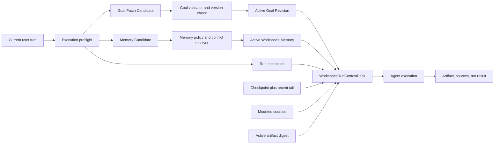

# Workspace Harness Goal / Memory 完整架构方案

日期：2026-07-13  
范围：`mindspace_web_frontend`、`mindspace_backend`、`mindspace_ml_backend`。移动端不在本轮 Workspace Harness / Deep Work 产品范围内。  
问题来源：Deep Work 详情页把多轮执行指令持续写成 Memory，而 Goal 长期停留在创建时快照，导致用户看到的上下文与 Agent 实际工作的上下文都逐渐失真。

## 执行进度

更新时间：2026-07-13

- Phase 0 已完成：ML 的 Evidence、Artifact Draft 与 legacy deterministic 路径不再把 `title + user_message` 写入 Memory；只有 chat-mode Memory Intent Judge 可以提出可复用 Memory candidate。Web 已恢复 Goal 编辑，并保留 `goalSnapshot` 其它字段。
- Phase 1 已完成：Backend 已增加不可变 `WorkspaceRunContextPack`、有界 active Memory 注入、Goal Revision、Memory candidate/policy、冲突/version 治理 API 与 `contextManifest`；Web 已切换 Working Brief，支持 Goal 历史恢复、Memory 编辑/遗忘和 Context Manifest 摘要；Backend -> ML step request 会透传并校验 scope-bound context pack。
- Phase 2 已完成：对目标 Workspace 执行 exact-equality dry-run，确认 6 条 legacy Memory 均等于 `workspace.title + source_run.request_payload.message` 后受控标记为 superseded；迁移不物理删除。active Memory 从 6 降为 0。创建时 prompt 先回填为历史 v1，再把已多轮明确确认的“同一主产物、三项数据表、唯一官方 URL、字段级引用”整理为结构化 Working Brief v2；v1 保留为 superseded。Context Pack 增加使用追踪，UI 将归档 Memory 放入默认折叠且只读的历史区。
- Phase 3 已完成可部署基础：Backend 增加确定性 Consolidator job、Workspace 行锁、expected-action-count 门禁、无正文 `workspace_context_events` 审计与 content-free metrics；ML 增加 7 类 Memory Intent 离线评测集、precision/recall/FPR/key accuracy scorer 和不含正文的生产决策日志。目标 Workspace dry-run 为 6 条归档、0 个待执行动作。
- Phase 3 hard-cut 已完成代码收口：Backend 删除独立 `goal_snapshot` DAO 写入口与 legacy Agent result / Artifact 物化适配器，Goal 创建、读取、更新和 Run Context 都强制以 active Goal Revision 为权威；成功结果缺少 `workspaceToolRequests` 时在物化前失败。ML 继续为旧 Backend 保留公开 legacy `/runs`，但私有 durable `/runs/steps` 只跨服务输出显式 tool requests，不再暴露 `memoryUpdates/sourceUpdates/artifactUpdate`。历史 Run 仅只读展示，不重放旧 payload。
- Phase 4 一致性收口已完成本地实现：Workspace 初始聚合改为单事务一次提交；Goal/Memory 版本冲突统一 HTTP 409；Memory 普通 PATCH 禁止改 key，candidate/conflicted 通过双版本 resolve API 治理。Context Pack 升级 v2 并固定 scope/runBudget，Memory 注入 fail-closed 且 manifest 按原因记录 dropped IDs/count；Durable `/runs/steps` 只接受 Pack。Web 将 active、治理队列、历史三分区，当前角标/Markdown 只统计 active，冲突刷新后保留草稿。移动端未修改。

## 一、历史设计召回

个人上下文项目中没有“焕美丝”的字面记录。结合当前讨论和已有资料，这里按 **Harness** 理解。最相关的历史结论来自：

- [`2026_06_18_workspace_harness_completeness_evaluation.md`](../survey_sessions/2026_06_18_workspace_harness_completeness_evaluation.md)：已经明确区分 Workspace Memory、Agent Long-term Memory、Conversation Summary Checkpoint，并指出两套长期记忆缺少去重、冲突、清理、UI 和指标治理。
- [`harness_primitives.md`](../knowledge_base/agent_harness/harness_primitives.md)：Memory Boundary 必须回答写入者、写入时机、检索上限、过期验证和类型隔离；Context Assembly 必须把静态规则、动态环境、记忆和检索结果按优先级与预算组装。
- [`openbook_context_support.md`](../survey_sessions/2026_06_18_openbook_context_support.md) 与 OpenBook Chapter 17：记忆需要经历发现、注入、提取、检索、整合五个阶段；索引与内容分离；旧记忆使用前需要验证；后台整合负责合并、更新和修剪。
- [`agent_app_open_source_survey_20260615.md`](../survey_sessions/agent_app_open_source_survey_20260615.md)：Working / Episodic / Semantic 三层记忆适合描述 Agent 现场、运行历史和长期知识，但产品实现仍需明确状态所有权。
- [`2026_06_18_workspace_harness_e2e_smoke_runbook.md`](../survey_sessions/2026_06_18_workspace_harness_e2e_smoke_runbook.md)：raw messages 是 source of truth，checkpoint 只覆盖已压缩历史；Web 只消费持久化 Memory 事件，不直接判断和写入记忆。

历史设计的核心判断可以归纳为一句话：**Conversation、Goal、Checkpoint、Memory、Source、Artifact 是不同的状态面，不能靠一个 `memoryUpdates` 数组承担所有连续性。**

## 二、当前问题

以 `workspace-f7d63266-5d43-4b75-8769-fda6e620fe65` 的只读检查为例：

- 绑定会话有 16 条 user message、9 条 assistant message。
- Workspace 当前有 6 条 active Memory，全部是 `decision / medium`。
- 内容模式接近 `Workspace title: current user message`，本质上是 Run 指令副本。
- `goal_snapshot` 只有创建时的 `prompt` 与空 `sourceHints`，后续“只用某来源”“继续修改同一产物”“新增表格”等持续约束没有进入 Goal。
- Run 的输入 Memory 数从 0 逐步增长到 5，说明展示噪声已经进入后续模型上下文。
- 现有 Memory 中存在 `sourceRunId` 指向 failed run 的历史数据，说明旧链路曾允许失败执行留下长期状态。

代码层有三处直接原因：

1. ML Evidence 与 Artifact Draft 路径无条件生成 `memoryUpdates = [{ content: title + user_message }]`。
2. Backend 以 `run_id + materialization_key` 生成 Memory ID，只保证同一 Run 重试幂等，不处理跨 Run 的语义重复、冲突或替换。
3. Goal 更新 API 已存在，但当前 Web 详情页只有只读 Markdown 预览，没有编辑和保存调用；README 中“Goal 可编辑”的约定与实现发生漂移。

这会同时伤害两层体验：用户看到的是执行日志式 Memory，Agent 下一轮接收的也是越来越长的重复指令。

## 三、第一性原理

### 3.1 Memory 的判定标准

一段信息只有同时满足以下条件，才适合成为 Memory：

1. 对未来多个 turn 仍有用。
2. 无法从当前 Goal、Artifact、Source 或代码/数据库实时状态中低成本重新获得。
3. 过时或错误后可以被验证、替换、失效或删除。
4. 来源清楚，能解释是谁、在什么上下文中提供或确认的。
5. 写入后的长期收益高于上下文污染、过时和冲突成本。

“把当前产物再改一遍”“这次只生成一张表”“继续刚才的任务”属于 Run Instruction；外部财报数字属于 Source / Artifact Evidence；两者都不应默认进入 Memory。

### 3.2 状态所有权

| 状态 | 作用 | Source of truth | 生命周期 |
| --- | --- | --- | --- |
| Conversation | 保存完整人机消息和事件 | `chat_messages` / event log | 长期审计，可压缩但不删除原始记录 |
| Current Goal | 当前有效的任务合同 | versioned Goal Revision | 用户或明确的 Goal Patch 更新 |
| Run Instruction | 仅约束当前执行 | `workspace_runs.request_payload` | 当前 Run |
| Checkpoint | 跨 context window / 失败恢复 | context/run checkpoint | 可重建的派生状态 |
| Workspace Memory | 当前 Workspace 可复用信息 | `workspace_memories` | 可更新、替换、失效 |
| Agent Long-term Memory | 跨 Workspace 的用户偏好和长期背景 | 独立 global memory service | 由 curation 治理 |
| Source | 外部事实和原始材料 | source / reference store | 随来源更新，可重新验证 |
| Artifact | Agent 交付物和中间产物 | versioned artifact | 版本化、可恢复 |

### 3.3 写入责任

- Business Backend 拥有 Goal、Memory、Checkpoint、Run、Source、Artifact 的持久化和并发控制。
- ML 只产生 `GoalPatchCandidate`、`MemoryCandidate`、execution plan 和 evidence；不直接写业务表。
- Web 只展示、编辑、确认或撤销，不在客户端按关键词推断记忆意图。
- Background Consolidator 只能在 Memory 边界内做合并、失效和索引更新，所有变更保留审计事件。

## 四、目标状态模型



### 4.1 Goal：从快照升级为版本化 Working Brief

新增 `workspace_goal_revisions`，Workspace 只指向一个 active revision。

建议字段：

```text
WorkspaceGoalRevision {
  goal_revision_id
  workspace_id
  user_id
  version
  objective
  deliverables[]
  constraints[]
  source_policy {}
  success_criteria[]
  non_goals[]
  open_questions[]
  status: active | superseded
  change_source: create | user_edit | conversation_patch | migration
  source_message_ids[]
  base_version
  created_at
}
```

规则：

- 创建 Workspace 时生成 v1。
- 当前 turn 明确改变长期任务合同时，preflight 返回 `GoalPatchCandidate`。
- 明确且无歧义的用户修改可以自动应用；涉及删除目标、放宽信源边界或互相冲突时需要用户确认。
- 一次性格式修改、重试、继续执行只进入 Run Instruction。
- Goal 更新使用 `baseVersion` 乐观锁，保留完整 revision history。
- 兼容期继续投影旧 `goalSnapshot`，但它由 active revision 生成，不再作为独立事实源。

### 4.2 Workspace Memory：稀疏、可替换、可解释

扩展现有 `workspace_memories`：

```text
WorkspaceMemory {
  memory_id
  memory_key
  workspace_id
  user_id
  memory_type: preference | instruction | decision | project_fact
  content
  structured_value {}
  confidence
  status: candidate | active | superseded | conflicted | expired | rejected
  source_type: user_message | explicit_tool | verified_result | migration
  source_message_ids[]
  source_run_id
  source_ids[]
  valid_from
  expires_at
  last_verified_at
  last_used_at
  use_count
  supersedes_memory_id
  version
  created_at
  updated_at
}
```

`memory_key` 表达稳定语义槽位，例如：

- `response.format.conclusion_first`
- `workspace.source_policy.primary_only`
- `workspace.audience.investment_committee`
- `workspace.decision.artifact_update_mode`

同一 key 的新值必须执行 upsert / supersede，不能按 Run 追加。没有稳定 key 的信息先保留为 candidate，不直接进入 active context。

### 4.3 Memory 写入决策

Memory Candidate 通过以下门禁：

1. **Future utility**：是否会影响后续多个 turn。
2. **Existing state check**：是否已经存在于 active Goal、Memory、Source 或 Artifact。
3. **Evidence boundary**：外部事实是否应留在 Source / Artifact，而不是 Memory。
4. **Scope**：属于 global user、workspace 还是 current run。
5. **Conflict**：是否与同 key active memory 冲突。
6. **Outcome policy**：来自 Agent 结果的 candidate 只在 Run 成功后落库；用户明确表达的长期偏好可独立于执行结果落库。
7. **Confidence and provenance**：缺少来源或内容含糊时保持 candidate / rejected。

聊天模式已有 Memory Intent Judge，可以继续作为候选生成器。Evidence / Artifact Draft 必须删除无条件 `title + user_message` 写入，复用同一策略或显式 `update_workspace_memory` tool contract。

### 4.4 Checkpoint：只负责连续性

Checkpoint 保存：

- `coveredUntilMessageId`
- 对话摘要
- 当前执行计划和 open loops
- 已完成 / 待完成步骤
- 最近错误与恢复入口
- active Goal revision ID
- active Artifact version ID

Checkpoint 不出现在 Memory UI，也不参与 Memory 去重。它可以被重新生成、替换和失效。

### 4.5 `WorkspaceRunContextPack`

每次 Run 构造一个不可变、可审计的 Context Pack：

```text
WorkspaceRunContextPack {
  schema_version
  workspace_id
  run_id
  goal_revision { id, version, digest }
  current_instruction
  selected_memories[]
  checkpoint_summary
  recent_message_tail[]
  active_artifact { id, version, digest }
  mounted_sources[]
  selected_source_refs[]
  profile_and_tool_policy
  context_budget
  manifest[]
}
```

`manifest` 对每个 fragment 保存 `type / id / version / token_count / selected_reason / dropped_reason`。这样可以回答“本轮模型到底用了哪些 Goal、Memory 和 Source”。

上下文优先级：

1. 系统硬约束与权限策略
2. 当前用户指令
3. Active Goal Revision
4. 与当前任务相关的 Workspace Memory
5. Global Long-term Memory
6. Checkpoint summary 与 recent tail
7. Artifact digest、Sources、tool results

Goal 与当前指令 pinned；Memory 按 scope、相关性、新鲜度、冲突状态和预算选择，默认不超过 8 条或总 context token 的 10%。完整 Memory 保留在存储层，模型只接收选中摘要与引用。

## 五、Memory 生命周期

### 5.1 Extract

- 用户明确说“以后都这样”“记住这个”时，主流程生成高置信 candidate。
- 普通 turn 结束后，只有在主流程没有产生 candidate 时，后台 extractor 才检查一次，避免重复提取。
- extractor 只读 Conversation / Goal / Memory，只能写 candidate event，不能修改 Goal、Artifact 或 Source。

### 5.2 Resolve

- exact duplicate：直接 dedupe，增加 provenance / use count。
- same key, same meaning：更新来源和新鲜度，不新增卡片。
- same key, new value：新记录 supersede 旧记录。
- same key, ambiguous conflict：进入 `conflicted`，请求用户确认。
- 已存在于 Goal：不重复写 Memory，只保存 Goal revision provenance。

### 5.3 Retrieve

候选集合先按 `workspace_id + status=active + scope` 过滤，再进行相关性选择。选择器必须返回：

- `memory_id`
- `selected_reason`
- `freshness`
- `verification_required`
- `token_cost`

涉及外部可变事实时，Memory 只提供线索，Agent 仍需回到 Source 或实时系统验证。

### 5.4 Consolidate

后台 consolidator 使用三道门：时间阈值、Memory/Session 增量阈值、分布式锁。四阶段为：

1. Orient：读取 active / conflicted / expired 概况。
2. Gather：检查近期 Memory candidates 与使用日志。
3. Consolidate：合并同义项、生成 supersede、标记待验证。
4. Prune：清理索引、过期候选和无效引用。

Consolidator 不直接物理删除记录，只改变状态并写 `workspace_context_events` 审计事件。用户主动“忘记”时也先 tombstone，后台再按数据保留策略物理清理。

## 六、API 与事件合同

### 6.1 Goal

- `GET /workspaces/{id}/goal`：返回 active revision 与 revision summary。
- `PATCH /workspaces/{id}/goal`：提交完整 Working Brief 或 JSON Patch，必须带 `baseVersion`。
- `GET /workspaces/{id}/goal/revisions`：查看历史。
- `POST /workspaces/{id}/goal/revisions/{version}/restore`：恢复为新版本。

### 6.2 Memory

- `GET /workspaces/{id}/memories?status=active`
- `PATCH /workspaces/{id}/memories/{memoryId}`：用户编辑，生成新 version。
- `DELETE /workspaces/{id}/memories/{memoryId}`：标记 forgotten / expired。
- 内部 tool：`upsert_workspace_memory(memoryKey, type, content, source, expectedVersion)`。

### 6.3 Stream events

- `goal_patch_proposed`
- `goal_updated`
- `memory_candidate`
- `memory_updated`
- `memory_superseded`
- `memory_conflicted`
- `context_manifest`

Web 只消费这些标准事件，不从 assistant 文本猜状态变化。

## 七、Web 产品设计

Context Sidebar 分成三个用户可理解的区域：

### 7.1 工作目标

展示 Working Brief，而不是 Raw JSON：

- 目标
- 交付物
- 信源规则
- 成功标准
- 当前长期约束
- 待确认问题

支持编辑、保存、查看版本历史和恢复。对话产生 Goal Patch 时显示差异摘要：“信源规则从不限来源改为仅官方来源”，用户可以接受、修改或撤销。

### 7.2 记忆

按偏好、项目事实、决策、长期指令分组。列表只显示内容、范围、更新时间和来源摘要；`memoryId`、`sourceRunId`、confidence 等审计字段放到详情折叠区。

用户可以：

- 修改
- 忘记
- 解决冲突
- 查看本轮是否使用

Run 指令和对话消息不出现在这里。

### 7.3 本轮上下文

默认只展示简短说明，例如“本轮使用：目标 v4、3 条记忆、1 个挂载文件、当前产物 v7”。开发/诊断模式可展开完整 `context_manifest`，普通用户不需要面对 token 与原始 JSON。

## 八、三仓实施位置

### ML Backend

- 删除 Evidence / Artifact Draft 无条件生成 `memoryUpdates` 的逻辑。
- 统一 `MemoryCandidate` schema，复用 Memory Intent Judge。
- execution preflight 增加 `goalPatchCandidate` 与 `memoryCandidates`，保持只读提议职责。
- Context assembler 消费 Backend 下发的 `WorkspaceRunContextPack`，不再自行全量拼接 memories。
- 加入 candidate eval：普通对话、一次性指令、明确长期偏好、冲突偏好、外部事实五类样本。

### Business Backend

- 新增 Goal Revision 模型、DAO、Service 和 optimistic concurrency。
- 扩展 Memory schema，增加 `memory_key / version / lifecycle / provenance / usage`。
- 新增 Memory Policy / Conflict Resolver / Consolidator，Router 只做传输。
- 统一构造并冻结 `WorkspaceRunContextPack`，保存 context manifest。
- Run 成功后再 materialize Agent 派生 Memory；显式用户 Memory 使用独立事务。
- `goalSnapshot` 只作为 active Goal Revision 的只读兼容投影，不再拥有独立写入口；Memory response 保持显式 lifecycle 字段，写入只走治理 API 或 allowlisted tool request。

### Web Frontend

- 恢复 Goal 编辑器，但升级为 Working Brief，而不是单个 prompt textarea。
- Memory 列表改为分组卡片与生命周期操作。
- 增加 Goal / Memory service 类型和 focused tests。
- stream 中消费 goal/memory 标准事件，刷新 detail 时保持 revision/version 一致。
- light / dark、i18n、loading / empty / conflict / save failure 状态一起完成。

## 九、历史数据迁移

迁移脚本必须先 dry-run，输出 workspace 数量、candidate 数量、预计 supersede 数量，不直接删除。

### 9.1 Goal

- 每个 Workspace 从现有 `goal_snapshot` 生成 Goal Revision v1。
- 扫描后续 user messages，只生成 `GoalPatchCandidate` 报告，不自动重写历史 Goal。
- 对仍活跃的 Workspace，由用户或一次受控 migration review 确认当前 Working Brief。

### 9.2 Memory

高置信噪声识别条件：

- `memory_type=decision`
- `confidence=medium`
- `source_ids=[]`
- 内容满足 `workspace title + ':' + run user_message` 模式

这类记录标记为 `superseded`，原因写为 `legacy_run_instruction_projection`。不物理删除，便于审计和回滚。

其余 Memory 进入离线分类：

- 可提升为 Goal constraint
- 保留为 active Memory
- 与其他 Memory 合并
- 标记 conflicted / expired

本次问题 Workspace 的 6 条记录应先进入 dry-run 报告，确认后再处理。

## 十、验证矩阵

### 10.1 ML focused tests

- 普通对话不产生 Memory。
- 一次性格式指令不产生 Memory。
- “以后输出先给结论”产生 preference candidate。
- Evidence / Draft 成功不会默认产生 `title + message` Memory。
- 外部数据事实进入 evidence，不进入 Memory。
- 明确长期 Goal 修改产生 Goal Patch；“继续”不产生 Goal Patch。

### 10.2 Backend focused tests

- 同一 `memory_key` 重复写入执行 dedupe/upsert。
- 冲突值进入 supersede 或 conflicted。
- failed run 不留下 Agent 派生 Memory。
- 显式用户 Memory 即使执行失败仍能独立保存。
- Goal `baseVersion` 冲突返回明确错误。
- Context Pack 只包含选中的 active Memory，并记录 manifest。
- `goalSnapshot` 投影始终等于 active Goal Revision，不能从 Workspace 列独立漂移。

### 10.3 Web focused tests

- Goal Working Brief 展示、编辑、保存、版本冲突和恢复。
- Memory 分组、编辑、忘记、冲突解决。
- `goal_updated / memory_updated / memory_superseded` stream 事件正确更新 UI。
- Raw JSON 与内部 ID 默认不出现在用户视图。

### 10.4 三仓 E2E

沿用 [`2026_06_18_workspace_harness_e2e_smoke_runbook.md`](../survey_sessions/2026_06_18_workspace_harness_e2e_smoke_runbook.md)，至少增加：

1. 连续发送 10 条一次性执行指令，Memory 数不增长。
2. 明确添加一个长期偏好，刷新后仍存在且下一轮 context manifest 显示被使用。
3. 修改 Goal 后进入 evidence run，Run 固定使用新 revision。
4. 创建冲突偏好，UI 要求确认，未确认前不注入模型。
5. failed run 不改变 Goal / Memory / Artifact active state。

## 十一、指标与门槛

建议新增：

- `memory_candidate_total{decision}`
- `memory_write_total{accepted,deduped,superseded,conflicted,rejected}`
- `memory_injected_count` 与 `memory_injected_tokens`
- `memory_used_in_output_total`
- `goal_patch_total{proposed,accepted,rejected,conflicted}`
- `context_pack_tokens{layer}`
- `context_fragment_dropped_total{reason}`
- `failed_run_state_side_effect_total`

首期质量门槛：

- 一次性指令错误写入 Memory 的比例低于 2%。
- failed run 的 Agent 派生 Goal / Memory side effect 为 0。
- 同一 `memory_key` 同时存在多条 active 记录的比例低于 1%。
- 默认注入 Memory 不超过 8 条且不超过 context token 的 10%。
- 每条被注入 Memory 都能在 manifest 中解释选择原因和来源。
- Goal 更新全部版本化，Run 能还原使用的 Goal revision。

## 十二、实施顺序

### Phase 0：停止继续污染

1. ML 删除 Evidence / Draft 无条件 Memory。
2. 增加回归测试，保证普通执行指令不写 Memory。
3. Web 恢复 Goal 编辑入口，先继续使用现有 `goalSnapshot` API。

### Phase 1：建立正确合同

1. Backend 增加 Goal Revision 和扩展 Memory 字段。
2. 定义 `GoalPatchCandidate / MemoryCandidate / WorkspaceRunContextPack`。
3. Web 切换到 Working Brief 与新 Memory UI。
4. 完成 Backend -> ML durable step 合同与 Web 消费切换。

### Phase 2：迁移和治理

1. 跑历史噪声 dry-run。
2. 受控标记 legacy Run Instruction Memory 为 superseded。
3. 上线 conflict resolver、usage tracking 和 context manifest。

### Phase 3：后台整合与评测

1. 上线 Consolidator / Dreamer job。
2. 建 Goal / Memory 离线评测集和生产指标。
3. 移除旧 `goalSnapshot` 独立写入和 Backend legacy materialization；ML legacy `/runs` 只承担旧版本蓝绿读取兼容，durable `/runs/steps` 不暴露旧 mutation fields。

三仓发布分别走 feature branch -> PR -> `main`，ML -> Backend -> Web 的顺序；`preview` 只用于明确的集成验证，不能代替独立生产 PR。

## 十三、最终判断

当前问题的修复不应停在“隐藏 Memory 卡片”或“让模型少写一点”。真正需要完成的是状态重新分层：

- Goal 成为版本化任务合同。
- Run Instruction 回到 Run。
- Checkpoint 只负责续接。
- Memory 只保存稀疏、可复用、可替换的信息。
- Source / Artifact 承载事实与产物。
- Context Pack 决定本轮实际注入什么，并留下 manifest。

这样一来，用户看到的 Context 与 Agent 实际使用的 Context 才能保持一致，Deep Work 也才能具备长期任务 Harness 的可信连续性。
