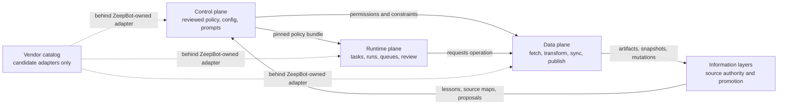
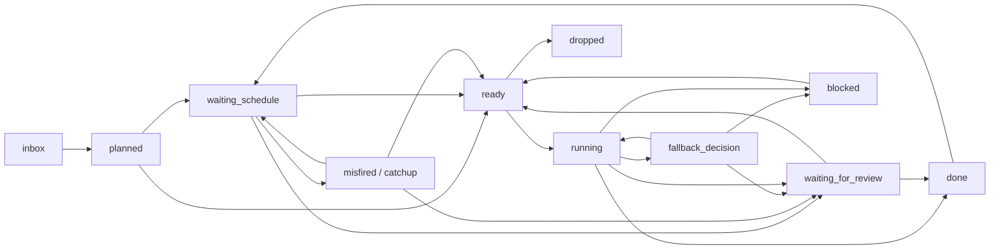
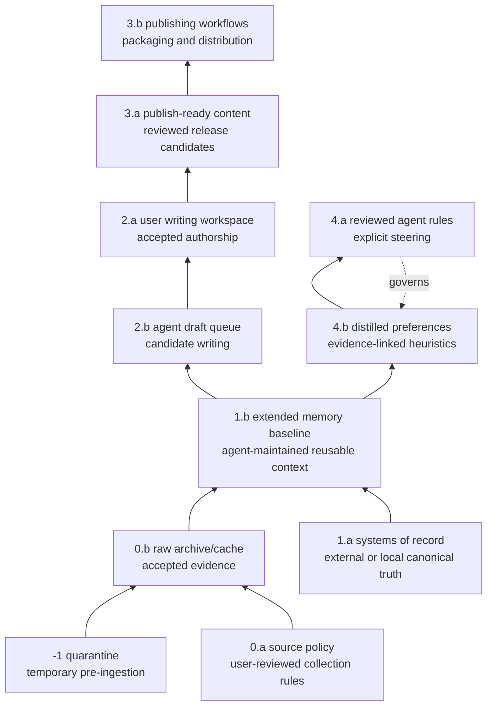
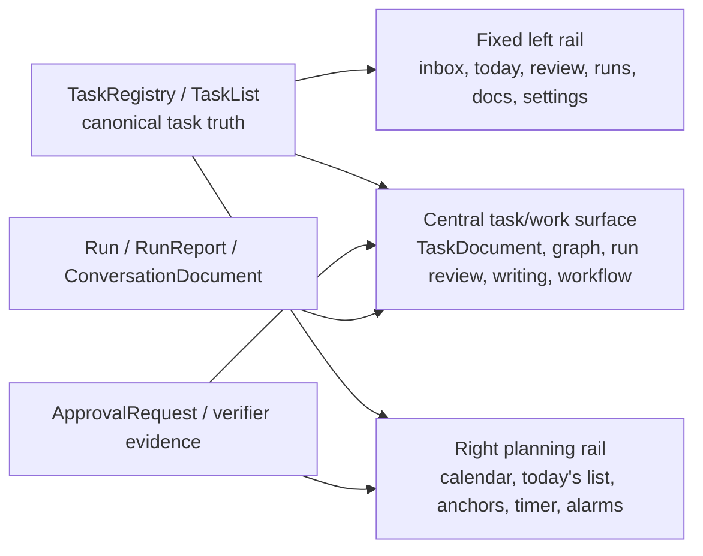
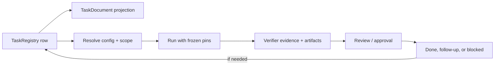

# ZeepBot Core Design Overview

ZeepBot is best understood as a task-centered external-memory and execution system. Its core job is not simply to chat, store notes, or run agents. Its job is to preserve Qihang's durable context, represent current work as inspectable tasks, run agents against pinned policy/config snapshots, and keep every source, artifact, mutation, and memory promotion auditable.

The current design is organized into four authoritative parts:

1. **Control plane**: reviewed policy, prompts, config, templates, security, storage, schedule, and notification rules.
2. **Runtime plane**: task truth, task graph, queues, runs, schedules, approvals, cockpit state, and review flow.
3. **Data plane**: ingestion, parsing, archiving, indexing, sync, publication, external mutation, and provider snapshots.
4. **Information layers**: source authority, authorship, provenance, promotion, and memory maturity.

The vendor catalog is separate. It can provide components, adapters, sidecars, and proof-of-concept targets, but it does not own ZeepBot truth.

<!-- more -->

## One-page Mental Model

ZeepBot should never blur these questions:

| Question | Owner |
|---|---|
| What is allowed? | Control plane |
| What are we doing now? | Runtime plane |
| What bytes or external records are moving? | Data plane |
| What is authoritative, reviewed, raw, drafted, or publish-ready? | Information layers |
| Which third-party tool may help? | Vendor catalog |

The most important invariant is that runtime and data-plane activity must not silently change source authority. A run can reference a raw archive, a Google Drive doc, a GitHub repo, a task document, or a user-authored draft, but that reference does not promote the referenced object or make it canonical.

## Design Principles

### 1. Task Management Is The Product Spine

The cockpit, daily planning rail, calendar, alarms, chat, runs, documents, reading list, review queue, and publishing queue should all orbit the task model when a task relationship exists. ZeepBot is not a collection of independent apps. It is a task-centered system that lets Qihang answer:

- What matters today?
- What is blocked?
- What should happen next?
- What is waiting for review?
- What context needs to reopen with this task?
- What exact policy/config/version did this run use?

### 2. Authority Is Explicit

ZeepBot must distinguish raw evidence, canonical external systems, agent-maintained memory, agent-written drafts, user-authored writing, publish-ready content, reviewed rules, and inferred preferences. These are not equivalent retrieval chunks.

The information-layer model encodes this distinction. Within the same numeric layer, `x.a` outranks `x.b` because `x.a` has user review, direct user maintenance, or explicit user intent.

### 3. Runs Are Frozen Against Config Drift

A run must use a frozen `ResolvedTaskConfig`, `ResolvedTaskScope`, config snapshot/hash/ref, and source map. Runtime does not follow "latest config" implicitly. Repo-local config edits after run start are drift, not live inputs.

### 4. Data Operations Are Auditable

Every fetch, parse, OCR, ASR, embed, archive, publish, notification delivery, provider sync, or external mutation should be traceable to a task/run or policy trigger. Data plane emits evidence; it does not decide authority.

### 5. Vendor Tools Are Replaceable Adapters

Third-party tools can support the system, but ZeepBot owns the object model and authority boundaries. A vendor can be a UI surface, graph engine, scheduler, vector store, model SDK, parser, browser capture tool, connector, runner, or tracing substrate. It should not decide task truth, source authority, policy, or publication rights.

## Core Architecture

### Control Plane

The control plane contains reviewed rules, prompts, templates, policies, and security/storage constraints. It answers:

> How should ZeepBot behave, what is allowed, which config version applies, and what must be reviewed before execution?

The split is simple:

| Control layer | Role | Maintainer |
|---|---|---|
| `0.a` | Reviewed active control/config. | User-reviewed |
| `0.b` | Proposed control/config changes and drift reports. | Agent-proposed |

Core rules:

- Config changes are reviewed and versioned.
- Runtime objects do not silently follow latest config.
- Each run pins `ResolvedTaskConfig`, `ResolvedTaskScope`, config snapshot/hash/ref, and source map.
- `0.b` proposals cannot directly change runtime behavior.
- Secret-like material is not stored in config; only secret references or encrypted references are allowed.
- Repo-local config is active authority for repo-scoped behavior, but cannot override hard global guardrails.
- A task that edits repo-local config must use a separate config-change workflow with validation and approval.

Control plane also defines policies for:

- source admission and retention;
- privacy, security, storage, and secret references;
- schedule, notification, and alarm rules;
- prompt, workflow, handoff, and harness selection;
- executable Markdown and publication freeze;
- external runners and execution environments;
- retrieval and memory harness behavior;
- GitHub repo creation and issue mirror policy.

### Runtime Plane

The runtime plane represents current work. It answers:

> What are we doing now, what is blocked, what should happen next, and what exact config/version is this run using?

The runtime split is:

| Runtime layer | Role | Maintainer |
|---|---|---|
| `0.a` | Human-facing task, task scope, review queue, reading list, publish queue, dashboard. | User-reviewed / human-facing |
| `0.b` | Agent orchestration: state machine, runs, resolved harnesses, context bundles, queues, events. | Agent/system-maintained |

The SQL `TaskRegistry` is the canonical runtime truth for ZeepBot tasks. `TaskDocument` / Markdown is the human-facing projection and authoring surface. A GitHub Issue mirror is only a backup/collaboration projection unless a reviewed import workflow accepts its edit back into SQL.

Key runtime objects:

| Object | Role |
|---|---|
| `TaskRegistry` | Canonical SQL task truth: identity, lifecycle, status, schedule state, review state, sync state, mirror refs. |
| `TaskList` | Materialized views: inbox, today, upcoming, overdue, ready, review, reading, publish, project. |
| `TaskDocument` | Markdown projection for reading, editing, planning, and handoff. |
| `Run` | One execution attempt pinned to resolved config/scope, harness, environment, context bundle, and evidence. |
| `RunWorkspace` | Execution workspace for files, artifacts, logs, and copy-back boundaries. |
| `ScheduleFiring` | Concrete scheduled activation or work unit. |
| `ApprovalRequest` | Human review gate for high-risk operations, mutations, drafts, config changes, or verifier failures. |
| `HandoffRecord` | Structured continuation artifact produced by a run for a future task/run. |

Runtime state should be explicit:

`fallback_decision` is short-lived runtime routing against frozen fallback policy. It cannot silently add workflow edges, broaden permissions, or change resolved config during a run.

### Data Plane

The data plane is the execution path that moves, transforms, stores, syncs, publishes, or mutates data. It answers:

> What bytes or records are being moved, transformed, written, published, or synced?

The data stages are:

| Stage | Role | Typical operations |
|---|---|---|
| `0` | Intake and materialization. | Fetch, download, import, pull/build image, create ingestion candidate, create cache artifact. |
| `1` | Transformation and extraction. | Parse, OCR, ASR, diarize, clean transcript, chunk, embed, summarize. |
| `2` | Persistence, indexing, and replication. | Archive, checksum, manifest, dedupe, index, sync, replicate, prune. |
| `3` | External mutation and publication. | Write to external systems, publish, schedule, record release, rollback/status check. |

Key data-plane objects:

| Object | Role |
|---|---|
| `IngestionCandidate` | Pre-admission item in information layer `-1`. |
| `RawArchiveItem` | Accepted raw/source-linked artifact in `0.b`. |
| `Artifact` | Generated or captured output: figure, table, patch, logs, report, notebook, exported asset. |
| `ArtifactManifest` | Canonical identity, checksum, backend, replicas, cleanup state. |
| `DataOperation` | One operation: fetch, parse, OCR, ASR, upload, publish, sync, notify, delete. |
| `DerivedRetrievalIndex` | Rebuildable retrieval sidecar over approved sources and artifacts. |
| `MemoryHarnessRecord` | Projection into memory systems with provenance and authority metadata. |
| `ExternalMutationRecord` | Auditable write to GitHub, Drive, Calendar, email, publishing target, or another external system. |
| `NotificationDeliveryRecord` | Delivery attempt for push, SMS, email, Slack, calendar reminder, or another notification channel. |

Important boundary: recurring task scheduling is runtime, not data plane. Data plane participates only when an external delivery/write occurs, such as email/push notification, calendar write, or provider mutation.

### Information Layers

The information-layer model describes logical authority, authorship, provenance, and promotion. It is orthogonal to storage backend. A Google Drive doc, Git repo, object-store blob, rsync mirror, mailbox, local cache, or Markdown file can host objects from different layers.

Layer summary:

| Layer | Role |
|---|---|
| `-1` | Ephemeral quarantine before policy admits material. |
| `0.a` | User-reviewed source collection policy. |
| `0.b` | Accepted raw evidence and source-linked machine derivatives. |
| `1.a` | User/team-maintained systems of record. |
| `1.b` | Agent-maintained extended-memory baseline: summaries, source maps, decisions, project context. |
| `2.b` | Agent-generated draft writing awaiting review. |
| `2.a` | User-authored writing Qihang understands and accepts. |
| `3.a` | Publish-ready reviewed content. |
| `3.b` | Agent-maintained publishing/distribution workflow records. |
| `4.a` | Reviewed agent rules, prompt templates, context policy, harness templates. |
| `4.b` | Evidence-linked inferred preferences, lessons, and routing heuristics. |

Promotion must preserve provenance. Raw LLM chat history should become `1.b` only as curated summaries, decision records, source maps, or project memory. `2.b` becomes `2.a` only through user review, editing, understanding, and authorship acceptance. `4.b` becomes `4.a` only through explicit review and acceptance as a steering rule, prompt, template, or policy.

## The Cockpit

The cockpit is a runtime `0.a` planning surface. It should feel like a task-management-centered Codex App: fixed left shortcut rail, central task/work surface, and right planning rail.

Design rules:

- Today's list is a projection over `TaskRegistry`, schedule state, review-needed state, and user selection. It is not a second task store.
- Review-needed work should appear in today/TODO by default unless hidden by explicit filter, snooze, or dismiss policy.
- GitHub Issues can appear as backup/provider links, but should not be queried as an independent ZeepBot task list.
- Countdown/timer state should attach to an active task anchor when possible.
- Persistent or cross-device wakeups should use `GlobalAlarm`, `AlarmEvent`, and `WakeupContextBundle`.
- Calendar display can read from live calendar refs; writes become approved external mutations.

## Core Workflows

### Task To Run

The task remains canonical in SQL. Markdown is a projection for humans. Every run records its config, scope, harness, environment, context bundle, data operations, verifier results, file access events, drift status, and summary reference.

### Ingestion To Memory

```mermaid
flowchart LR
    Candidate["-1 IngestionCandidate"]
    Policy["0.a SourcePolicy"]
    Archive["0.b RawArchiveItem"]
    Extract["Parse/OCR/ASR/chunk/embed"]
    Memory["1.b MemoryItem"]
    Draft["2.b Draft"]
    UserWriting["2.a User writing"]

    Candidate --> Policy
    Policy -->|"accept / redact / reject"| Archive
    Archive --> Extract
    Extract --> Memory
    Memory --> Draft
    Draft -->|"review + authorship acceptance"| UserWriting
```

Unsafe files stay in quarantine until scanned/sandboxed. Secret-like material is rejected. Retrieval indexes and memory harness records are derived sidecars, not source truth.

### External Mutation

External mutation is never "just a tool call." It should pass through runtime intent, control policy, review where needed, data-plane execution, provider verification, and audit.

Examples:

- GitHub repo creation and initialization.
- GitHub Issue mirror sync from SQL task truth.
- Calendar writes.
- Publication to a platform.
- Notification delivery to external channels.
- Git provider merge surfaces.

Every external write should produce an `ExternalMutationRecord` or a specialized mutation record with before/after snapshots, provider IDs/URLs, idempotency keys where useful, rollback/delete/archive path, verification status, and audit refs.

## V0 Implementation Order

A practical v0 should not start by building every sidecar or vendor integration. It should establish the core authority spine first.

1. Define object schemas and versioning: `TaskRegistry`, `TaskDocument`, `Run`, `ResolvedTaskConfig`, `ResolvedTaskScope`, `DataOperation`, `ArtifactManifest`, and core information-layer metadata.
2. Build SQL/graph sidecars for task truth, view membership, dependencies, schedules, approvals, review records, config pins, and run history.
3. Define Markdown/YAML formats for user-facing task documents and reviewed config files.
4. Build config validation and compilation into frozen resolved policy bundles.
5. Build the minimal cockpit: left shortcuts, central task surface, right planning rail, today list, active anchor timer, review queue, publish queue, alarms, and task/run/conversation links.
6. Build scheduler/queue and runtime state machine.
7. Build run execution records, verifier evidence, artifact capture, file access telemetry, and drift reporting.
8. Build data-plane storage adapters, ingestion candidates, raw archive admission, extraction jobs, and retrieval sidecar invalidation.
9. Add approval workflows for config changes, external mutations, drafts, publish/freeze, and verifier failures.
10. Add one or two narrow vendor-backed adapters only where uncertainty is high and the proof-of-concept preserves plane boundaries.

## Design Risks To Keep Visible

| Risk | Failure mode | Guardrail |
|---|---|---|
| Authority collapse | Raw notes, semantic hits, GitHub Issues, agent memory, and reviewed rules are treated as equal truth. | Preserve information-layer metadata and provenance. |
| Config drift | A run silently changes behavior because "latest config" changed. | Pin resolved config/scope and immutable determining config paths. |
| Task duplication | SQL task, Markdown doc, cockpit row, and GitHub Issue become four competing tasks. | `TaskRegistry` owns truth; all others are projections or mirrors. |
| Vendor capture | A workflow engine, vector DB, memory service, or UI becomes the real authority. | Adopt vendors behind ZeepBot-owned adapters only. |
| Secret leakage | Credentials enter config, logs, images, prompts, or archives. | Store only secret references; reject secret-like material. |
| Review bypass | Auto-merge, executable Markdown, calendar writes, repo creation, or publication skips review. | Route through `ApprovalRequest`, policy checks, and mutation records. |
| Memory staleness | Old summaries or inferred preferences keep steering future runs after sources changed. | Add validity, stale-after, provenance, and conflict checks. |

## Source Map

Start here:

- [`README.md`](../../README.md): root ZeepBot routing.
- [`control-plane/README.md`](control-plane/README.md): control plane index.
- [`runtime-plane/README.md`](runtime-plane/README.md): runtime plane index.
- [`data-plane/README.md`](data-plane/README.md): data plane index.
- [`information-layers/README.md`](information-layers/README.md): information-layer index.
- [`vendor/README.md`](vendor/README.md): vendor candidate catalog.

Most important detailed source files:

- [`control-plane/30-control-plane-rules.md`](control-plane/30-control-plane-rules.md)
- [`control-plane/31-relationship-to-runtime-and-data-plane.md`](control-plane/31-relationship-to-runtime-and-data-plane.md)
- [`runtime-plane/05-runtime-rules.md`](runtime-plane/05-runtime-rules.md)
- [`runtime-plane/06-minimal-taskdocument-schema.md`](runtime-plane/06-minimal-taskdocument-schema.md)
- [`runtime-plane/08-minimal-run-schema.md`](runtime-plane/08-minimal-run-schema.md)
- [`runtime-plane/13-zeepbot-planning-surface-task-cockpit.md`](runtime-plane/13-zeepbot-planning-surface-task-cockpit.md)
- [`runtime-plane/30-runtime-state-machine.md`](runtime-plane/30-runtime-state-machine.md)
- [`runtime-plane/34-task-registry-and-github-issue-mirror.md`](runtime-plane/34-task-registry-and-github-issue-mirror.md)
- [`data-plane/04-key-objects.md`](data-plane/04-key-objects.md)
- [`data-plane/08-data-plane-rules.md`](data-plane/08-data-plane-rules.md)
- [`information-layers/authority-priority-promotion-rules.md`](information-layers/authority-priority-promotion-rules.md)
- [`control-plane/35-context-infrastructure-structure-absorption.md`](control-plane/35-context-infrastructure-structure-absorption.md)

## Retrieval Keywords

ZeepBot core design, ZeepBot architecture overview, task-centered external memory, control plane, runtime plane, data plane, information layers, TaskRegistry, TaskDocument, Run, ResolvedTaskConfig, ResolvedTaskScope, DataOperation, ExternalMutationRecord, source authority, memory promotion, cockpit, review queue, pinned config, vendor adapters.
